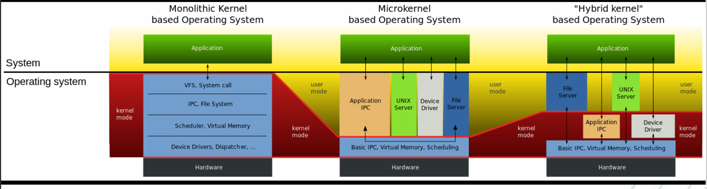

# 操作系统概论
+ **对下管理资源，对上提供服务**
## 操作系统的基本要求
1. **提供解决各种冲突（资源竞争引起）的策略**  如： 进程、内存、设备
2. **协调并发(cocurrency)活动的关系**
   +  进程之间的通信，同步与互斥
3. 保证数据一致性
4. 实现数据的存储控制：共享程度、隐私安全。

## 操作系统执行过程
1. 编译成exe可执行文件（编译原理）
2. User告诉shell（访问操作系统服务的用户界面“壳”）执行该exe
3. 创建一个新的**子线程socket**

## 操作系统结构

### 微内核结构
+ 中断处理（I/O、异常），进程通信（IPC），基本调度
+ 优点：易于实现、移植，分布式环境，

+ 内核态与用户态的切换与代价

## 历史
+ 第一个操作系统UNIX <- C compiler <- C语言
+ 机器语言 -> 汇编 -> C compiler的子集 C0编译器 -> 由C0编译器扩展到C1语言 -> 由C1语言编写C2的编译器...如此递归 -> C编译器 -> C语言 -> ANSI-C

## 概念辨析
1. 假如没有操作系统，怎样控制硬件？--裸机编程
   + 直接通过汇编或者C语言操控CPU的寄存器、内存、I/O端口地址
   + 手动布局内存：TEXT DATA HEAP/STACK，以及不同线程
   + 独占式运行：一次只能运行一个程序，如：打印文件
   + 驱动代码无法复用。
2. 计算机系统中不同层次接口的作用？
   + API 用户与计算机硬件系统之间的接口:例如：程序员调用 printf() 或 open()
   + 系统资源的管理者（处理机、存储器、I/O设备、文件管理）
   + 实现对计算机资源的抽象（OS是扩充机/虚拟机）
3. 冯·诺依曼计算机的主要特点是什么？
   + DATA/TEXT共同存储在存储器中
   + 五大部件组成： 运算器（ALU）、控制器、存储器、输入设备和输出设备。
   + 二进制表示
   + 指令顺序执行
   + 以运算器（ALU）为中心