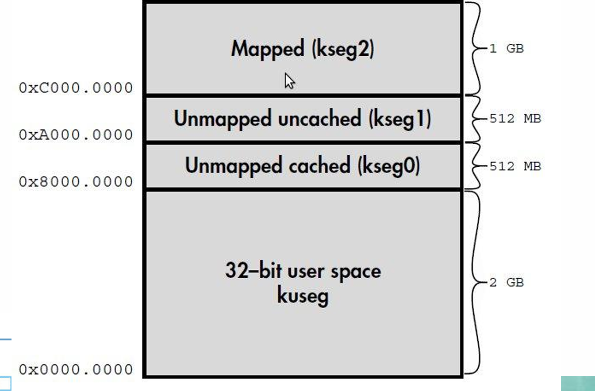
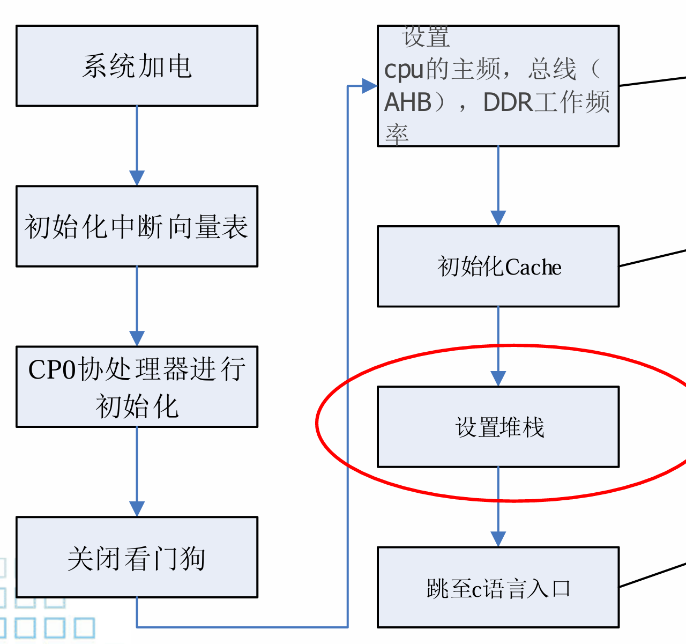
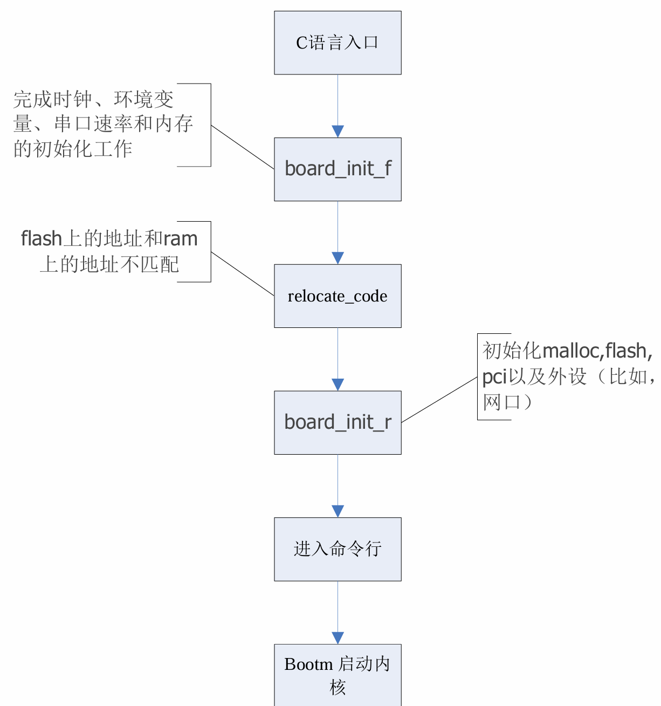

## 启动的纠结性
+ **矛盾**：必须通过启动程序启动计算机，而启动程序又必须在启动好的计算机上运行。
+ 类似于01的鸡生蛋问题
+ **解决方案：** **逐步释放系统灵活性，从最安全通用功能最弱的状态逐步设置硬件**
+ BIOS
### Bootloader()
+ 引导加载程序：系统加电后的第一段程序，在OS kernel之前运行的小程序。
+ 内容：
  + Stage1: 初始化系统硬件(booter) ，依赖于CPU体系结构。(Asm)
  + Stage2: 将OS映像加载到内存中，并跳转到OS的代码运行(loader)，要求移植性高。(C)
## MIPS的基本地址空间(VM)
> li sp, 0x80400000
+ 程序地址空间（4G）

+ MIPS上电启动后，无法采用TLB Cache，因此只能使用Kseg地址空间。
  + 所以启动地址为0xBFC0 0000，抹除高三位后，映射到物理内存ROM中

## MIPS的启动
+ stage1: 
+ stage2: 

## X86的启动

### 第一步：加载BIOS
+ **位置**：放置在断电后内容不会丢失的只读存储器
+ 内容：硬件自检，读取启动程序，设置启动顺序
+ **作用**：系统上电后，CPU处理的第一个指令地址（PC）会定位到BIOS所在储存其中。
+ 寻址能力低：16位代码

> UEFI 提高寻址能力
### 