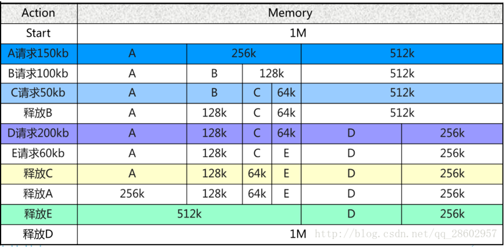
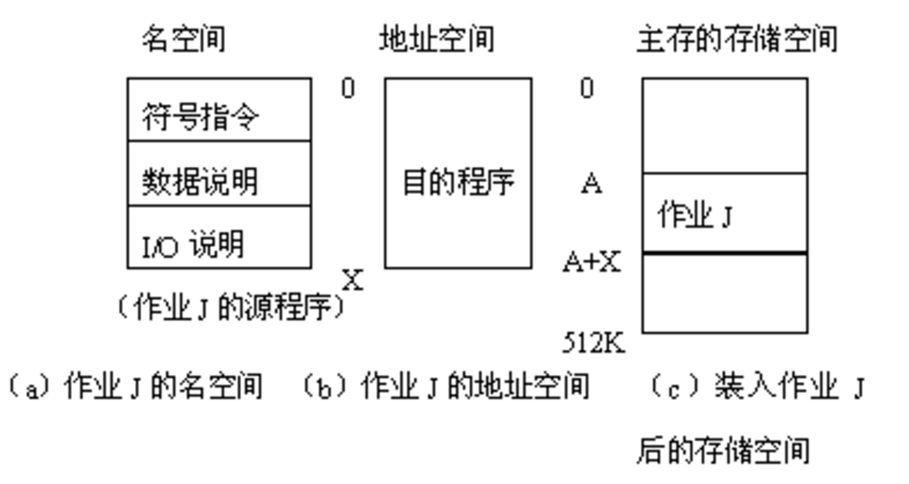

### **一、 内存管理的基础逻辑**

内存管理的核心目标是实现**地址独立**（程序不依赖物理地址）和**地址保护**（进程间互不干扰） 。

**存储层次**：遵循“寄存器 - 缓存 - 内存 - 外存”结构，速度逐级减慢，容量逐级增大，单价逐级降低

---
### **二、 内存分配方式的演进**

从最简单的单道程序管理，逐步演进到支持并发的多道程序分区管理。

#### **1. 单道程序内存管理**

*  **逻辑**：内存中仅存 OS 和一个用户程序，用户程序地址永远固定 。


*  **地址翻译**：采用**静态地址翻译**，在运行前由加载器计算出物理地址 。


*  **优缺点**：运行速度快但资源浪费严重，无法运行比物理内存大的程序 。


#### **2. 固定式分区 (Fixed Partitioning)**

* **逻辑**：系统初始化时将内存划分为若干固定大小的连续分区 。

* **主要缺陷**：产生**内部碎片**（分配了但没用掉的空间），且分区总数固定限制了并发数。

* 单一队列的分配方式：所有程序共享一个队列，分配时从头开始找第一个满足要求的分区（**首次适应算法**） 。
* 多队列分配方式：给每个分区设立一个队列，程序根据需求进入对应大小的队列， 。

#### **3. 可变式分区 (Dynamic Partitioning)**

* **逻辑**：分区边界可移动，按需切割空间 。

* **主要缺陷**：产生**外部碎片**（分区之间无法利用的小空闲区），需通过**紧凑技术**整理 。
* **已分配分区表和未分配分区表**： MCB（Memory Control Block）记录已分配分区的起始地址和长度，空闲链表记录未分配分区的信息 。以链表结构维护，分配时扫描链表寻找合适的空闲块。

### 关于内存碎片
* **内碎片**：分配了但没用掉的空间（如固定分区） 。
  * 无法被整理，但作业完成会被释放
* **外碎片**：太小而无法利用的空闲区间（如动态分区） 。
  * **这造成内存系统性能下降的主要原因**，可以通过**紧凑技术 (Compaction)** 移动程序位置来消除 。
---

### **三、 闲置空间追踪与搜索算法**

操作系统通过特定的数据结构和算法来决定将哪块空闲内存分给请求者。

* **闲置内存管理**：


* **位图 (Bitmaps)**：每个单元对应一个 bit。
  * **优点**是空间成本固定；
  * **缺点**是没有容错能力且时间成本高 。


* **链表 (Linked Lists)**：通过 `P`（程序）和 `H`（空洞）节点追踪。
  * **优点**是有容错能力；
  * **缺点**是空间开销取决于程序数量且扫描较慢 。


#### **动态分区分配算法 **

当有多个空闲块时，该选哪一个？ 

* **首次适应 (First Fit)**：地址递增搜索，最简单，但在低地址易产生碎片 。


* **下次适应 (Next Fit)**：从上次查找位置开始，分布更均衡，但缺乏大块 。


* **最佳适应 (Best Fit)**：找最接近大小的块，保留了大分区，但留下了大量细小碎片 。


* **最坏适应 (Worst Fit)**：总是选最大的块，对中小作业友好，但长作业可能无块可用 。


#### fast-fit
**核心：分类搜索**
+ 把空闲分区**按照内存大小分类**
+ 经常用到的**某长度的空闲区设立空闲区链表**，系统为**空闲链表**设立一张**管理索引表**
+ 依据需要**程序的长度**，就可在表中寻找到其最小空闲区链表，取下第一块分配即可。
> 长度为n的请求 -- 直接返回表中能容纳N的链表第一块

#### buddy system(linux)

**内存分配流程**
1. 系统开始时，只有最大的内存块（即整个内存块）

2. 进程申请 $n$ 大小的内存时，系统寻找满足 $2^{i-1} < n \le 2^i$ 的最小块。（**向上取整的2的整数幂**）
   + 如果找到$2^i$大小的空闲内存块：直接分配
   + 没有找到：**Spliting the blocks**
      1. 寻找 $2^{i+1}$ 、$2^{i+2}$  ... 直到找到现有的空闲块。  
      2. **将大块平分为两个相等的块，这对块互为 “伙伴” (Buddies)。**
      3. 其中一半用于继续分裂或分配（是否为$2^i$大小），另一半则加入到对应大小的空闲链表中。
      4. 重复此过程，直到得到正好满足要求的 $2^i$ 大小的块。 



**内存释放流程**

回收内存时，若释放块的**buddy也空闲**，则将两者合并为一个 $2^{i+1}$ 的大块。
   + 合并后，继续检查新的伙伴，**直到无法再合并为止**。 
---

* **置换算法 (计算题常客)**：
*  **OPT (最优)**：换掉未来最久不用的（理想状态，无法实现） 。
  
* **FIFO (先进先出)**：可能出现 **Belady 现象**（分配页框越多，缺页率反而升高） 。
  
* **LRU (最近最久未使用)**：性能接近 OPT，是目前的主流 。

* **抖动 (Thrashing)**：当所有进程的工作集之和大于物理内存时，CPU 大部分时间在忙着换页，导致效率急剧下降 。

### **三、程序的装入**

**名空间 vs. 地址空间 vs. 存储空间**：
* **名空间 (Namespace)**：程序中使用的符号（变量名、函数名等）的集合，编译器负责管理 。
* **地址空间 (Address Space)**：程序运行时使用的地址范围
* **存储空间 (Storage Space)**：实际的物理内存区域，用于存放程序和数据 。
  


* **重定位 (Relocation)**：逻辑地址转换为物理地址：“将装入时**目标程序的指令**和数据地址修改为**实际的物理地址**。重定位可以在不同阶段完成：
  * **静态重定位**：在程序运行前由重定位寄存器完成计算 。
  * **动态重定位**：通过硬件（如 MMU）在每次内存访问时动态转换，这是现代系统的基础。

#### **程序段**：程序在内存中是如何组成的？（重点）

1. 核心程序段 (Segments)
   + Text 段 (代码段)：存放执行代码，通常为只读，大小运行前确定。
   + Data 段 (数据段)：存放**已初始化的全局变量**，属于静态内存分配。
     + 包括一些字符串常量等。
   + BSS 段：存放未初始化的全局变量。它**不占用可执行文件空间**，由系统在加载时初始化。

    + Stack 段：存放函数调用的**局部变量**和**返回地址**，**函数参数**，属于动态内存分配，大小可动态调整。
    + Heap 段：用于**动态内存分配（如 malloc）**，大小可动态调整。
  
**例子**
```C
  int global_init = 42; // Data 段
  int global_uninit;    // BSS 段
  int main()
  {
    int a = 10;
    printf("a = %d", &a); // Stack或寄存器，但"a = %d"这个字符串常量在Data段
    int* p = malloc(sizeof(int)); // Heap 段
    *p = 20;
    printf("p = %d", *p);
    return 0;
  }
```
