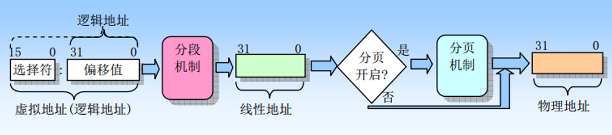
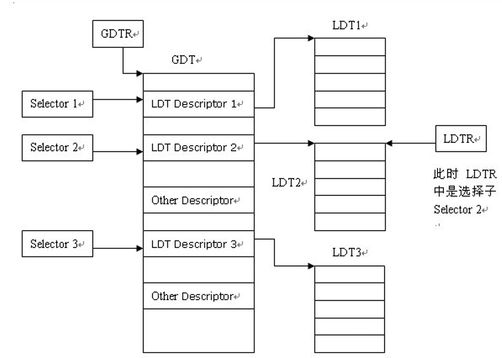
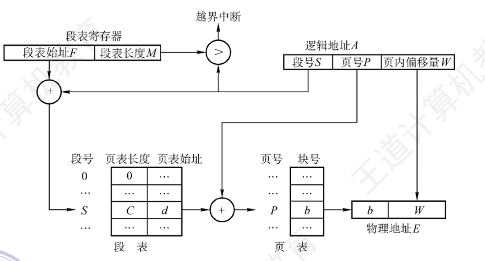

## 04内存分配（2）
### 一、 存储分配方式与程序运行基础

**1. 存储分配的三种方式**
*   **直接指定方式：** 程序员在编写程序或编译时，直接使用实际的物理地址。
*   **静态分配：** 程序编译时均从地址0开始，当装配程序对其进行链接装入时，才确定它们在主存中的物理地址。
*   **动态分配：** 作业在装入时确定位置，但在执行过程中可以根据需要动态申请附加空间，不需要时也可归还给系统。

**2. 程序的内存分段（基础知识）**
一个程序在内存中主要由以下几个段组成：
*   **.text段（代码段）：** 保存程序执行代码和操作指令，通常是只读的，由系统从可执行文件中加载。
*   **.data段（数据段）：** 保存已初始化的全局变量和静态变量，属于静态内存分配，从可执行文件中加载。
*   **.bss段：** 保存未初始化的全局变量和静态变量。它**不在可执行文件中占据实际空间**，由系统在加载时初始化（清零）。
*   **堆（Heap）：** 用于存放进程运行中动态分配的内存段（如 `malloc` / `free`），大小不固定，向上（高地址）生长。
*   **栈（Stack）：** 存放局部变量、函数参数以及保存/恢复调用现场（返回地址等），向下（低地址）生长。


### 二、 程序的链接与装入 

一个源程序变为可在内存中执行的程序，需要经历**编译、链接、装入**三个步骤。
例子：.o文件，所有`jal`指令的目标地址没有载入，还只是符号

**1. 程序的链接**
*   **本质：** 合并不同目标文件（.o）中相同的“节”（Section），并解决符号引用（如：空地址填入）。
    *   例：gcc工具 collect2：链接器

    

*   **静态链接：** 将所需的所有目标模块和共享库代码直接链接入最终的可执行文件中。
*   **动态链接：** 在程序运行时才对需要的共享库目标模块进行链接，具有高效且节省内存空间的优点，但运行速度相对静态链接较慢。
*   **重定位（Relocation）：** 链接器在合并模块时，**确定每个定义符号在虚拟地址空间中的最终地址**，并修改（重定位）代码中对这些符号的引用地址。
    *   特殊的数据结构：记录每一个带填充的指令
    *   指令不同，带填充地址的长度可能不同(`R_MIPS_26`)
```C
typedef struct {
    /*给出了使用重定位动作的地点。对重定位文件来说，它的值是从节起始处到受重定位影响的存储单元的字节偏移量；对可执行文件或共享目标文件来说，它的值是受重定位影响的存储单元的虚拟地址*/
    Elf32_Addr r_offset;
    /*给出了与重定位修改地点有关的符号表索引和所使用的重定位的类型*/
    Elf32_Word r_info;(symbol:24; type:8)
} Elf32_Rel;
```

**2. 程序的装入与运行流程**
*   **动态运行时装入：** 程序在内存中的物理位置可能改变，因此装入时并不立即把相对地址转为绝对地址，而是推迟到**程序运行时**，依靠硬件的**重定位寄存器 (MMU)** 来完成地址映射。
```
        |
        | shell
        fork()
        /  \
       /    \
      /      \
     /        \
    |          |
| shell      | shell
| (father)   | (child)
|            execve()
|            |
|            | program
|            |

```
*   **具体执行过程：**
    1.  Shell 通过 `fork()` 创建子进程。
    2.  子进程通过 `execve()` 系统调用加载可执行程序。
    3.  加载器读取 ELF 文件的头部魔数（Magic Number, `0x7f ELF`）确认文件格式。
    4.  读取程序头表（Program Headers），寻找 `Type` 为 `LOAD` 的段（Segment），这些是需要加载到内存中的部分。
    5.  为每个**段**分配物理页并映射到虚拟地址，将文件内容拷贝到内存。如果内存中的大小（MemSiz）大于文件中的大小（FileSiz）（如 `.bss` 段），则多出部分用 0 填充。
    6.  设置进程控制块（PCB）的 PC 指向 ELF 中记载的入口地址（通常是 `_start` 函数，随后调用 `main`），控制权交给进程执行。

### 三、 ELF文件格式深入

在 Linux 下，可执行文件格式为 **ELF (Executable and Linkable Format)**，它是一种与特定CPU架构（如x86, MIPS等）相关的**应用程序二进制接口** **(ABI)**。
*   **三类 ELF 文件：** 可重定位文件（.o）、可执行文件、共享目标文件（.so）。
*   **文件视角与内存视角：**
    *   **Section（节）：** ELF 目标代码文件由 section 组成（如 `.text`, `.data`, `.bss` 等），这是编译链接阶段的视角。
    *   **Segment（段）：** 链接器会将相同属性（如读写权限）的 section 合并成 segment，这是程序执行/加载阶段的视角。

### 五、 页式、段式与虚拟存储管理大纲

*   **覆盖与交换技术：** 早期多道程序环境下用来扩充内存的方法，解决小内存运行大作业的问题。
*   **分页与分段：**
    *   **页式：** 纯分页系统不具备对换功能。
    *   **段式：** 使用段表映射，逻辑地址由段号和段内地址组成，利于实现可重入代码（多进程共享、不允许修改的代码）的共享。
    *   **段页式：** 结合二者，分段管理虚拟存储器，分页管理实物理存储器。
*   **虚拟存储器与页面置换策略：**
    *   **特征：** 离散性、多次性（多次调入）、对换性（换入换出）、虚拟性。
    *   **页面置换算法：** 最优(OPT)、先进先出(FIFO，可能出现缺页率反增的 Belady 现象)、改进的 Clock 算法、最近最久未使用算法 (LRU) 以及 Aging 算法等。
    *   **抖动 (Thrashing)：** 驻留内存的进程过多导致频繁缺页，处理器利用率先升后降。可以通过局部置换、引入工作集 (Working Set) 算法、预留页面等方式消除与预防。

## 附：MIPS calling Convention 栈帧

### 1. 栈帧的基本概念与作用
每次调用一个子程序（函数）时，系统都会为该次调用创建一个独一无二的栈帧（如果是递归调用，则每次深入调用都会创建一个新的栈帧）。栈是**向下生长**的（即向低地址方向扩展）。

栈帧的主要作用有两个：
*   **作为“契约”**：它定义了调用者（Caller）和被调用者（Callee）之间如何传递参数、如何传递返回值，以及如何共享寄存器。
*   **分配局部存储**：它为被调用者规定了其局部数据在栈帧中的组织方式。

**核心规则**：栈指针寄存器（$sp）的值在任何时候都**必须是8的倍数**（即双字对齐），以防止运行时产生地址对齐错误。因此，每个栈帧的总大小也必须是8的倍数。

---

### 2. 栈帧的5个组成区域
一个完整的MIPS栈帧最多可以划分为5个区域，从低地址（栈顶，$sp指向的位置）到高地址（栈底）依次为：

#### ① 参数区 (Argument Section)
*   **位置与作用**：位于栈帧最底端。如果当前子程序还要调用其他子程序，这个区域用来存放传递给**其他子程序**的参数。
*   **参数槽 (Argument Slots)**：参数区的前4个字被称为“参数槽”，对应 `$a0` 到 `$a3` 这四个参数寄存器。即使调用的子程序参数少于4个，调用者也**必须**为这4个槽分配空间。这4个槽由调用者分配，但留给被调用者使用（被调用者可以选择将 `$a0`-$`a3` 的值存入其中以便像数组一样处理）。
*   **超过4个参数**：如果参数超过4个，多出来的参数（第5个及以上）就会直接存放在参数区的对应位置（如 `$sp+16`, `$sp+20` 等）。其最小大小为4个字长。

#### ② 保存寄存器区 (Saved Registers Section)
*   **位置与作用**：位于参数区上方。用于保存 `$s0` 到 `$s7` 这些“保存寄存器”的值。
*   **规则**：如果当前子程序在执行时需要修改这些寄存器，必须在程序的开头（Prologue）将它们的原始值存入该区域，并在程序返回前（Epilogue）将原始值恢复原位。如果子程序没有修改它们，则不需要保存。

#### ③ 返回地址区 (Return Address Section)
*   **位置与作用**：紧接着保存寄存器区。它固定占用1个字长，专门用来保存返回地址寄存器 `$ra` 的值。
*   **规则**：在子程序入口处存入该区域，在退出前恢复给 `$ra`，主要用于非叶子（调用了其他函数的）子程序。

#### ④ 填充区 (Pad)
*   **位置与作用**：位于返回地址区上方，固定占用1个字长。
*   **规则**：内部不存储任何数据。它的唯一作用是为了**对齐**——如果前面三个区域（参数区、保存寄存器区、返回地址区）的字节总数不是8的倍数，就插入这个填充区，以确保紧随其后的“局部数据区”能够从8字节（双字）的边界开始。

#### ⑤ 局部数据区 (Local Data Storage Section)
*   **位置与作用**：位于栈帧的最高端。用来存放当前子程序的局部变量，或者保存那些需要跨子程序调用保留的临时寄存器（`$t0` 到 `$t9`）的值。
*   **规则**：这部分空间是当前子程序完全**私有**的，无论是调用者还是被调用者都不会访问它。它的大小由子程序的局部存储需求决定，但也必须填充为8字节的倍数。

---

### 3. 不同子程序对栈帧的精简机制
并非所有子程序都需要上述完整的5个区域，子程序可以根据自身需求省略不需要的区域。资料将其分为三类：

1.  **简单叶子子程序 (Simple Leaf)**：既**不调用其他子程序**，也不需要局部变量和修改保存寄存器。这种子程序**根本不需要栈帧**，因此不需要修改栈指针 `$sp`。
```C
int func1(int a, int b)
{
    return a + b;
}
```
2.  **带数据的叶子子程序 (Leaf with Data)**：不调用其他子程序，但**需要局部变量空间或保存寄存器**。它需要压栈分配栈帧，但它的栈帧中**没有**“参数区”和“返回地址区”。
```C
int func1(int a, int b)
{
    int c;
    c = a + b;
    return c;
}
```
3.  **非叶子子程序 (Nonleaf)**：会调用其他子程序。通常需要完整的栈帧结构（包含上述大部分或全部区域）。
```C
int print(int x)
{
    printf("x = %d", &x);
    return 0;
}
```
**总结**：子程序在入口处会通过减去栈帧总大小来移动 `$sp`（压栈创建栈帧），并在退出前通过加上相同的总大小来恢复 `$sp`（出栈销毁栈帧）。这就构成了整个函数调用期间内存空间动态分配与回收的基础。