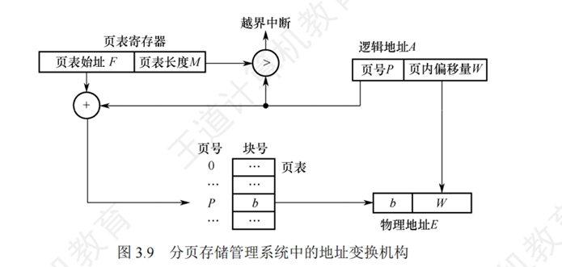
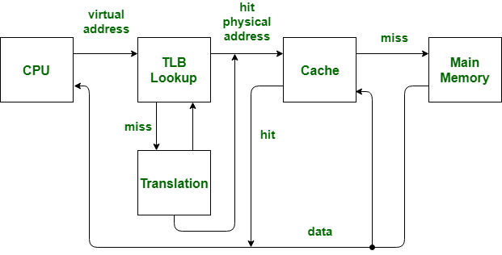

## 操作系统 内存管理（三）—— 页式储存

---

## 📚 第一部分：基础概念与核心思想

### 一、分页机制的基本思想

*   **基本思想**：如果能把一个逻辑地址连续的程序，分散存放到若干不连续的内存区域内，并保证其正确执行，就能充分利用内存空间，减少由于由于碎片拼接（紧凑）带来的开销。

#### 两大核心基本单位

| 类型 | 说明 |
|------|------|
| **页（页面/Page）** | 将作业的**逻辑地址空间**分成若干大小相等的片 |
| **存储块（页框/Frame）** | 将**物理主存空间**分成与页面相同大小的片 |

#### 纯分页系统 (Pure Paging System)

*   **概念**：在不具备页面置换（换入换出）功能的分页系统中，程序的所有页必须一次性全部装入主存的页框内。--- 【学习虚拟存储后，与之进行对比，本节都是纯分页系统】
*   **优点**：**没有外部碎片**（每个进程最多只有最后页产生极小的页内碎片）；程序不必连续存放，便于动态扩展地址空间。
*   **缺点**：程序必须全部装入内存后才能运行（存在时间上的连续性要求）。

---

### 二、分页的地址结构与计算

#### 地址结构
*   逻辑地址由两部分组成：**页号 P + 页内位移（偏移量） W**。
*   页面大小由硬件决定，通常为 2 的幂（现代OS常用 4KB）。
*   如果逻辑地址空间为 $2^m$，页大小为 $2^n$，那么逻辑地址的高 $m-n$ 位表示页号，低 $n$ 位表示页内偏移。

#### 数学计算公式

| 公式 | 含义 |
|------|------|
| $P = \lfloor A / L \rfloor$ | 给定逻辑地址 A 和页面大小 L，页号 = INT(A/L)（INT为整除函数） |
| $d = A \bmod L$ | 页内地址 = A mod L（mod为取余函数） |

*   **内存分配**：以页为单位，按进程大小分配。**逻辑上相邻的页，物理上不一定相邻**。

---

## 🏗️ 第二部分：数据结构与地址转换

### 三、核心数据结构【本质就是数组、数组下标】

为了管理分页，系统需要维护三种重要的数据结构：

```
┌─────────────────────────────────────────────────────┐
│  1. 进程页表（每进程一张）                            │
│     └─ 记录该进程的逻辑页号到物理页面号的映射关系        │
│                                                         │
│  2. 物理页面表（系统只有一张）                          │
│     └─ 描述物理内存空间的分配和使用状况                  │
│     └─ 通常用位示图或空闲页面链表实现                   │
│                                                         │
│  3. 请求表（系统只有一张）                              │
│     └─ 记录系统内各个进程页表的位置和大小                │
│     └─ 可集中管理，也可分散放置在各个进程的PCB中         │
└─────────────────────────────────────────────────────┘
```

---

### 四、页表与页表项 (PTE) 的底层细节

*   **页表的性质**：页表本身存放在**内存**中。访问一个数据需要**2次访存**（第一次访问页表，第二次访问实际内存数据）。

#### 页表项（PTE）的具体内容

| 字段 | 说明 |
|------|------|
| **修改位 (Modified/dirty bit)** | 如果为1，表示该页被写过，置换时必须写回磁盘；为0则无需写回 |
| **访问位 (Referenced bit)** | 为1表示该页最近被读或写过，用于页面置换算法（如LRU）挑选淘汰页面 |
| **在/不在位 (Present/absent bit)** | 标识该页是否已装入物理内存 |
| **保护位 (Protection bits)** | 标识页面的读 (r)、写 (w)、执行 (x) 权限 |

---

### 五、地址变换机构（硬件转换过程）

当CPU要访问某个逻辑地址时，依靠硬件自动完成以下严格的转换步骤：

```
CPU 产生逻辑地址
        │
        ▼
┌──────────────────────────────────┐
│  1. 拆分                          │
│     └─ 将逻辑地址（有效地址）自动    │
│        分为"页号"和"页内地址"      │
└──────────────────────────────────┘
        │
        ▼
┌──────────────────────────────────┐
│  2. 越界保护                      │
│     └─ 页号 ≥ 页表长度             │
│     └─ 产生地址越界中断            │
└──────────────────────────────────┘
        │
        ▼
┌──────────────────────────────────┐
│  3. 地址变换（定位PTE）            │
│     └─ 页表始址 + 页号 × 页表项长度 │
│     └─ 读出物理块号                │
└──────────────────────────────────┘
        │
        ▼
┌──────────────────────────────────┐
│  4. 合成物理地址                  │
│     └─ 物理块号(高位) + 页内地址   │
│        (低位)                    │
└──────────────────────────────────┘
```



---

## ⚖️ 第三部分：性能权衡与优化

### 六、页面大小的选取博弈

| 页面大小 | 优势 | 劣势 |
|----------|------|------|
| **较小** | **页内碎片**少，内存利用率高 | 进程页面数增多 → 页表变长 → 占用连续内存大；换入换出时磁盘I/O次数多，速度慢 |
| **较大** | 页表短小，占用内存小；磁盘换入换出速度快 | 页内碎片增大，浪费内存 |

*   **最优页面大小公式**：设进程平均占用 $s$ 字节，一个页表项占 $e$ 字节，则最优页面大小 **$p = \sqrt{2es}$**。

---

### 七、解决空间问题：多级页表 💡【考试计算重点】

*   **痛点**：对于32位系统，若页面4KB，一个进程的页表可能高达4MB，且要求**连续**内存存放。
*   **原理**：将页表本身再进行分页（即"页目录"或外部页表），离散存放在不同物理块中。运行时只需将页目录常驻内存，内部页表按需动态调入。
*   **地址结构**：如32位系统的"10-10-12"结构（一级页表号10位 + 二级页表号10位 + 页内偏移12位）。

---

## 🚀 第四部分：硬件加速机制

### 八、MMU 与 快表 (TLB)

#### 分页带来的性能灾难

*   **性能下降瓶颈**：在纯分页系统中，内存地址的转换完全依赖存放在内存中的页表。
*   **多次访存问题**：
    *   每次访问一个数据，至少需要**2次**物理访存（第1次查页表，第2次取数据）
    *   如果是**二级页表**，访存次数会飙升到**3次**（查外部页目录 → 查内部页表 → 取数据）
    *   这会导致 CPU 访存效率严重下降。
*   **解决思路**：必须引入硬件机制来加速虚拟地址到物理地址的映射过程。

---

#### MMU (存储管理单元) 的内部结构

为了提高地址转换效率，CPU 内部增加了一个专门的硬件单元，称为 **MMU (Memory Management Unit，存储管理单元)**。由于快表（TLB）起着主导作用，有些操作系统教科书甚至不严格区分 MMU 和 TLB。

MMU 内部主要由三个部件组成：

```
┌────────────────────────────────────────────────────────┐
│  MMU (存储管理单元)                                     │
│  ┌──────────────────────────────────────────────────┐ │
│  │  1. 页表 Cache（即 TLB / 快表）                    │ │
│  │     └─ 存放虚拟地址与物理地址映射条目               │ │
│  │  2. TLB 控制单元                                   │ │
│  │     └─ 负责 TLB 填充、刷新、覆盖、越界检查          │ │
│  │  3. 页表查找单元                                   │ │
│  │     └─ TLB 未命中时查找多级页表                    │ │
│  │     └─ 可硬件自动完成，也可产生异常交由OS软件完成  │ │
│  └──────────────────────────────────────────────────┘ │
└────────────────────────────────────────────────────────┘
```

---

#### 快表 TLB (Translation Lookaside Buffer) 的核心机制

*   **基本概念**：快表又称联想存储器，是一种特殊的高速缓冲存储器（Cache），专门用来存放页表中**最活跃的一部分**条目（通常只有 64 ~ 1024 条）。

*   **地址转换工作流**：

```
CPU 产生逻辑地址 (VA)
        │
        ▼
┌──────────────────────────────────┐
│  提取页号，提交给 TLB              │
└──────────────────────────────────┘
        │
        ▼
    TLB 查找
   ╱        ╲
  │          │
  ▼          ▼
✅ TLB 命中  ❌ TLB 失效/Miss
  │          │
  │     ┌──────────────────────────┐
  │     │  MMU 访问物理内存页表     │
  │     │  找到物理地址             │
  │     │  输出物理地址             │
  │     │  复制到 TLB 中            │
  │     │  触发缺页异常时进入内核   │
  │     └──────────────────────────┘
  │          │
  └────┬─────┘
       ▼
  输出物理地址
```

*   **TLB 替换策略**：
    *   当 TLB 满了但需要装入新条目时，操作系统会采用特定的**替换算法**（如 LRU 最近最少使用、随机替换等）淘汰旧条目。
    *   同时，有些关键条目（如内核代码页）可以被 **固定（Locked）** 在 TLB 中不被替换。

---

#### ASID 与上下文切换保护

*   **ASID (Address-Space Identifier, 地址空间标识码)**：有的 TLB 在每个条目中会额外保存一个 ASID，用来唯一标识该条目属于哪个进程。

*   **提供隔离保护**：当 TLB 解析地址时，会对比当前运行进程的 ASID 与 TLB 条目中的 ASID，如果不匹配，即使页号一样，也视为 TLB 失效，从而防止进程越界访问。

*   **优化上下文切换**：**【考试重点】**

| TLB是否支持 ASID | **上下文切换**行为 |
|---------------|----------------|
| ✅ 支持 | 可同时容纳多个不同进程的条目 |
| ❌ 不支持 | 整个 TLB 必须被**冲刷（Flushed / 清空）** |

---

### 九、特殊页表结构

#### 哈希页表
*   结合哈希函数进行地址转换，解决地址空间过大问题。

#### 反置页表 (Inverted Page Table)

*   **原理**：依据物理内存的**物理页面号**来组织，而不是逻辑页号。【下标：物理页号，内容逻辑页号】
*   **特点**：
    *   表的大小**只与物理内存大小相关**，与逻辑地址空间和进程数无关
    *   极大地节省了页表空间，只需要准备一个页表即可
*   **缺点**：查找困难【可结合Hash表】，且**很难实现页面共享**（因为一个物理帧只对应一个虚拟页表项）。

---

## 🔄 第五部分：共享保护与完整架构

### 十、页共享与保护的局限

#### 页共享
*   多个进程将自己页表中的需要共享的数据/程序的相应页，指向同一个物理块，即可实现共享。
*   例如：为一个应用程序开多个进程，其程序是相同的

#### 保护机制
*   "地址越界保护"
*   页表项中的"保护位（读/写/执行）"来实现
*   **COW**：Copy on write — 一个进程向共享区写的时候给它拷贝一份

> **⚠️ 分页共享的痛点**：如果将"需要共享的数据"和"不共享的数据"划分在了同一个物理页面中，会导致不共享的数据也被暴露，不易保密。这是因为分页是按物理尺寸机械划分的，没有逻辑意义（**实现数据逻辑共享的最好方法其实是分段存储管理**）。

---

### 十一、完整的 CPU 访存层级架构

加入 TLB 后的完整计算机访存宏观顺序为：

```
CPU → TLB Lookup (查快表) → Cache (查高速缓存) → Main Memory (查主存)
```

#### 地址翻译 - 读取内容



---

## 💡 考试做题/复习指南

在遇到计算"**实际访存次数**"的题目时（例如试卷单选题）：

```
第一步：看系统页表级数
├─ 单级页表 → 本身需要 1 次访存
└─ 二级页表 → 本身需要 2 次访存

第二步：看 TLB 是否命中
├─ TLB 命中
│  └─ 查表阶段不产生内存访存
│  └─ 总访存次数 = 1 次（取数据）
│
└─ TLB 未命中 + 二级页表
   └─ 总访存次数 = 3 次
      └─ (1次查外部页表 + 1次查内部页表 + 1次访问最终数据)
```
