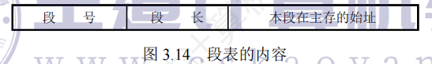
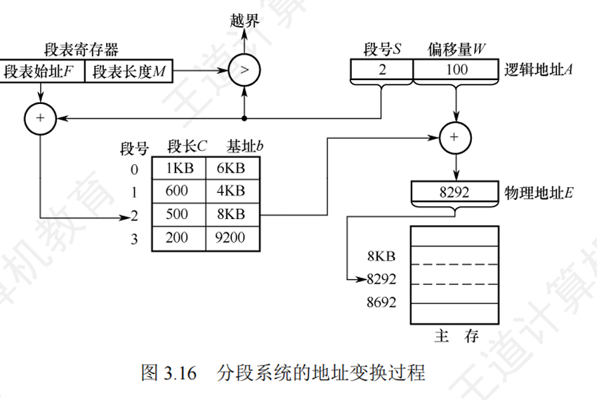
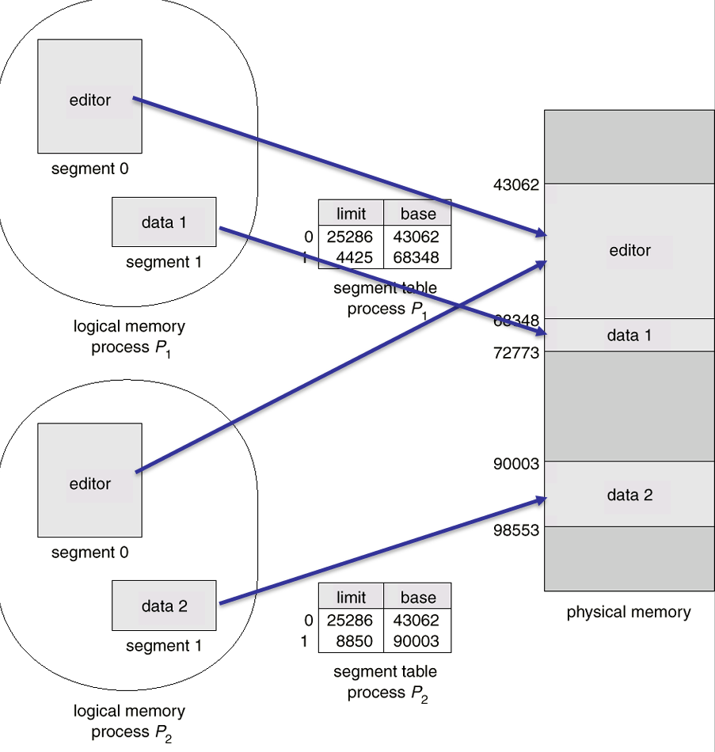

## 操作系统 内存管理（四）—— 分段与段页式存储

---

## 📚 第一部分：分段存储管理核心思想

### 一、为什么需要分段？

分页解决了内存外部碎片问题，实现了非连续分配，但分页是**按照物理尺寸机械划分**的，不考虑程序的逻辑结构。而程序本身天然按照逻辑功能划分（代码段、数据段、堆栈段等），不同段有不同的访问权限和增长需求。

**核心思想**：按照**程序员/程序的逻辑意义**划分地址空间，每个段对应一个逻辑功能模块，每个段有自己的长度和起始地址。

> **破除连续性总结**：
> - 页式 → 破除**程序整体在物理内存的连续性**要求
> - 多级页表 → 破除**页表自身存储的连续性**要求
> - 分段 → 允许程序各逻辑段**离散存放**，满足不同段的独立增长需求

---

### 二、分段机制基本原理

#### 1. 地址结构
分段的地址空间是**二维**的：
$$逻辑地址 = 段号\ S\ +\ 段内位移\ W$$

| 特性 | 说明 |
|------|------|
| 段长 | **不固定**，由用户程序决定（不同段长度不同），可动态增长 |
| 连续性 | 每个段在逻辑上是连续的，但各段之间可以物理离散存放 |
| 地址空间 | 二维，必须同时指定段号和段内偏移 |

> 💡 **对比页式**：页式地址空间仍是一维的，页号只是硬件划分的偏移高位，对程序员透明不可见。

#### 2. 核心数据结构：段表

每个进程拥有一张**段表**，存放在内存中，用于记录逻辑段到物理内存的映射。

**段表项（Segment Table Entry）包含**：
| 字段 | 含义 |
|------|------|
| **段长（Limit）** | 该段的长度，用于越界检查 |
| **段基址（Base）** | 该段在物理内存中的起始地址 |



---

### 三、分段地址变换过程

CPU访问逻辑地址时，地址变换步骤如下：

```
CPU 产生逻辑地址 (S, W)
        │
        ▼
┌──────────────────────────────────┐
│  1. 段号越界检查                  │
│     └─ S ≥ 段表长度 → 越界中断   │
└──────────────────────────────────┘
        │
        ▼
┌──────────────────────────────────┐
│  2. 查段表                        │
│     └─ 段表始址 + S × 段表项大小  │
│     └─ 得到 段基址Base + 段长Limit │
└──────────────────────────────────┘
        │
        ▼
┌──────────────────────────────────┐
│  3. 段内越界检查                  │
│     └─ W ≥ Limit → 段内越界中断   │
└──────────────────────────────────┘
        │
        ▼
┌──────────────────────────────────┐
│  4. 计算物理地址                  │
│     └─ 物理地址 = Base + W        │
└──────────────────────────────────┘
        │
        ▼
   访问物理内存数据
```



---

### 四、分页 vs 分段 终极对比 💡【必考简答题】

| 比较维度 | 页式存储管理 | 段式存储管理 |
|----------|--------------|--------------|
| **核心目的** | 实现非连续分配，解决内存碎片问题 | 满足程序员对逻辑模块划分、共享、保护的需求 |
| **信息单位** | **页是物理单位**（硬件划分） | **段是逻辑单位**（程序划分） |
| **大小特性** | 页面大小**固定**，由硬件决定 | 段长度**不固定**，由用户程序决定 |
| **地址空间** | **一维**（单一线性地址空间） | **二维**（段号+段内偏移） |
| **对程序员** | 分页对程序员**透明不可见** | 分段对程序员**可见**，需要显式指定段 |
| **碎片问题** | 只有最后一页有少量**页内碎片** | 容易产生**外部碎片**（需要紧凑） |

**生活化类比**：
- **分页** = 一本书按纸张物理大小切成等大页面
- **分段** = 一本书按内容逻辑划分成章节，章节长度可长可短

---

### 五、段的共享与保护

分段系统**天生易于实现共享和保护**，因为共享本身就是基于逻辑单位的。

#### 1. 段共享
多个进程需要共享同一个逻辑模块（如动态库、编辑器）时，只需在各自段表中让对应段表项指向**同一个物理内存起始地址**即可。



#### 2. 可重入代码（纯码，Pure Code）
允许多个进程同时执行的共享代码，要求：
- 执行过程中**不修改自身代码**（只读）
- 所有局部变量都在栈上动态分配

#### 3. 保护机制
- **越界检查**：段号检查 + 段内偏移检查（双重检查）
- **保护位**：标识段的读(r)/写(w)/执行(x)权限，代码段通常标记为只读+可执行
- **特权级保护**：不同特权级代码不能随意互相访问（如X86的Ring 0~3）

---

### 六、分段存储的优缺点

| 优点 | 缺点 |
|------|------|
| 天然支持程序逻辑划分，符合程序员思维 | 段内要求连续，仍然可能产生外部碎片 |
| 易于实现**共享**（按逻辑单位共享） | 段长不固定，内存分配管理更复杂 |
| 易于实现**保护**（按逻辑段设置权限） | 当段太大无法装入时，仍然受物理内存限制 |
| 支持段的**动态增长** | 一次访存需要两次内存访问（查段表 + 取数据） |

---

## 🏗️ 第二部分：段页式存储管理

### 七、段页式的设计思想

**问题背景**：
- 分页：内存利用率高，消除外部碎片，但不利于共享和保护
- 分段：利于共享、保护、动态增长，但存在外部碎片

**解决方案**：结合两者优点 → **段页式存储管理**

> **基本思想**：用**分段**来管理逻辑地址空间（满足逻辑需求），用**分页**来分配物理内存（解决碎片问题）。

---

### 八、段页式地址结构与数据结构

#### 地址结构（三维）
$$逻辑地址 = 段号\ S\ +\ 段内页号\ P\ +\ 页内地址\ W$$

#### 数据结构
- 每个进程 **一张段表**
- 每个段 **一张页表**
- 物理内存仍然以页框为单位分配

**关系示意**：
```
进程 → 段表 → 段表项 → 对应段的页表 → 页表项 → 物理页框 → 物理地址
```

---

### 九、段页式地址变换与访存次数

完整地址变换流程：

```
逻辑地址 (S, P, W)
       │
       ▼
  检查段号越界
       │
       ▼
  查段表 → 得到该段页表在内存的起始地址
       │
       ▼
  查页表 → 得到物理页框号
       │
       ▼
  合成物理地址 = 物理页框起始 + W
       │
       ▼
  访问数据
```

#### 📊 访存次数分析【考试考点】
- 无 TLB（快表）时：**3次访存**
  1. 查段表（1次）
  2. 查页表（1次）
  3. 访问数据（1次）
- 有 TLB 且命中时：**1次访存**（直接得到物理页框，只访问数据）


---

### 十、实际架构案例：Intel X86 地址翻译

X86 架构真实采用**分段 + 分页**的二级地址转换机制：

$$逻辑地址(段:偏移) \xrightarrow{分段} 线性地址 \xrightarrow{分页} 物理地址$$


#### 关键数据结构

| 结构 | 作用 |
|------|------|
| **GDT（全局描述符表）** | 整个系统一张，存放全局段描述符 |
| **LDT（局部描述符表）** | 每个进程一张，存放进程私有段描述符 |
| **CR0 寄存器** | `PG` 位控制分页机制的开启/关闭 |
| **CR3（PDBR）** | 存放当前进程页目录表的物理基地址，**上下文切换时必须更新** |


#### Linux 的"扁平化"设计
为了简化和可移植性，Linux 在 X86 上实际**几乎禁用了分段**：
- 所有段的段基址都设为 0
- 所有段的段限长都设为 4GB（32位）
- 结果：**虚拟地址 = 线性地址**，分段机制只是走个形式

---

## 💡 期末高频考点与易错总结

| 考点 | 易错点/正确结论 |
|------|----------------|
| **分页 vs 分段 地址空间维数** | 分页是**一维**，分段是**二维** ❗ |
| **访存次数计算题** | - 单级页表：无TLB → 2次；有TLB命中 → 1次<br>- 二级页表：无TLB → 3次；有TLB命中 → 1次<br>- **段页式**：无TLB → **3次**；有TLB命中 → 1次 |
| **页/段 大小特性** | 页大小**固定**，段大小**不固定** ❗ |
| **页/段 单位性质** | 页是**物理单位**，段是**逻辑单位** ❗ |
| **分段共享优势** | 分段比分页更容易实现**按逻辑单位共享**，因为共享本身基于逻辑 |
| **段页式评价** | 结合了分段和分页的优点，但是需要三次访存，速度较慢（依赖TLB加速） |

---

### 判断题速练

1.  **分页存储管理技术的逻辑地址是二维的** → **❌ 错误**（一维）
2.  **分段对程序员是透明的** → **❌ 错误**（可见，程序员需要感知段）
3.  **段页式存储管理没有外部碎片** → **✅ 正确**（物理内存按页分配）
4.  **分段存储管理有利于动态链接** → **✅ 正确**（可以在运行时动态加载新段）