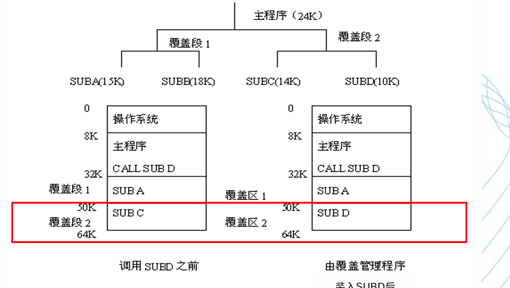
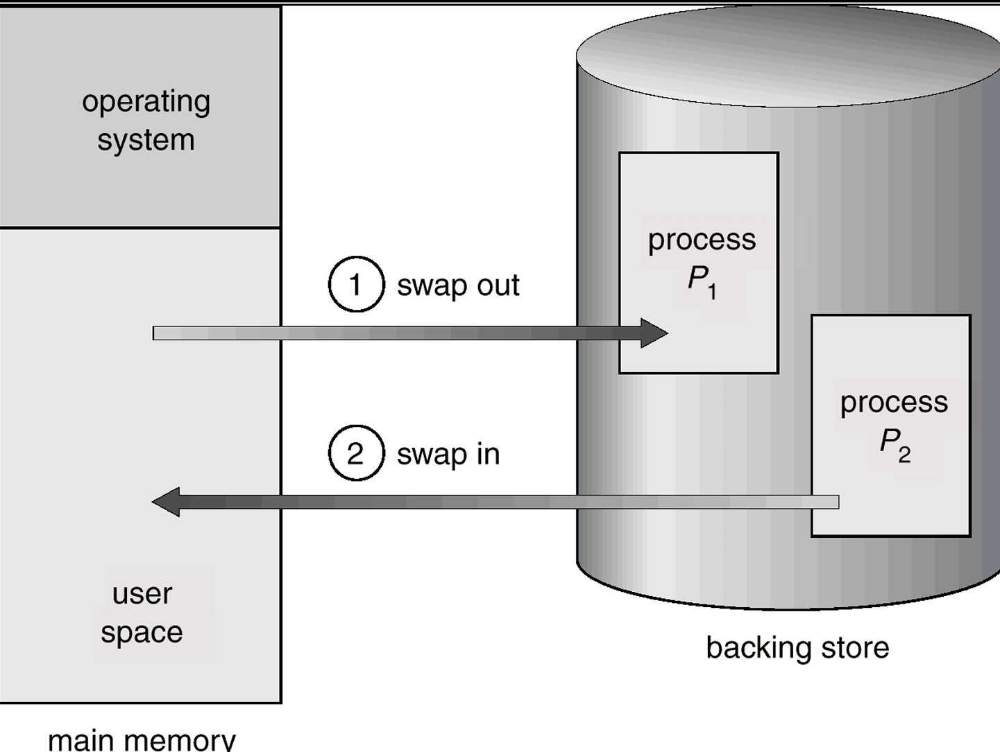
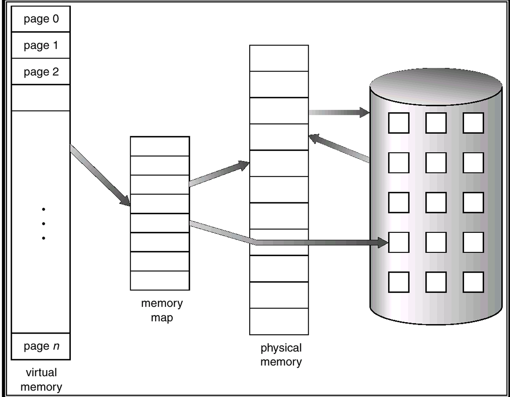
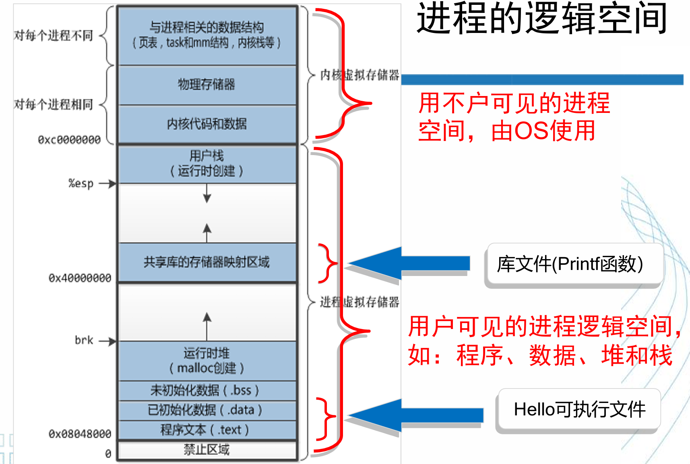

# 📚 虚拟内存管理

---

## 模块一：前置思想 —— 如何突破物理内存的容量限制？
要解决“1G内存如何跑2G程序”的问题，核心思想是**内存的“时空复用”**。早期有两种实现思路：

### 1. 覆盖技术 (Overlay)
*   **思想**：将程序按调用关系分段，**不会同时用到的模块共享同一块内存区域**。
*   **空间分配**：一个覆盖段分配的内存大小，等于该段中**最大模块的大小**。
*   **致命缺点**：**对程序员不友好（不透明）**。程序员必须**手动分析调用关系**并划分覆盖段，极其繁琐，现已基本淘汰。



### 2. 交换技术 (Swapping) 💡[核心机制基础]
*   **思想**：把暂时不用的数据或进程换出到辅存（磁盘），腾出空间给需要的进程，用时再换回。
*   **与覆盖的本质区别**：**交换对程序员是完全透明的**，由操作系统自动在后台完成。
*   **交换策略**：换出“最近不会用到”的进程（如后台等待I/O的进程）；内核核心代码决不能换出。
    * **积极策略 vs 懒惰策略**：懒惰策略就是**直到内存不够时，再交换**。



---

## 模块二：理论基石 —— 局部性原理 💡[必考重点]
*   **时间局部性**：最近被访问过的数据/指令，很快很可能再次被访问（如：循环结构、频繁读写的变量）。
*   **空间局部性**：某个存储单元被访问，其**附近的单元**也很可能马上被访问（如：数组的顺序遍历）。
*   **排序算法**：实际运行时间：堆排序 >> 快排
    *   堆结构的下沉与上浮往往在非连续空间内读取，局部性差，Cache命中率低。
*   **矩阵乘法**：C语言中数组是按行存储的。在矩阵乘法 $C = A \times B$ 中，如果是 `IJK` 循环顺序，由于跳跃访问不同行，空间局部性极差，Cache命中率低；如果改为 `KIJ` 循环顺序（按行顺序访问），空间局部性变好，速度会快出一倍以上。

**IJK版本（一列乘一行-产生一个点）：**
```c
for (i = 0; i < N; i++)
    for (j = 0; j < N; j++) {
        C[i][j] = 0;
        for (k = 0; k < N; k++)
            C[i][j] += A[i][k] * B[k][j]; //一列储存位置相隔，Cache命中率低
    }
```

**KIJ版本（一行乘一列，生成一矩阵，再相加）：**
```c
for (k = 0; k < N; k++)
    for (i = 0; i < N; i++) {
        r = A[i][k]; //把A的数据放在局部变量寄存器，防止多次读入，提高利用率。
        for (j = 0; j < N; j++)
            C[i][j] += r * B[k][j];//同行储存位置邻近，Cache命中率高。(Cache line)
    }
```
**C语言的优化：对于连续多次使用到的同一个值，把它存在临时变量（寄存器）中，加快读取速度。**

---

## 模块三：虚拟存储管理的核心概念 💡[简答/辨析重点]
在之前学过的“实存管理”（如基本分页、分段）中，程序必须**一次性全部装入内存**才能运行。
虚拟存储打破了这一限制：**程序只把现在要用的部分装入，运行中需要哪部分再动态调入**。

### 1. 虚拟存储给进程提供的"幻觉"
它为每个进程提供了一个**大的、一致的、连续的、私有的**地址空间：
*   **大**：容量上限由地址总线位数决定，远超实际物理内存。
*   **一致与连续**：各进程看到统一的内存布局，逻辑上是连续的。
*   **私有**：进程间地址隔离，防止互相篡改。
+ 回顾：虚拟内存把主存作为磁盘的高速缓存

### 2. 虚拟存储的核心原理 💡[必背考点]
* **按需装载**
* **缺页调入**
* **不用调出**: **操作系统**将内存中暂时不使用的页或段调出**保存在外存**上



### 3. 虚拟存储的三大核心特征 💡[必背考点]
+   **离散性**： 物理分配内存的不连续，虚拟地址空间使用的不连续。
*   **多次性**：作业无需一次性全部装入，可分多次调入。【最重要的特征，直接使得内存可以逻辑上扩大】
*   **对换性**：运行中可将暂不使用的内容换出到外存（按需调页）。
*   **虚拟性**：逻辑上扩充了内存容量，用户感觉内存变大了。
*(注：结合《内存管理(3)》笔记，还包含"离散性"特征)*

---

## 模块四：Cache 与 虚拟存储的终极对比 [概念辨析]

| 对比维度 | Cache (高速缓存) | 虚拟存储 (Virtual Memory) |
| :--- | :--- | :--- |
| **解决的核心问题** | **速度差**（填补CPU与主存的速度鸿沟） | **容量问题**（用磁盘扩充物理内存的容量） |
| **所在层次** | 位于 CPU 与 主存 之间 | 位于 主存 与 辅存（磁盘） 之间 |
| **未命中开销** | 极小（仅需几十个时钟周期） | **极大**（毫秒级磁盘I/O，差了几个数量级） |
| **管理者 (透明性)** | 硬件实现（对OS和程序员均**完全透明**） | OS实现（对程序员透明，但**OS需要管理它**） |

---

## 模块五：基本概念与知识框架 [掌握概念]

### 实存管理和虚存管理的概念关系
**实存管理：**
- 分区（Partitioning）（连续分配方式，包括固定分区、可变分区）
- 分页（Paging）
- 分段（Segmentation）
- 段页式（Segmentation with paging）

**虚存管理：**
- 请求分页（Demand paging）—— 主流技术
- 请求分段（Demand segmentation）
- 请求段页式（Demand SWP）

### 基本概念

**1. 进程的逻辑空间（虚拟空间）**
+ 通过**链接器**，将构成进程所需要的所有程序和运行环境，按照规则装配链接形成的**按字节从0开始编址的一个空间**
+ OS的空间称为 **系统空间**



**2. 交换空间（交换文件）**
+ 一段**连续的磁盘空间**，对**用户不可见**
+ 物理内存不够的条件下，OS将内存中暂时用不到的数据存在**交换空间**中，腾出来为其他程序运行

---

## 模块六：进程虚拟地址空间布局 (以32位Linux为例)
理解虚拟内存，必须清楚一个进程在自己眼里的内存长什么样（总共4GB）：

| 地址范围 | 大小 | 用途 | 设计目的 |
|----------|------|------|----------|
| `0 ~ 0x08048000` | ~128MB | **禁止区域** | 捕获空指针（NULL）访问。解引用NULL直接触发页保护错误，而不是读出乱码 |
| `0x08048000 ~ 3GB` | ~3GB | **用户空间** | 存放代码段、数据段、BSS段、堆（Heap）和用户栈 |
| `3GB ~ 4GB` | 1GB | **内核空间** | 存放OS内核代码与数据。**每个进程都共享映射这一段** |

### 设计要点
**为什么内核空间要映射到每个进程的虚拟地址空间中？**
- 系统调用时直接在当前地址空间跳转执行内核代码，**无需切换页表和刷新TLB**，极大提升了性能。

---

## 模块七：请求分页的底层机制 

### 1. 延迟分配 (Lazy Allocation)
现代Linux不提前分配物理内存。创建进程时仅建好地址空间布局；只有当程序**第一次真正访问**某一页，触发了**缺页中断 (Page Fault)**时，OS才会去物理内存分配空间或从磁盘读取数据进内存，这加快了启动速度并节省了内存。

### 2. 映射类型的区分
*   **文件映射 (File-backed)**：如代码段、数据段，不在内存时直接去可执行文件里读。
*   **匿名映射 (Anonymous)**：如堆、栈运行时产生的数据。它们没有对应的磁盘文件，如果被换出，必须写到**交换区 (Swap Space)**中。

### 3. 页表项 (PTE) 的扩充 💡[选择/填空必考]
为了实现虚拟分页，原本只存物理页号的页表项，利用空闲位增加了重要标志位：
*   **存在位 (Present)**：判断该页当前是在物理内存中(1)，还是在外存中(0)。【虚存最重要】
*   **修改位 (Dirty)**：该页调入内存后是否被写过？如果被修改过，换出时**必须写回磁盘**；没修改过则直接丢弃即可。
*   **访问位 (Accessed)**：记录该页最近是否被访问过，是**页面置换算法**（如LRU、Clock）挑选淘汰页面的核心依据。
*   **保护位**：控制读/写/执行权限。

---

## 💡 考试重点总结

| 考点 | 考察形式 |
|------|----------|
| 覆盖 vs 交换 的区别 | 选择题/简答题 |
| 时间局部性 vs 空间局部性 | 选择题，能举例识别 |
| 虚拟存储的四大特征（离散性+三大特征） | 简答题 |
| Cache vs 虚拟存储 的对比 | 辨析题/简答题 |
| 32位Linux进程地址空间布局 | 选择题/简答题 |
| 页表项各个标志位的作用 | 选择题/填空题 |

> 下节课重点：**缺页中断处理过程**和**页面置换算法**（期末考试和面试高频考点）
