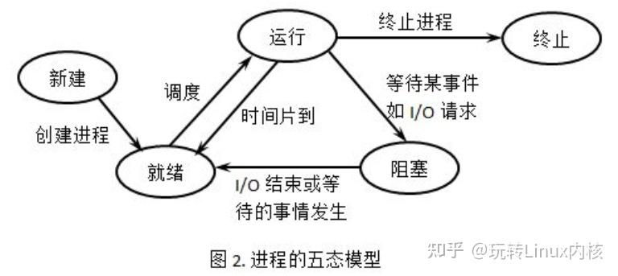

# 📚 《操作系统》第4章：进程与线程 - 听课与复习Notes

## 模块一：程序的并发执行与 Bernstein 条件
**1. 并发与并行的辨析**
*   **并发 (Concurrent)**：两个活动在同一时间段内交替推进（强调“宏观上同时，微观上交替”），单核CPU也能实现。
*   **并行 (Parallel)**：两个程序在同一时刻**真正同时**运行（必须依赖多核/多处理器）。

+ 前驱图（有执行顺序要求的两个程序）
+ 有前驱关系的几个程序不能并发执行
+ 
**2. 程序并发执行的特征**
*   间断性（执行-暂停-执行）、非封闭性（共享资源导致相互影响）、**不可再现性**（结果依赖于执行次序）。

* **竞争**：多个进程，读写一个**共享数据**时，依赖于他们**执行的相对时间（次序）**。
* **竞争条件**：多个进程并发访问和操作某一数据，且执行结果与**访问的特定顺序**有关。
  
**3. Bernstein 条件-并发进程无关的充要条件 💡[重点计算]**
*   **目的**：判断两个进程并发执行时，结果是否**可再现**（即不发生数据竞争的充分条件）。
*   **规则**：设 $R(S)$ 为读集，$W(S)$ 为写集。
    *   若满足 $R(S1) \cap W(S2) = \Phi$ 
    *   且 $W(S1) \cap R(S2) = \Phi$ 
    *   且 $W(S1) \cap W(S2) = \Phi$，
    *   则二者可安全并发。

* 理解：两个进程 **读写互相不冲突，写写不冲突** 

---

## 进程管理的概念 - 原语

**原语（Primitive）**：由若干条指令组成，用于完成特定功能的**原子操作**。

**原子性的核心含义**：
- **不能执行到一半被打断**
- 一旦被分割就会破坏语义完整性

#### 原语 vs 系统调用

| 关系 | 说明 |
|------|------|
| 交集 | 进程控制相关的基本操作几乎都是原语（如fork、exit等） |
| 区别 | 不是所有系统调用都是原语，有些系统调用可以中途暂停后继续执行 |

## 进程管理
+ 目标：提高**开发效率与执行效率** - 更多的动态交互与控制能力：创建、执行、暂停、停止
+ 
## 模块二：进程 (Process) 的核心概念与 PCB
**1. 进程的引入与定义**
*   程序是静态的文件，而**进程是动态的、程序的一次执行**。
*   **对应关系**：一个程序可对应多个进程（如多次打开同一软件）；一个进程可包含多个程序。多个进程可以同时对应到同一个可执行文件。

* **定义**：进程是**可并发执行的程序**在某个**数据集合**上的**一次计算活动**，是OS进行资源分配与调度的**基本单位**
  

+ **程序的一种抽象**，支持程序运行的一种系统机制
+ 一种**数据结构**：把握程序在运行时的动态变化情况
  
**2. 进程的特征 💡[简答/选择重点]**
*   **动态性**（有生命周期）、**并发性**、**独立性**（资源分配的基本单位）、**异步性**（按不可预知的速度推进）、**结构特征**（由代码、数据、**PCB**组成）。

**3. 进程控制块 (PCB) 💡[核心数据结构]**
*   **地位**：PCB是进程管理最重要的结构，进程存在与否的唯一标志。
    *   伴随着进程创建而创建、撤销而撤销
*   **包含内容**：进程标识符(PID)、程序和数据地址、**当前状态**（方便管理相同状态的队列）、**现场保护区**（保存CPU寄存器状态，用于上下文恢复）、优先级、资源清单、链接字（队列中下一个PCB的首地址）等。
【不包含页表，但有页表的指针】
**组织方式**
+ 线性表方式：把所有PCB连续存放在系统区
+ 索引表方式：单独给每个状态的进程PCB建立索引表
+ **链接表方式**：最常用，按状态将PCB连成“就绪队列”、“阻塞队列”等。

**4. 进程与程序的区别与联系**
| 维度 | 进程 | 程序 |
|------|------|------|
| 性质 | 动态的，程序的一次执行 | 静态的，有序代码的集合 |
| 生命周期 | 暂时的，状态变化的过程 | 永久的，可长久保存 |
| 组成 | 程序、数据、进程控制块(PCB) | 仅代码 |
| 对应关系 | 一个程序可对应多个进程（多次执行）；一个进程可包括多个程序（调用关系） | 一个程序可被多次执行产生多个进程 |
---

## 模块三：进程的状态与切换 
**1. 三种基本状态转换【状态机】**
*   **就绪 (Ready)**：万事俱备，只欠CPU。
*   **执行 (Running)**：正在占用CPU。
*   **阻塞/等待 (Blocked/Waiting)**：因等待某事件（如I/O完成、等待输入）而暂停。
*   
*   ⚠️ **期中考试易错点**：进程**不能**直接从“阻塞态”转换到“运行态”，必须先进入“就绪态”等待调度。

> 在单用户系统中，有n个进程，排在就绪队列和阻塞队列中的进程个数的取值范围是：**0~(n-1), 0~n**
>
> 
**2. 进程上下文切换(Context Switch) vs 陷入内核 (Mode Switch)**
+ 注意是“进程”的上下文切换，
**进程上下文切换**：
- 通常由调度器执行
- 保存进程**执行断点**
- 切换内存映射（页表基址、flush TLB）
- 开销相对较大

*   **陷入内核**：
- CPU状态改变
- 由中断、异常、Trap指令（系统调用）引起
- 需要保存执行现场（寄存器、堆栈等）
- 开销相对较小

⚠️ **考试易错点**：
*  系统调用（陷入内核）**不一定会导致进程上下文切换**；
*  从一个进程到另一个进程的上下文切换，**必须在内核模式下执行，陷入内核**操作系统代码才能完成。
*  上下文切换一定需要模态切换，但模态切换不一定是由于切换上下文导致的。

---

## 模块四：进程控制与生命周期

学习几个系统调用，主要任务是**创建**和**撤销**进程，实现**进程的状态转换**。


**1. 创建进程：`fork()` 与 `exec()`**
* 进程图：有向树（表示进程之间的创建关系）
*  `fork()`：**创建一个继承的子进程**。
   *  给子进程分配内存
    *   复制变量、内存、CPU寄存器到子进程里（**有一个特殊的CPU寄存器不复制**）
*   **返回值奇妙之处**：调用一次，返回两次。父进程中**返回子进程的PID**，子进程中**返回0** **【本质是链表的后驱】**。
*   `exec()`：用新程序重写当前进程，PID不改变。
  
*   ⚠️ **父子进程的区别与联系**：`fork` 创建后，父子进程中的同一变量具有**相同的虚拟地址，但真正的物理地址不同**（写时复制机制）【复制的只是虚拟地址，但是是独立的地址空间，父子有自己独立的**页表**】，父子进程不完全相同（如PID等）

**2. 等待进程：`wait()`**
* `wait()`系统调用用于父进程等待子进程的结束：
- 子进程结束时通过`exit()`向父进程返回一个值，唤醒父进程
- 父进程通过`wait()`接受并处理返回值

**2. 僵尸进程 vs 孤儿进程**
*   **僵尸进程**：子进程已通过 `exit()` 退出，但父进程还没调用 `wait()` 回收其PCB。此时状态为 `<defunct>`。
*   **孤儿进程**：父进程先退出，子进程还在运行。孤儿进程会被 `init` 进程（PID=1）收养并负责回收。

**3. 进程退出**
进程结束执行时调用`exit()`，完成进程资源回收：

**exit()系统调用的功能**
- 将调用参数作为进程的"结果"
- 关闭所有打开的文件等占用资源
- 释放内存
- 释放大部分进程相关的内核数据结构
- 保留结果的值，检查是否父进程存活
  - 如没有存活，设置父进程为Root进程（孤儿进程）
- 进入僵尸（zombie/defunct）状态，等待父进程回收

---

## 模块五：线程 (Thread) 的引入与模型
**1. 为什么需要线程？**
*   进程的痛点：地址空间隔离导致通信（IPC）不便，且创建、切换的系统开销极大。
*   **线程定义**：线程是进程的一部分，是**进程内的指令执行流**，是**处理机（CPU）调度的基本单位**（而进程是资源分配的基本单位）。
*   **理解：进程包含资源拥有者 + 可执行单元**
    *   **而线程就是那个可执行单元**：分离了资源与计算，提高**并发效率**

**2. 线程的”共享”与”私有” ⚠️[必考辨析]**
*   **共享**：同一进程内的所有线程共享地址空间（代码段、数据段/全局变量、打开的文件、堆）。
*   **私有**：每个线程**必须拥有独立的栈**（保存局部变量）、**独立的寄存器上下文和程序计数器(PC)**。

**3. 进程与线程的对比与关系 💡[核心概念梳理]**

| 对比维度 | 进程 (Process) | 线程 (Thread) |
|---------|---------------|---------------|
| **核心角色** | **资源分配的基本单位** | **CPU调度/执行的基本单位** |
| **角色分离** | 资源拥有者（地址空间、文件、I/O等） | 指令流执行单元（分离资源与计算） |
| **拥有资源** | 完整资源平台：虚空间、进程映像、文件、I/O空间、处理机保护 | 仅独享必要资源：寄存器、栈、程序计数器、运行状态 |
| **关系** | 一个进程可包含**多个线程** | 线程是进程的一部分，隶属于某个进程 |
| **并发性** | 进程间可并发 | 同一进程内的多个线程也可并发 |
| **状态** | 就绪、执行、阻塞三种基本状态 | 同样具有就绪、执行、阻塞三种基本状态 |
| **上下文切换开销** | 较大（需切换内存映射、flush TLB） | 较小（同一地址空间内切换） |
| **通信/共享** | 需通过IPC机制通信 | 共享同一地址空间，通信方便 |
| **崩溃影响** | 一个进程崩溃不影响其他进程（地址空间隔离） | 一个线程崩溃会导致**整个进程的所有线程崩溃**（C/C++） |

**线程：协同容易，小而轻所以并发性高，栈私有，无法独立运行。**

**进程与线程的关系总结：**
* ✅ 一个进程中可以同时存在多个线程
* ✅ 各个线程之间可以并发执行
* ✅ 各个线程之间可以共享地址空间和文件等资源
* ❌ 当进程中的一个线程崩溃时，会导致其所属进程的所有线程崩溃

**4. 线程的实现模型 💡[核心机制]**

---

### 三种映射模型的图示

```
(a) 用户级线程 = 多对一 (Many-to-One)
用户空间  ↻ ↻ ↻  （三个线程由库管理）
          └──┼──┘
内核空间     ↻    （内核只看到一个进程）
             P

(b) 内核级线程 = 一对一 (One-to-One)
用户空间  ↻   ↻   ↻
          │   │   │
内核空间  ↻   ↻   ↻   （每个线程内核都可见）
           \  |  /
              P

(c) 混合模型 = 多对多 (Many-to-Many)
用户空间  ↻ ↻ ↻ ↻ ↻  （5个用户线程）
          │ │  │ │
内核空间  ↻ ↻  ↻ ↻    （映射到4个内核线程）
          P    P
```

---

### 一、用户级线程 (ULT) → 多对一模型

**原理**：线程在**用户空间**由线程库管理，**对OS内核透明**（内核只看到一个进程）。
> **对应映射模型**：多对一 (Many-to-One) → 多个用户级线程映射到同一个内核线程

**线程库功能**：创建/销毁线程、调度、保存恢复上下文、消息传递。

✅ **优点**：
- 线程切换与内核无关，切换极快（Null Fork: 34μs）
- 调度由应用决定，易优化
- 可运行在任何OS上，只需线程库支持

❌ **缺点**：
- 一个线程发起系统调用被阻塞，**整个进程所有线程都会被阻塞**
- 无法利用多核CPU真正并行（内核只能把CPU分配给进程）


---

### 二、内核级线程 (KLT) → 一对一模型

**原理**：由OS内核直接创建和管理，**每个用户线程对应一个内核线程**。
> **对应映射模型**：一对一 (One-to-One) → 每个用户线程都有独立的内核线程与之对应
> **多线程内核**：支持内核线程的OS内核，内核自身也可多线程并发。

✅ **优点**：
- 阻塞发生在**线程级别**：一个线程阻塞不影响其他线程，并发能力强。
- 能在多核CPU上真正**并行**运行
- 内核中的处理也可通过多线程实现

❌ **缺点**：
- 线程切换需要内核参与，涉及模态切换
- 开销较大（Null Fork: 948μs，是用户级的28倍）
- 降低效率

**典型实现**：Windows、Linux、Solaris、Mac OS X

---

### 三、混合实现 → 多对多模型

**原理**：线程在用户空间创建和管理，同时实现**用户线程到内核线程的映射****（m ≤ n）。**
> **对应映射模型**：多对多 (Many-to-Many) → n个用户级线程映射到m个内核级线程

✅ **优点**：
- 集两者之长：既保留用户线程的轻量级（多对一），又避免单线程阻塞全盘（一对一）
- 克服了多对一模型并发度不高的缺点
- 克服了一对一模型占用太多内核线程、开销太大的缺点

---

### 核心对比总结 ⚠️[辨析题必背]

| 对比维度 | 用户级线程 (ULT) | 内核级线程 (KLT) |
|---------|----------------|----------------|
| **内核是否可见** | ❌ 内核不可感知 | ✅ 内核可感知 |
| **创建/撤销/调度** | 用户级线程库处理 | 需内核提供支持 |
| **系统调用阻塞** | 整个进程被阻塞 | 仅该线程被阻塞 |
| **CPU调度单位** | 进程 | 线程 |
| **多核并行** | ❌ 无法实现 | ✅ 可以实现 |
| **切换开销** | 小（34μs） | 大（948μs） |
| **运行态** | 仅用户态 | 用户态+内核态 |

> **经典延迟数据（参考）**：进程创建 11,300μs >> 内核线程 948μs >> 用户级线程 34μs

---

## 🧠 本章核心逻辑串讲（复习必看）

### 主线：从"并发需求"到"线程实现"的演进路径

```
并发问题 → 第一层抽象（进程）→ 第二层抽象（线程）
    ↓           ↓                    ↓
  区别并行     有状态/PCB          三种实现
```

| 问题 | 关键词一句话记忆 |
|-----|----------------|
| **并发与并行的区别** | 并发 = 交替推进（宏观同时），并行 = 真·同时运行（多核） |
| **引入进程的目的** | 管理并发：解决"程序vs计算"不对应、多道程序资源竞争 |
| **进程与程序的区别** | 程序 = 静态代码，进程 = 动态执行 + 拥有资源，有生命周期 |
| **进程的状态与控制** | 就绪→执行→阻塞三态流转【状态机模型】，PCB管理，fork/exit/wait控制 |
| **引入线程的目的** | 进程切换太重！把"资源拥有者"和"执行流"拆开 |
| **线程与进程的区别** | 进程 = 资源分配单位，线程 = CPU调度单位，共享地址空间 |
| **线程的实现方法** | 谁管线程？用户级（ULT/多对一）→ 内核级（KLT/一对一）→ 混合管（多对多） |

---

### 思考题解析

#### 1. 区分：父进程、子进程 vs 主程序、子程序

| 维度 | 父/子进程（Process） | 主/子程序（Program） |
|------|---------------------|---------------------|
| **本质** | 两个独立进程，各有PCB、PID、地址空间 | 同一程序内的代码调用关系 |
| **运行** | 可并发执行，OS调度 | 串行调用，子程序返回才继续 |
| **资源** | 独立地址空间、独立栈 | 共享同一地址空间、同一栈 |
| **生命周期** | 父死子不一定死（孤儿进程被收养） | 子程序退出一定回到主程序 |
| **典型操作** | `fork()` 创建 | 函数调用 `call` |

> **一句话**：父子进程是OS层面两个独立实体，主子程序是语言层面的调用关系。

---

#### 2. 一个进程进入阻塞状态，其执行断点保存在什么地方？如何恢复执行？

**保存位置**：**进程PCB的现场保护区**（不是栈，也不是内核公共区域）

**保存过程**：
```
进程发起I/O进入阻塞
    ↓
把CPU寄存器（PC、栈指针、通用寄存器）
全部保存到该进程PCB的"现场保护区"
    ↓
进程从运行态→阻塞态，让出CPU
```

**恢复过程**：
```
等待事件发生（I/O完成），中断唤醒进程
    ↓
进程从阻塞态→就绪态，等待调度
    ↓
调度器选中，把PCB中保存的寄存器值
重新写回CPU物理寄存器（包括PC）
    ↓
进程从断点无缝继续执行
```

> **考点点睛**：每个进程自己的PCB保存自己的上下文，这也是进程切换开销大的原因。
