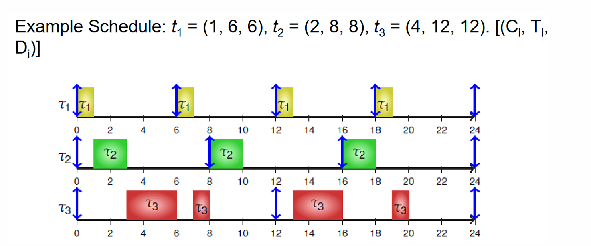
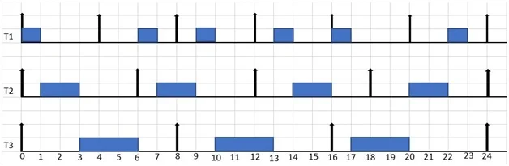
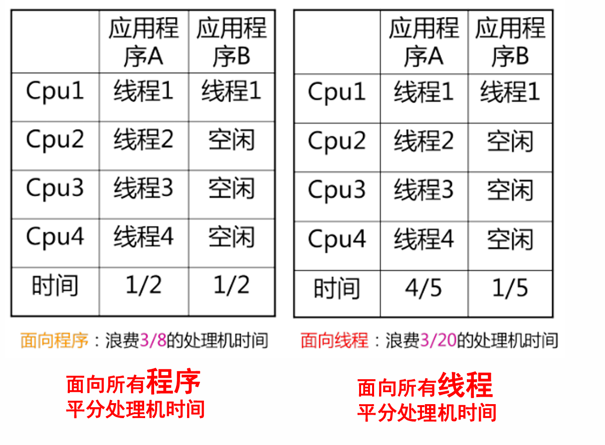
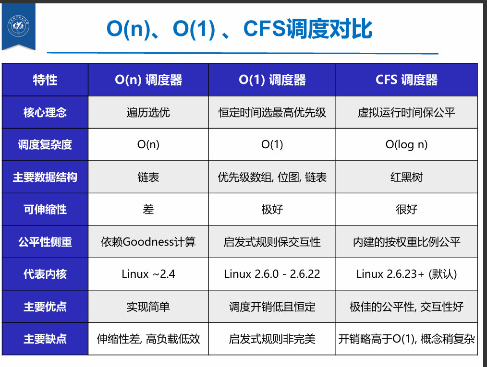

# 进程调度

## 📚 模块一：CPU调度基础与上下文切换

### 1. 调度的基本概念

CPU调度的核心任务是控制、协调多个进程对CPU的竞争。系统需要按照一定的策略（调度算法），从就绪队列中选择一个进程，并把CPU的控制权交给被选中的进程。

### 2. 调度的层次与时机 (When)

#### 高中低级调度区分

* **高级调度（作业调度）**：决定接纳哪些作业进入内存。


* **中级调度（内外存交换）**：将进程的部分或全部换出到外存，或将所需部分换入内存。


* **低级调度（进程/线程调度）**：决定哪个就绪进程获得CPU，执行频繁，要求极高效率。


#### 触发调度的核心事件

只要OS取得对CPU的控制，进程切换就可能发生，严谨的触发场景包括：

* **用户调用**：来自程序的显式请求（如系统调用），进程多半会被阻塞。


* **陷阱 (Trap)**：最末一条指令导致出错，引起进程移至退出状态。


* **中断 (Interrupt)**：外部硬件或时钟触发，控制权转移至中断处理程序。


* **其他时机**：新进程创建、进程运行完毕、进程因I/O或信号量阻塞时。


### 3. 进程与上下文切换 (Context Switch)

从一个进程到另一个进程的上下文切换，**必须在内核模式下执行**操作系统代码才能完成。

```text
当前运行进程 ──▶ 中断/陷阱/调用发生 ──▶ 保存当前处理器上下文 (PC及其他寄存器)
                                          │
                                          ▼
                                用新状态更新正在运行进程的PCB
                                          │
                                          ▼
                                把进程移至合适的队列 (就绪/阻塞)
                                          │
                                          ▼
                                选择另一个要执行的新进程
                                          │
                                          ▼
                                 更新被选中进程的PCB (新状态等)
                                          │
                                          ▼
恢复新进程上下文 ◀── 从被选中进程中重装入CPU上下文 ◀──┘

```

#### 切换的开销成本

* **直接开销**：保存/恢复寄存器、切换地址空间等。


* **间接开销 (常考)**：高速缓存(Cache)、缓冲区缓存以及TLB失效导致的性能下降。


* **【特别补充】**：同一进程创建的子线程内，地址空间共享。这意味着像程序代码段长度这样的属性在进程内的所有线程间是共享的，因此在这些线程间进行切换时，免去了切换地址空间的巨大开销，效率远高于跨进程的上下文切换。


---

## ⚖️ 模块二：调度性能准则与进程分类

### 1. 面向不同视角的调度指标 💡[计算题基础]

| 性能指标 | 定义与公式说明 | 适用场景 |
| --- | --- | --- |
| **周转时间** | 作业从提交到完成（得到结果）所经历的时间。| 批处理系统|
| **带权周转时间** | 周转时间 / 要求服务时间（实际执行时间）。| 批处理系统|
| **响应时间** | 用户输入一个请求到系统给出首次响应的时间。| 分时/交互式系统|
| **吞吐量** | 单位时间CPU完成的作业数量。| 批处理系统
| **截止时间** | 最早开始时间和最晚完成时间。保证在一定时间内完成。| 实时系统|
| **利用率与均衡** | 处理机忙碌时间/总时间；CPU-Bound与I/O-Bound的搭配。| 大中型主机|

+ **注**：周转时间与吞吐量不是倒数关系，

### 2. 进程的分类

根据资源的占用特点与交互需求，进程（【按照原理、计算模拟甘特图、优劣势分析、适用场景与系统】需要明确区分）可分为：

* **A. 资源需求**：
* **CPU-bound (CPU密集型)**：计算量大，需要大量的CPU时间。


* **I/O-bound (I/O密集型)**：频繁进行I/O，花费大量时间等待I/O操作完成。


* **B. 交互性**：
* **批处理进程**：无需与用户交互，后台运行，以CPU-bound为主。


* **交互式进程**：与用户交互频繁，要求响应快，以I/O-bound为主。


* **实时进程**：不能被低优先级阻塞，响应时间必须短且稳定（如视频/音频）。


---

## 🔄 模块三：经典批处理与交互式调度算法

### 1. 批处理系统的经典算法

| 算法名称 | 抢占性 | 核心机制与公式 | 优缺点分析 |
| --- | --- | --- | --- |
| **FCFS (先来先服务)** | 非抢占式| 按到达顺序执行。类比页面调换的FIFO。| **优点**：简单，性能开销小。<br>**痛点**：有利于长作业和CPU繁忙型；**极度不利于短作业和I/O繁忙型**（导致设备闲置）。|
| **SJF (最短作业优先)** | 非抢占式 | 优先调度执行时间最短的进程。| **优点**：最小化平均周转时间，提高**吞吐量**。<br> **缺点**：对长作业不利（可能饥饿）、难以准确估计作业时间。|
| **SRTF (最短剩余时间优先)** | 抢占式| 若新到达进程剩余时间比当前进程短，直接抢占CPU。| **缺点**：源源不断的短作业会导致长作业长时间得不到运行（饥饿）。|
| **HRRF (最高响应比优先)** | 非抢占式 | **RP = 1 + (已等待时间 / 要求运行时间)**。| **优势**：FCFS和SJF的折中。长作业随等待时间增加，RP提升，**避免了饥饿现象**。<br> **缺点**：每次调度需重新计算RR，性能开销大。|

### 2. 交互式系统的调度算法

#### 时间片轮转 (RR - Round Robin)

* **机制**：按照FCFS排队，为每个进程分配时间片($q$)，耗尽则强制抢占并放入队尾。流程包括：排队、轮转、中断、抢占、出让（主动）。

**时间片长度($q$)的权衡【知道清楚，我们设计的目的】**：


* **过长**：退化为FCFS算法，进程在一个时间片内执行完，响应时间长。


* **过短**：一次请求需多个时间片，上下文切换频繁，系统开销大，响应时间长。


* **定量关系**：预设系统响应时间 $T(响应时间) = N(进程数目) \times q(时间片)$，即 $q = \frac{T}{N}$。同时也受**CPU执行速度**等**系统处理能力**影响。


#### 优先级调度 (Priority Scheduling)

* **静态优先级**：创建进程时确定，直到终止不改变。依据进程类型、资源需求等划分。


* **动态优先级**：运行中可自动改变。例如等待时间延长则提升优先级，执行完时间片则降低优先级。


#### 多级反馈队列 (MLFQ - Multi-level Feedback Queue) ⚠️[核心机制]
+ **在RR与优先级调度的基础上，综合升级**

MLFQ是现代操作系统的基石，在不知道进程执行长度的情况下优化周转时间与响应时间。

```text
       【新进程进入】
            │
            ▼
 队列1 (高优先级, 时间片 S1) ──▶ 若时间片用完未结束 ──▶ 降级 
            │ (若I/O阻塞则出让)                       │
            ▼                                        ▼
 队列2 (中优先级, 时间片 S2) ──▶ 若时间片用完未结束 ──▶ 降级
            │ (S2 > S1)                              │
            ▼                                        ▼
 队列3 (低优先级, 按 FCFS)  ◀────────────────────────┘

```

* **精妙规则**：
1. 高优先级队列先执行；同级内部采用RR轮转。


2. 新进程直接放入最高优先级队列（优先视作交互式短任务）。


3. **降级机制**：用完该层的时间片后，优先级立刻下降一级。级别越低，时间片长度越长，使得每个进程能找到合适的运行周期。


4. **优先级提升(Boost)**：每隔时间 $S$，将**所有**进程重新移入最高优先级，一举解决长作业饿死问题，并适应进程行为的动态变化。


### 3. 公平共享调度与 Linux 演进 (了解)

**公平共享调度**
* **彩票调度 (Lottery)**：发“彩票”随机抽奖，短期存在不确定性。


* **步幅调度 (Stride)**：计算 `Stride = MaxStride / ticket`，每次累加给 `Pass`，调度器选择 `Pass` 最小的进程执行，具有确定性。


* **Linux CFS (完全公平调度器) 💡[现行Linux标准]**：摒弃传统队列，为每个进程维护**虚拟运行时间 (vruntime)**，使用**红黑树**管理（复杂度 $O(\log n)$），永远选择最左侧（vruntime最小）的进程执行。


---

## 🚀 模块四：实时系统与多处理机调度

### 1. 实时系统与调度算法

实时系统要求计算机必须在**确定的时间范围**内做出反应（硬实时要求绝对满足，软实时可偶尔不满足）。
**重点：要感知优先级，本质是调整不同任务的offset，由于实时，因此可调度是有条件的**。

**任务集参数预设**：
假设任务集 $S = \{t_1, t_2, t_3, \dots, t_n\}$：

* 周期为 $T_1, T_2, \dots, T_n$
* 执行时间为 $C_1, C_2, \dots, C_n$ (且 $C_i < T_i$)
* 截至周期(deadline)为 $D_1, D_2, \dots, D_n$，通常令 $D_i = T_i$
* CPU利用率：$U = \sum_{i=1}^n \frac{C_i}{T_i}$
* 前提：任务独立，上下文切换可忽略。

#### RMS vs EDF 对比表

| 调度算法 | 优先级类型 | 调度核心原则 | 可调度充分条件 | 优缺点分析 |
| --- | --- | --- | --- | --- |
| **RMS (单调速率调度)** | 静态优先级| **周期越短，优先级越高**。抢占式。| $\sum \frac{C_i}{T_i} \le n(\sqrt[n]{2} - 1)$<br> | **优**：单处理器下静态优先级最优算法。<br> **缺**：CPU利用率有理论上限（约69%），部分长周期任务可能错过ddl。|
| **EDF (最早截止期优先)** | 动态优先级| **绝对截止时间越近，优先级越高**。抢占式。| $\sum \frac{C_i}{T_i} \le 1$<br> | **优**：理论上可达100%利用率。<br>**缺**：实现复杂，过载行为难预测。|

**RMS**


**EDF**


* **LLF (最低松弛度优先)**：松弛度 = 进程最晚开始时间 - 当前时间。紧急度越高越优先。


### 2. 优先级倒置 (Priority Inversion) ⚠️[高频名词解释]

* **现象定义**：高优先级任务A想获取资源锁被低优先级任务C占用，而中优先级任务B抢占了C的CPU，导致A被无限期延迟（如NASA火星车故障）。


* **解决方案**：
* **优先级置顶 (Priority Ceiling)**：进入临界区的进程，其优先级自动提至所有可能申请该资源进程的最高优先级（不允许被抢占）。


* **优先级继承 (Priority Inheritance)**：低优先级进程C临时“继承”被它阻塞的高优先级进程A的优先级，直到释放资源。


### 3. 多核与多处理机调度 (Multi-Processor)

多处理机调度注重整体运行效率，且必须处理访问OS数据结构时的互斥问题。

* **AMP (非对称式多处理)**：多个处理器地位不同，采用主从架构（例如：神威·太湖之光）。


* **SMP (对称式多处理)**：处理器地位相同。


* **自调度 (单队列)**：整个系统有一个公共的就绪队列，每个处理机从中选取进程。可能存在Cache切换开销与队列同步开销。


* **MQMS (多队列)**：每个处理机有独立的就绪队列。


* **Gang Scheduling (成组调度)**：将一个进程内的一组线程，同时分派到一组处理机上，或同时剥夺。



* **多核性能优化策略**：


* **Cache 亲和性 (Cache Affinity)**：尽量让进程保持在同一个CPU上运行，避免Cache失效惩罚。
* **负载平衡 (Load Balance)**

**平衡负载的方法：**
* **推：工作迁移 (Work Migration)**：OS周期性检验，将超载CPU队列的进程“推”到空闲CPU。
* **拉：工作窃取 (Work Stealing)**：空闲CPU主动去繁忙CPU的队列中“偷”任务执行。


## 模块五：Linux 调度算法 (了解)

---

## 💡 模块五：考试指南与易错梳理

### 1. 期中易错概念补充 🔍

* **系统调用**：由程序（软件）主动产生，属于内部异常/软中断。


* **中断**：由硬件/外设被动触发，与当前执行的指令无关。


* **分时操作系统**：例如 Unix，其核心设计目标是优化用户的交互**响应时间**，而非仅仅追求批处理系统那样的吞吐量。


* **Belady 现象**：在采用 FIFO 等不合理的页面置换算法时，分配给进程的物理页面数增加，缺页中断次数反而增加的异常现象。


### 2. 【题型1】给定调度算法计算作业性能值表

解此类大题的标准流程：

* **第一步：判断抢占性**。确认所给算法（如FCFS、SJF、SRTF、HRRF）是抢占式还是非抢占式。


* **第二步：绘制甘特图**。每次作业完成（或被抢占）时，**必须仔细分析一遍当前就绪队列中所有进程的指标**（尤其是HRRF，每次调度都要重新计算响应比）。


* **或者，对于非抢占式，可以选择计算列表项**。构建严谨的表格，严格依照公式计算：
`提交时间 | 运行时间 | 调度顺序 | 开始时刻 | 等待时间 | 完成时刻 | 周转时间 | 带权周转时间`。