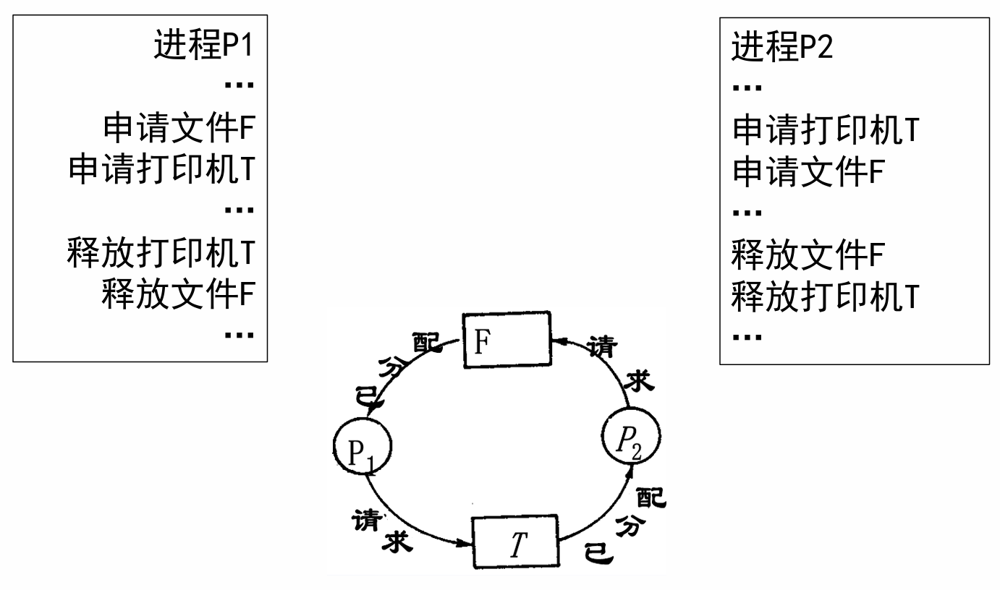

# 死锁

## 📚 一、死锁的基本概念

### 死锁（Deadlock）定义

一组进程中，**每个进程都无限等待被该组进程中另一进程所占有的资源**，因而永远无法得到资源、无法继续推进，这种现象称为**进程死锁**，这一组进程称为**死锁进程**。

更口语化地说：
+ 每个进程都在等别人释放资源；
+ 别人也在等本组中其他进程释放资源；
+ 没有外力介入时，这组进程永远无法继续运行。

### 死锁产生的原因

| 原因 | 含义 | 典型场景 |
| --- | --- | --- |
| 资源竞争 | 多个进程竞争有限资源 | 打印机、磁带机、锁、信号量 |
| 推进顺序不当 | 并发执行次序不合理，互相等待 | P 占读卡机等打印机，Q 占打印机等读卡机 |
| PV / 锁使用不当 | 信号量或锁的申请、释放顺序错误 | 在持有 `mutex` 时阻塞等待 `empty/full` |

### 经典例子：打印机与读卡机

设系统中只有一台打印机和一台读卡机：

| 进程 P | 进程 Q |
| --- | --- |
| 请求读卡机 | 请求打印机 |
| 请求打印机 | 请求读卡机 |
| 释放读卡机 | 释放读卡机 |
| 释放打印机 | 释放打印机 |

若 P 已占有读卡机、等待打印机；Q 已占有打印机、等待读卡机，则二者互相等待，形成死锁。



### 锁顺序不当导致死锁

```c
void proc_A(void) {
    lock(A);
    lock(B);
    /* Critical Section */
    unlock(B);
    unlock(A);
}

void proc_B(void) {
    lock(B);
    lock(A);
    /* Critical Section */
    unlock(A);
    unlock(B);
}
```

若 `proc_A` 已获得锁 A、等待锁 B；`proc_B` 已获得锁 B、等待锁 A，就会形成循环等待。

---

## 🏗️ 二、资源竞争与死锁条件

### 资源使用模式

资源通常按照以下模式使用：

```text
申请 → 分配 → 使用 → 释放
```

当资源数量有限，并且进程在申请、释放顺序上处理不当时，就可能出现死锁。

### 资源类型

| 类型 | 含义 | 例子 | 死锁风险 |
| --- | --- | --- | --- |
| 可抢占资源 | 获得后可以被系统或其他进程剥夺 | CPU【上下文切换机制支持】、内存 | 较低 |
| 不可抢占资源 | 分配后不能强行收回，只能由进程自行释放 | **磁带机、打印机** | 较高 |
| 临时性资源 / 可消耗资源 | 一个进程产生，另一个进程使用，使用后消失 | 消息、中断 | 取决于请求/释放顺序 |

### 临时性资源竞争示例

`S1`、`S2`、`S3` 是消息资源。

不会死锁的顺序：

```text
P1: Release（S1）；Request（S3）；
P2: Release（S2）；Request（S1）；
P3: Release（S3）；Request（S2）；
```

可能死锁的顺序：

```text
P1: Request（S3）；Release（S1）；
P2: Request（S1）；Release（S2）；
P3: Request（S2）；Release（S3）；
```

原因：三个进程都先请求别人尚未释放的消息，形成：

```text
P1 等 S3 → P3 等 S2 → P2 等 S1 → P1
```

### PV 操作使用不当产生死锁

生产者—消费者问题中：

+ `full` 表示满缓冲区数量，初值为 0；
+ `empty` 表示空缓冲区数量，初值为 N；
+ `mutex` 用于互斥访问缓冲区，初值为 1；
+ `full + empty == N`。

错误写法：

```text
生产者：P(mutex) → P(empty) → 放入数据 → V(full) → V(mutex)
消费者：P(mutex) → P(full)  → 取出数据 → V(empty) → V(mutex)
```

若缓冲区为空，消费者先获得 `mutex`，再执行 `P(full)` 时阻塞。此时生产者拿不到 `mutex`，无法生产数据，于是死锁。

正确思想：**先判断资源数量，再进入互斥区**。

```text
生产者：P(empty) → P(mutex) → 放入数据 → V(mutex) → V(full)
消费者：P(full)  → P(mutex) → 取出数据 → V(mutex) → V(empty)
```

### 哲学家进餐问题

```text
P(chopstick[i]);
P(chopstick[(i+1)mod 5]);
eat
V(chopstick[i]);
V(chopstick[(i+1)mod 5]);
think
```

如果五个哲学家同时拿起右边筷子，再等待左边筷子，就会形成环路等待，发生死锁。

### 死锁发生的四个必要条件【重点】

| 条件 | 含义 | 例子 |
| --- | --- | --- |
| 互斥条件 | 资源一次只能被一个进程排他性使用 | 打印机 |
| 请求和保持条件 | 已占有资源，又请求新资源，同时不释放已有资源 | P 占读卡机等打印机 |
| 不剥夺条件 | 资源使用完之前不能被强行剥夺 | 打印机不能被系统强行抢走 |
| 环路等待条件 | 多个进程形成循环等待链 | 哲学家进餐 |

```text
互斥 + 请求和保持 + 不剥夺 + 环路等待
        ↓
四个必要条件同时成立 → 可能发生死锁
```

注意：
+ 这四个条件是死锁的**必要条件**；
+ 破坏任意一个条件，就可以预防死锁；
+ 四个条件同时具备时，不一定已经死锁，但系统具备死锁可能性。

### 活锁与饥饿

| 概念 | 含义 | 例子 |
| --- | --- | --- |
| 活锁（Livelock） | 没有阻塞，但一直重复尝试、失败、再尝试 | 三人进窄门，都退让后又同时尝试 |
| 饥饿（Starvation） | 因资源分配策略不公平，某些进程长时间等待 | SJF 下长作业可能一直等不到 CPU |

活锁和死锁的区别：死锁表现为阻塞等待；活锁中的实体仍在不断改变状态。

---

## ⚖️ 三、处理死锁的基本方法

```text
处理死锁
├── 不允许死锁发生
│   ├── 死锁预防：静态方法，设计时破坏死锁条件
│   └── 死锁避免：动态方法，分配前判断是否安全
└── 允许死锁发生
    ├── 死锁检测与解除：出问题后处理
    └── 无所作为：鸵鸟算法
```

| 方法 | 核心思想 | 发生时机 | 特点 |
| --- | --- | --- | --- |
| 死锁预防 | 破坏四个必要条件之一 | 系统设计时 | 保证不死锁，但限制强 |
| 死锁避免 | 分配前判断是否会进入不安全状态 | 运行时 | 更灵活，但需要额外信息和算法开销 |
| 死锁检测与解除 | 允许死锁发生，之后检测并恢复 | 运行时 | 资源利用率高，但恢复有代价 |
| 鸵鸟算法 | 假装死锁不会发生 | 始终 | 简单，但死锁后可能长期阻塞 |

---

## 🚫 四、死锁预防：破坏必要条件

死锁预防是**静态策略**：通过限制资源申请方式，使死锁四个必要条件不能同时成立。

### 预防死锁的四个方向

| 破坏条件 | 方法 | 评价 |
| --- | --- | --- |
| 互斥条件 | 允许资源共享，或通过代理执行 | 很多资源本身不能共享 |
| 请求和保持条件 | 一次性申请全部资源 | 简单但资源利用率低 |
| 不剥夺条件 | 允许系统抢占资源 | 对 CPU、内存较可行，对打印机等较难 |
| 环路等待条件 | 按资源编号递增申请 | 较常用，资源利用率相对较好 |

### 1. 打破互斥条件

允许进程同时访问某些资源。例如只读文件可被多个进程同时读；打印机可通过 **SPOOLing 技术**让多个打印请求先进入磁盘缓冲区，再由打印进程统一输出。

局限：打印机、磁带机等资源本身具有排他性，不能真正同时使用。

### 2. 打破请求和保持条件

实行资源预先分配策略：

```text
能满足全部需求 → 一次性分配全部资源
不能满足全部需求 → 不分配任何资源
```

这样不会出现“已占有一些资源，又申请其他资源”的情况。

缺点：
+ 进程运行中需要哪些资源可能不可预测；
+ 资源利用率低，很多暂时不用的资源被提前占用；
+ 降低并发性。

### 3. 打破不剥夺条件

当进程已占有某些资源，又申请新资源但不能立即满足时，释放其已经占有的全部资源，以后再重新申请。

缺点：实现困难，可能需要回滚现场；对打印机等不可抢占资源不适用。

### 4. 打破环路等待条件

实行**资源有序分配策略**：给所有资源编号，要求进程按编号递增顺序申请。

```text
资源编号：R1 < R2 < R3 < ... < Rn
进程申请：只能从小号资源申请到大号资源
```

示例：PA 使用 `R1 → R2`，PB 原本使用 `R2 → R1`。若规定 `R1` 编号小于 `R2`，则 PB 也必须按 `R1 → R2` 申请，从而避免环路等待。

| 优点 | 缺点 |
| --- | --- |
| 能有效破坏环路等待 | 需要给资源合理编号 |
| 比一次性申请的资源利用率更高 | 限制进程自然申请顺序 |

---

## 🚀 五、死锁避免：安全状态与银行家算法

### 死锁避免的核心思想

死锁避免是**动态策略**：不直接破坏死锁必要条件，而是在每次资源分配前检查“分配后系统是否仍安全”。

```text
进程请求资源
      ↓
试探性分配并检查安全性
      ↓
安全：正式分配
不安全：撤销分配，让进程等待
```

| 对比 | 死锁预防 | 死锁避免 |
| --- | --- | --- |
| 类型 | 静态策略 | 动态策略 |
| 核心 | 破坏死锁必要条件 | 保持系统处于安全状态 |
| 典型方法 | 资源有序分配法 | 银行家算法 |

### 安全序列

所谓系统是安全的，是指系统中的所有进程能够按照某一种次序分配资源，并依次运行完毕，这种进程序列称为**安全序列**。

对于序列中的每个进程 `Pi`，若它还需要的资源可以由：

```text
当前可用资源 + 前面进程运行结束后释放的资源
```

满足，则该序列是安全序列。

### 安全状态、不安全状态与死锁状态

| 状态 | 含义 | 与死锁关系 |
| --- | --- | --- |
| 安全状态 | 存在安全序列 | 一定不会死锁 |
| 不安全状态 | 不存在安全序列 | 可能死锁，但不一定已经死锁 |
| 死锁状态 | 进程已经循环等待，无法推进 | 一定不安全 |

```text
死锁状态 ⊂ 不安全状态
安全状态一定不会死锁
不安全状态不一定已经死锁
```

### 安全状态简例

某类资源总数为 12：

| 进程 | 已有资源 | 最大需求 | 尚需资源 |
| --- | --- | --- | --- |
| A | 3 | 9 | 6 |
| B | 2 | 4 | 2 |
| C | 2 | 7 | 5 |

当前空闲：`12 - (3 + 2 + 2) = 5`。

可以先满足 B，再满足 C，最后满足 A，因此存在安全序列：

```text
<B, C, A>
```

系统处于安全状态。

### 银行家算法【重点】

银行家算法用于死锁避免。思想类似银行贷款：不能把资源分配到使系统无法满足所有进程最终需求的程度。

#### 数据结构

| 名称 | 含义 |
| --- | --- |
| `Available` | 当前每类资源的可用数量 |
| `Max` | 每个进程对每类资源的最大需求 |
| `Allocation` | 当前已经分配给每个进程的资源数量 |
| `Need` | 每个进程还需要的资源数量，`Need = Max - Allocation` |
| `Request_i` | 进程 `Pi` 当前请求的资源数量 |

#### 安全性算法

```text
1. Work = Available
2. Finish[i] = false
3. 找一个未完成且 Need[i] <= Work 的进程 Pi
4. 若找到：Work = Work + Allocation[i]，Finish[i] = true，继续找
5. 若找不到：
   - 所有 Finish 为 true：系统安全
   - 否则：系统不安全
```

流程：

```text
Work = Available
      ↓
找 Need[i] <= Work 的未完成进程
      ├── 找到：假设完成，释放资源，继续
      └── 找不到：看是否所有进程完成
                  ├── 是：安全
                  └── 否：不安全
```

#### 资源请求判断

当进程 `Pi` 发出 `Request_i`：

```text
1. Request_i <= Need_i？否则出错
2. Request_i <= Available？否则等待
3. 试探性分配：
   Available = Available - Request_i
   Allocation_i = Allocation_i + Request_i
   Need_i = Need_i - Request_i
4. 执行安全性算法：
   安全 → 正式分配
   不安全 → 撤销分配，Pi 等待
```

一句话：**不是“有资源就分配”，而是“有资源且分配后仍安全”才分配。**

### 银行家算法的限制

+ 需要预先知道每个进程的最大资源需求；
+ 每次请求都要运行安全性算法，有一定开销；
+ 最大需求在真实系统中不一定容易获得。

---

## 🔍 六、死锁检测与解除

### 基本思想

死锁检测与解除允许系统进入死锁状态，之后再检测并恢复：

```text
正常分配资源 → 定期/必要时检测死锁 → 发现死锁后解除
```

适合死锁概率较低、系统不希望过度限制资源分配的场景。

### 资源分配图

| 图中元素 | 含义 |
| --- | --- |
| 圆形节点 `Pi` | 进程 |
| 方形节点 `Rj` | 资源类型 |
| `Pi → Rj` | 请求边：进程 Pi 正在请求资源 Rj |
| `Rj → Pi` | 分配边：资源 Rj 已经分配给进程 Pi |

```text
请求边：Pi ─────▶ Rj
分配边：Rj ─────▶ Pi
```

### 资源分配图与死锁判断

| 资源实例数 | 判断规则 |
| --- | --- |
| 每类资源只有一个实例 | 有环路 ⇔ 有死锁 |
| 每类资源有多个实例 | 有环路不一定死锁；无环路一定无死锁 |

多实例资源系统通常需要进一步用资源分配图化简或检测算法判断。

### 死锁检测算法思想

检测算法与银行家算法的安全性算法类似：

```text
能满足某进程当前请求 → 假设该进程完成并释放资源 → 继续化简
```

最后：
+ 所有进程都能化简：无死锁；
+ 剩余不能化简的进程集合：可能处于死锁。

| 对比 | 银行家算法 | 死锁检测 |
| --- | --- | --- |
| 目的 | 分配前避免进入不安全状态 | 分配后判断是否已经死锁 |
| 需要信息 | 最大需求 `Max` | 当前请求与当前分配 |
| 输出 | 请求能否分配 | 哪些进程可能死锁 |

### 解除死锁的方法

| 方法 | 思路 | 代价 |
| --- | --- | --- |
| 撤销进程 | 终止一个或多个死锁进程，释放资源 | 可能丢失工作 |
| 资源抢占 | 从某些进程手中抢占资源 | 需要回滚，可能较复杂 |
| 进程回退 | 恢复到之前的安全检查点 | 需要系统支持检查点 |

选择牺牲进程时通常考虑：进程优先级、已运行时间、还需时间、已占资源数量、回滚代价、是否会导致饥饿等。

### 鸵鸟算法

鸵鸟算法：**无所作为，假装死锁不会发生**。

适用场景：死锁发生概率极低，检测和恢复代价高于偶发死锁本身的代价。

---

## 💡 七、考试指南与易错点

### 高频考点速查

| 考点 | 答题关键词 |
| --- | --- |
| 死锁定义 | 一组进程、无限等待、等待本组其他进程占有的资源 |
| 四个必要条件 | 互斥、请求和保持、不剥夺、环路等待 |
| 死锁预防 | 破坏四个必要条件之一 |
| 死锁避免 | 安全状态、银行家算法、分配前判断 |
| 安全/不安全/死锁关系 | 死锁一定不安全，不安全不一定死锁 |
| 资源分配图 | 单实例有环即死锁；多实例有环不一定死锁 |

### 易错点

1. **不安全状态 ≠ 死锁状态**

```text
死锁状态 ⊂ 不安全状态
```

2. **银行家算法发现“安全”不等于所有线程现实中一定马上完成**  
   它只说明存在一个理论上的安全序列。

3. **PV 操作不能先拿 `mutex` 再等 `empty/full`**

```text
错误：P(mutex) → P(empty/full)
正确：P(empty/full) → P(mutex)
```

原因：如果进程在持有 `mutex` 的情况下阻塞，其他进程无法进入临界区改变条件。

### 银行家算法解题模板【考试重点】

```text
1. Need = Max - Allocation
2. 检查 Request_i <= Need_i，Request_i <= Available
3. 试探性分配：
   Available'  = Available - Request_i
   Allocation' = Allocation_i + Request_i
   Need'       = Need_i - Request_i
4. 从 Available' 出发找安全序列
5. 有安全序列 → 可分配；无安全序列 → 不可分配
```

### 资源分配图化简模板

```text
找请求可被 Available 满足的进程
→ 假设其完成并释放资源
→ 更新 Available
→ 重复
→ 全部可化简则无死锁；剩余进程为死锁相关进程
```

---

## 🔄 八、本章小结

### 一句话总结

死锁的本质是：

```text
多个进程因竞争不可抢占资源，并在不合理推进顺序下形成循环等待，导致系统无法继续推进。
```

### 总框架

```text
死锁
├── 原因：资源竞争、推进顺序不当、PV/锁使用不当
├── 条件：互斥、请求和保持、不剥夺、环路等待
└── 处理：预防、避免、检测与解除、鸵鸟算法
```

### 最需要记住的关系

```text
安全状态：一定不死锁
不安全状态：可能死锁
死锁状态：一定不安全
```
