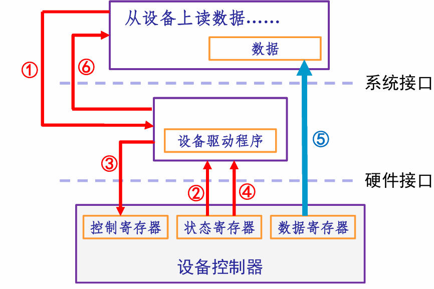
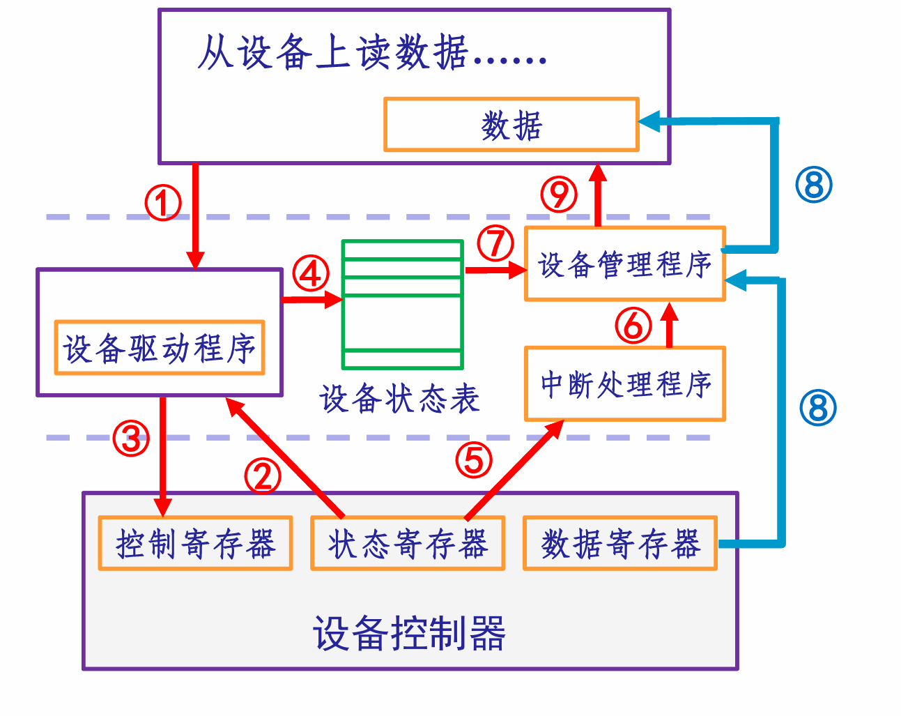
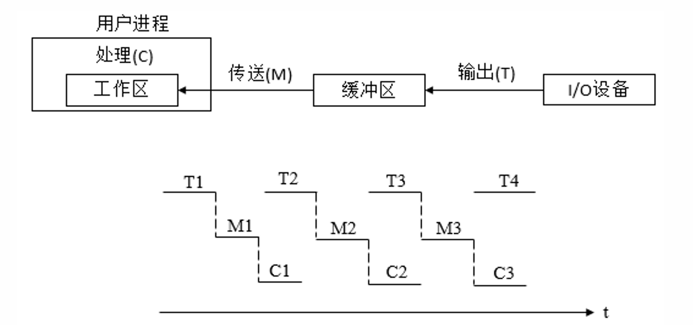
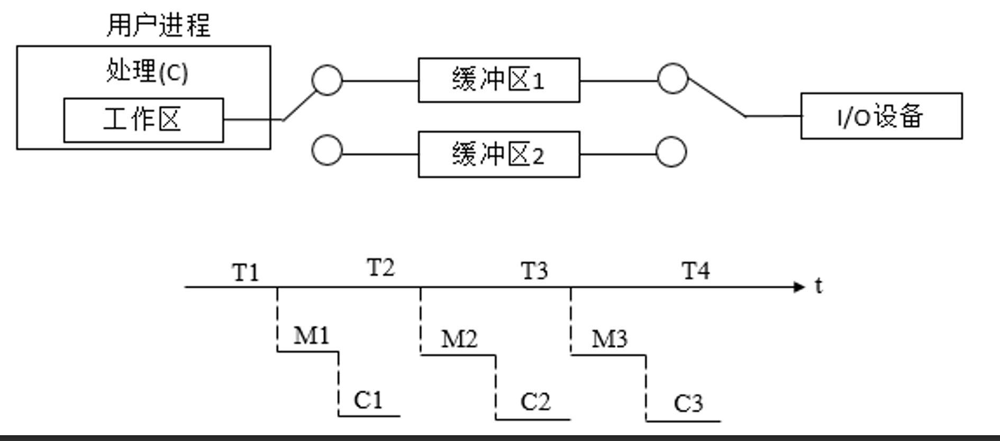

# 第五章 I/O 管理（1）

本笔记依据回放内容、课程 PPT 与期末复习重点整理，重点关注：I/O 管理概述、I/O 硬件机制、I/O 控制方式、I/O 软件层次、缓冲技术与设备管理基础。

---

### 📚 一、I/O 管理概述：为什么操作系统要管 I/O？

#### 1. I/O 管理的核心问题

I/O 设备种类繁多、速度差异巨大、控制接口复杂，因此 I/O 性能经常成为系统性能瓶颈。操作系统需要在用户进程与硬件设备之间建立统一抽象，完成设备访问、控制、分配、缓冲和错误处理。

**bus：系统总线**

总线是接入 I/O 设备的主要方式：

$$
总线带宽 = 频率 \times 宽度\ \text{byte/sec}
$$

不同输入系统传输速率差异巨大，例如键盘只有约 `10B/s`，而 PCI 总线可达到数百 `MB/s`。这种速度差异决定了 I/O 管理必须考虑缓冲、并行和异步机制。

#### 2. 设备管理目标

| 目标 | 含义 |
| --- | --- |
| 提高效率 | 提高 I/O 访问效率，匹配 CPU 与多种外设的速度差异 |
| 方便使用 | 对不同设备提供统一接口，使用户无需关心硬件细节 |
| 方便控制 | 方便 OS 增加、删除、控制设备，适应新设备类型 |
| 提高并行性与安全性 | 提高 CPU 与 I/O 设备并行能力，同时保护设备传输的数据 |

#### 3. I/O 管理的主要功能

| 功能 | 说明 |
| --- | --- |
| 用户接口 | 提供命令接口和编程接口，如系统调用 |
| 设备分配和释放 | 使用设备前，需要分配设备、控制器、通道等资源 |
| 设备访问和控制 | 包括并发访问、差错处理和设备控制 |
| I/O 缓冲和调度 | 通过缓冲、调度提高 I/O 效率 |
| 中断处理 | 设备完成操作后，通过中断通知 CPU |

#### 4. I/O 设备分类

##### （1）按传输速度分类

I/O 设备速度差异很大：键盘、鼠标等低速设备；磁盘、网卡等高速设备；总线、存储接口等更高速设备。

##### （2）按信息交换单位分类


| 类型 | 信息交换单位 | 典型设备 | 特点 |
| --- | --- | --- | --- |
| 块设备 | 数据块 | 磁盘、磁带、光驱 | 传输速率较高，可寻址，支持随机读写 |
| 字符设备 | 字符 | 键盘、鼠标、串口、某些 USB 设备 | 传输速率较低，通常不可寻址 |
| 网络设备 | 数据包/帧 | 以太网、WiFi、蓝牙 | 依赖 MAC/IP 等地址，面向通信 |

##### （3）按共享属性分类

| 类型 | 含义 | 例子 |
| --- | --- | --- |
| 独占设备 | 一段时间内只能由一个进程使用 | 打印机、磁带机 |
| 共享设备 | 允许多个进程交叉使用 | 硬盘 |
| 虚设备 | 在一类设备上模拟另一类设备 | 用 SPOOLing 将打印机变成共享设备 |

---

### 🏗️ 二、I/O 硬件机制：CPU 如何控制设备？

#### 1. I/O 设备的组成

I/O 设备通常由两部分组成：

1. **机械部分**：设备本身，即物理装置；
2. **电子部分**：设备控制器或适配器。

设备控制器负责连接 CPU 和具体设备，是 OS 控制设备的关键抽象。

#### 2. 设备控制器


设备控制器的核心作用是通过寄存器与 CPU 交互：

| 寄存器 | 作用 |
| --- | --- |
| 数据寄存器 | 暂存 CPU 与设备之间交换的数据 |
| 控制寄存器 | 接收 CPU 发来的控制命令 |
| 状态寄存器 | 报告设备当前状态，如忙、闲、完成、出错 |

设备控制器的功能包括：

- 接收和识别 CPU 命令；
- 完成 CPU 与控制器、控制器与设备之间的数据交换；
- 了解并报告设备状态；
- 识别设备地址；
- 提供硬件缓冲；
- 对设备传来的数据进行差错检测。

#### 3. I/O 端口地址与寄存器寻址

I/O 端口地址是接口电路中每个寄存器的唯一地址。CPU 对设备寄存器的访问主要有两种方式：

| 编址方式 | 说明 | 优点 | 缺点 |
| --- | --- | --- | --- |
| 内存映像编址（MMIO） | 将设备寄存器映射为物理内存地址的一部分，通过 load/store 访问 | 普通内存访问指令即可操作设备寄存器；保护机制较自然 | 设备寄存器不能被 cache |
| I/O 独立编址（PMIO） | I/O 端口有独立地址空间，如 Intel `in/out` 指令 | 外设不占用内存地址空间；容易区分内存操作和 I/O 操作 | 指令类型少，操作不灵活 |

在许多 RISC 架构中，常通过内存映射 I/O 访问设备寄存器，即设备寄存器与内存复用地址总线，通过特定物理地址范围访问设备。

#### 4. 为什么设备寄存器不能走 cache？

设备寄存器的读取不能经过 cache。例如在 MIPS 架构中，不走 cache 的地址段对应 `kseg1`。

原因：设备寄存器反映的是硬件实时状态。如果第一次读取设备状态后被放入 cache，之后 CPU 可能一直读到 cache 中的旧值，而不是设备的真实状态，导致无法正确检测设备是否完成或是否出错。

```text
CPU 读取设备状态寄存器
        │
        ▼
如果走 cache：
        │
        ├─ 第一次读取：从设备寄存器取值，并缓存
        │
        └─ 后续读取：可能直接读 cache 旧值 ❌

正确做法：
        │
        ▼
设备寄存器所在地址区设置为不可缓存
每次都直接访问真实设备状态 ✅
```

---

### 🚀 三、I/O 控制方式：CPU 干预如何逐步减少？

【四种控制方式（流程，是什么）， CPU干预程度对比，有什么样的特点，适合于什么样的场景，不适用于什么场景】  

四种方式按 CPU 干预程度由高到低依次为：

1. 程序控制 I/O（PIO，轮询方式）；
2. 中断驱动 I/O；
3. DMA；
4. 通道控制方式。

#### 1. PIO：程序控制 I/O（轮询方式）

PIO（Programmed I/O）也称程序控制 I/O 或轮询方式。控制过程中，CPU 会不断测试设备是否完成执行过程，因此适合数据变化慢、数据产生快、数据量小的简单设备。



##### PIO 工作流程

```text
应用程序提出 I/O 请求
        │
        ▼
设备驱动检查设备状态
        │
        ▼
设备正常 → 发出控制命令
        │
        ▼
CPU 不断轮询设备状态
        │
        ├─ 未完成：继续等待/查询
        │
        └─ 已完成：取回数据
        │
        ▼
应用程序继续执行
```

##### PIO 特点

| 方面 | 内容 |
| --- | --- |
| CPU 干预程度 | 最高，CPU 全程轮询和搬运数据 |
| 优点 | 硬件简单，编程容易 |
| 缺点 | CPU 忙等，浪费 CPU 时间；开销与数据量成正比 |
| 适合场景 | 简单、小型、低速、数据量小的设备 I/O |
| 不适合场景 | 高速设备、大批量数据传输 |

#### 2. 中断驱动 I/O

+ 中断驱动方式中，CPU 发出 I/O 命令后，将请求状态记录在设备状态表中，然后继续执行其他工作；
+ 设备完成后主动发出中断通知 CPU。中断处理程序识别到这是控制命令完成信号后，交由设备管理程序查询设备状态表，再提交结果、传回数据或唤醒进程。



中断驱动需要维护额外的数据结构，即**设备状态表**，用于记录 I/O 请求与设备执行状态。

##### 中断驱动工作流程

```text
用户程序提出 I/O 请求
        │
        ▼
设备驱动检查设备状态
        │
        ▼
设备准备好 → 发出控制命令
        │
        ▼
将请求状态记录到设备状态表
        │
        ▼
CPU 继续执行其他任务
        │
        ▼
设备完成 I/O 后发出中断
        │
        ▼
中断处理程序识别完成信号
        │
        ▼
设备管理程序查询设备状态表
        │
        ▼
提交结果/传回数据/唤醒进程
```

##### 中断驱动特点

| 方面 | 内容 |
| --- | --- |
| CPU 干预程度 | 中等，发起和完成时需要 CPU，中间可并行执行其他任务 |
| 优点 | 避免 CPU 忙等，提高 CPU 利用率 |
| 缺点 | 每次中断需要保护和恢复现场；中断频繁时开销大 |
| 适合场景 | 比较复杂、速度不太高、事件驱动明显的 I/O 设备 |
| 不适合场景 | 每个字符/每个字节都中断的高速大数据传输 |

#### 3. DMA：直接存储访问方式

DMA（Direct Memory Access）让 DMA 控制器负责内存与外设之间的数据块传输。CPU 只负责开始前设置参数，完成后响应中断。

##### DMA 控制器寄存器

| 寄存器 | 作用 |
| --- | --- |
| 命令/状态寄存器 CR | 接收 CPU 命令，保存控制信息或设备状态 |
| 内存地址寄存器 MAR | 保存内存起始地址 |
| 数据寄存器 DR | 暂存设备与内存之间传输的数据 |
| 数据计数器 DC | 保存本次要传输的字节数或字数 |

##### DMA 基本流程

```text
CPU 设置 DMA 控制器参数
  ├─ 内存起始地址 MAR
  ├─ 传输字节数 DC
  ├─ 传输方向
  └─ 控制命令 CR
        │
        ▼
CPU 发起 I/O 操作后继续执行其他任务
        │
        ▼
DMA 控制器接管总线
        │
        ▼
设备 ↔ 内存 成批传输数据
        │
        ▼
传输完成后 DMA 控制器发出中断
        │
        ▼
CPU 响应中断并进行后续处理
```

##### 读取磁盘数据例子

```text
1. 设备驱动收到读取磁盘数据到内存地址 X
2. 设备驱动控制磁盘控制器从磁盘读取数据
3. 磁盘控制器初始化 DMA 传送
4. 磁盘控制器传送数据到 DMA 控制器
5. DMA 控制器传送 C 字节数据到内存地址 X
6. DMA 控制器完成数据传送后，产生中断请求，通知 CPU 传送完成
```

##### DMA 特点

| 方面 | 内容 |
| --- | --- |
| CPU 干预程度 | 较低，只在开始和结束时干预 |
| 优点 | 成批数据传输不需要 CPU 搬运，适合高速设备 |
| 缺点 | 传输方向、内存地址、数据长度等仍由 CPU 设置；设备增加时可能需要更多 DMA 控制器 |
| 适合场景 | 磁盘、网卡等高速块传输设备 |
| 不适合场景 | 极简单设备或数据量很小的 I/O |

#### 4. 通道控制方式（Channel）

通道是进一步减少 CPU 干预的机制。它本质上是一个专门负责输入输出的处理器，有自己的指令和程序，可以执行由通道指令组成的通道程序。

##### 通道基本思想

```text
CPU 构造通道程序
        │
        ▼
CPU 启动通道
        │
        ▼
通道执行通道程序
        │
        ├─ 控制多个 I/O 操作
        ├─ 管理设备传输
        └─ 与 CPU 分时使用内存
        │
        ▼
完成后中断通知 CPU
```

##### 通道类型

| 类型 | 工作方式 | 适用设备 |
| --- | --- | --- |
| 字节多路通道 | 以字节为单位交叉服务多个设备 | 打印机、终端等低速/中速设备 |
| 数组选择通道 | 每次为一台设备传送一批数据，速率高 | 磁盘、磁带等高速设备 |
| 数组多路通道 | 结合分时交叉与高速批量传输 | 多个高速设备并行工作场景 |

#### 5. DMA 与中断方式的区别

| 比较点 | 中断驱动方式 | DMA 方式 |
| --- | --- | --- |
| 中断时机 | 每个数据传送完成后可能中断 CPU | 一批数据传输完成后才中断 CPU |
| 数据传送者 | CPU 在中断处理时控制完成 | DMA 控制器直接在主存和设备间传输 |
| CPU 开销 | 频繁中断时开销较大 | CPU 只负责开始和结束，开销较小 |
| 适用对象 | 复杂设备、低中速设备、异常事件处理 | 高速设备、数据块传输 |

#### 6. I/O 四种控制方式综合对比

| 控制方式 | CPU 干预程度 | 数据传输主体 | 优点 | 缺点 | 适合场景 |
| --- | --- | --- | --- | --- | --- |
| PIO/轮询 | 最高 | CPU | 硬件简单，编程容易 | CPU 忙等，效率低 | 简单、低速、小数据量设备 |
| 中断驱动 | 较高 | CPU | CPU 不必忙等，利用率提高 | 中断频繁时开销大 | 低中速、事件驱动型设备 |
| DMA | 较低 | DMA 控制器 | 成批传输，CPU 开销小 | 需要 DMA 控制器，参数仍需 CPU 设置 | 磁盘、网卡等高速块设备 |
| 通道 | 最低 | 通道处理器 | 可执行通道程序，控制多组 I/O | 硬件复杂，费用高 | 大型机、多设备复杂 I/O 系统 |

💡 **线索：** 这四种方式体现的是“CPU 逐步摆脱 I/O”的过程：

```text
PIO：CPU 一直等
        ▼
中断：CPU 不等，但数据仍由 CPU 处理
        ▼
DMA：一批数据由 DMA 搬运
        ▼
通道：连传输控制逻辑也交给专用处理器
```

---

### 🔄 四、I/O 软件层次：从用户请求到硬件执行

#### 1. 驱动程序的本质

驱动程序的本质是：把设备文件的读写转化为对数据寄存器、控制寄存器、状态寄存器的读写。也就是说，用户看到的是文件或统一接口，而驱动程序面向具体设备控制器，通过读写寄存器来真正控制硬件。

#### 2. I/O 相关软件的层次关系 【重点！】


PPT 中的 I/O 软件层次可整理如下：

| 层次 | 名称 | 功能 |
| --- | --- | --- |
| 4 | 用户进程 | 使用 I/O 系统调用，进行格式化 I/O |
| 3 | 设备无关软件 | 命名、保护、阻塞、缓冲、设备分配 |
| 2 | 设备驱动程序 | 设置设备寄存器，检测设备状态 |
| 1 | 中断处理程序 | I/O 结束时处理中断，唤醒设备服务子程序 |
| 0 | 硬件 | 执行实际 I/O 操作 |

#### 3. I/O 请求处理过程

```text
用户进程
  │ 发出 read/write 等 I/O 请求
  ▼
系统调用进入内核
  │
  ▼
设备无关软件
  ├─ 逻辑设备名转换
  ├─ 权限保护
  ├─ 缓冲管理
  └─ 设备分配
  │
  ▼
设备驱动程序
  ├─ 检查设备状态寄存器
  ├─ 写控制寄存器发出命令
  └─ 准备数据寄存器或 DMA 参数
  │
  ▼
硬件设备执行 I/O
  │
  ▼
完成后产生中断
  │
  ▼
中断处理程序保存结果并通知驱动
  │
  ▼
驱动/内核 I/O 子系统唤醒进程并返回结果
```

#### 4. 设备独立性

设备独立性是指用户程序使用逻辑设备名，而系统实际执行时将逻辑设备名映射到物理设备名。

| 概念 | 含义 |
| --- | --- |
| 逻辑设备 | 用户程序看到的设备名，如 `/dev/printer` |
| 物理设备 | 实际硬件设备，如某台具体打印机 |
| LUT | 逻辑设备表，用于逻辑设备名到物理设备名的映射 |

逻辑设备表 LUT 的典型表项：

| 逻辑设备名 | 物理设备名 | 驱动程序入口地址 |
| --- | --- | --- |
| `/dev/tty` | 3 | 1024 |
| `/dev/printer` | 5 | 2046 |

#### 5. 设备驱动程序的组成与特点

| 组成 | 作用 |
| --- | --- |
| 自动配置和初始化子程序 | 检测设备是否存在、是否正常，并初始化相关状态 |
| I/O 操作子程序 | 响应系统调用，执行具体 I/O 操作 |
| 中断服务子程序 | 接收硬件中断，完成善后处理，唤醒阻塞进程 |

设备驱动程序的特点：

- 是内核的一部分，错误可能导致系统严重问题；
- 与具体设备特性紧密相关；
- 与 I/O 控制方式紧密相关；
- 需要向内核提供标准接口；
- 可动态加载和卸载。

---

### ⚖️ 五、I/O 缓冲管理：匹配速度差异、减少中断、提高并行性

#### 1. 为什么需要缓冲？

缓冲技术的直接目标是**提高外设利用率**，通过在设备与进程之间设置缓冲区来组织数据传输。

缓冲技术的目的：

- 匹配CPU和外设的不同处理速度
- 减少CPU的中断数
- 提高CPU与I/O外设的**并行性**

缓冲可以理解为把原本零散的数据进行分组，类似“取号排队”：先把数据归组进入缓冲区，再由 CPU 或设备按节奏处理，从而减少双方互相等待。

从效果上看，缓冲类似 CPU 流水线：让 CPU 处理、设备输入、数据复制尽可能重叠，从而提高**数据的吞吐**。

#### 2. 缓冲的代价：多次复制

缓冲的主要代价是可能造成一个数据包在设备、缓冲区与用户区之间来回复制，即**多次复制**。


网络数据传输中可能存在多次复制：

```text
发送方向：用户空间 → 内核空间 → 网络控制器 → 网络
接收方向：网络 → 网络控制器 → 内核空间 → 用户空间
```

缓冲提高了并行性和吞吐，但也可能带来额外拷贝成本。

#### 3. 单缓冲

单缓冲只有一个缓冲区，CPU 与外设轮流使用该缓冲区，因此 I/O 输入与向 CPU 传输在同一时刻只能进行一个。

单缓冲中，每次 I/O 请求分配一个缓冲区。设：

| 符号 | 含义 |
| --- | --- |
| T | 设备输入数据到缓冲区的时间 |
| M | 从缓冲区传送数据到用户工作区的时间 |
| C | 用户进程处理数据的时间 |

由于 `T` 和 `C` 可以并行，单缓冲每块数据处理时间为：

$$
\max(C,T)+M
$$

单缓冲可以形成一定的 pipeline：CPU 处理当前数据块时，I/O 设备可以向缓冲区传输下一块数据。因此，每一块数据处理时间取决于设备输入时间 `T` 和 CPU 处理时间 `C` 中较大的一个，再加上缓冲区到用户区的数据移动时间 `M`。



##### 单缓冲流程图

```text
第 i 块数据：
设备输入到缓冲区 T
        │
        ▼
缓冲区复制到用户区 M
        │
        ▼
CPU 处理 C

流水效果：
CPU 处理第 i 块数据时，设备可输入第 i+1 块数据
但只有一个缓冲区，仍存在轮流使用限制
```

#### 4. 双缓冲

双缓冲中，CPU 与外设都可以连续处理，无需频繁等待对方。

双缓冲设置两个缓冲区，使设备可以向一个缓冲区输入数据，同时 CPU 处理另一个缓冲区中的数据。

具体来说，I/O 设备向第一块缓冲区填入数据后，即可继续向第二块缓冲区填数据；同理，CPU 处理完第一块数据后，也可以尝试从另一个缓冲区读入数据。



双缓冲时，系统处理一块数据的时间可粗略认为是：

$$
\max(C+M,T)
$$

| 情况 | 效果 |
| --- | --- |
| `C < T` | 可使块设备连续输入，设备不必频繁等待 CPU |
| `C > T` | 可使 CPU 不必等待设备输入 |

#### 5. 循环缓冲

循环缓冲是多个缓冲区组成的环形队列，适用于 CPU 和外设速度差异较大、双缓冲仍不够的场景。

对于输入循环缓冲，通常有三类缓冲区：

| 缓冲区类型 | 含义 |
| --- | --- |
| R：空缓冲区 | 可供输入进程写入数据 |
| G：已装满数据的缓冲区 | 可供计算进程读取 |
| C：工作缓冲区 | 计算进程当前正在使用 |

对应指针：

| 指针 | 作用 |
| --- | --- |
| Nexti | 指示输入进程下次可用的空缓冲区 R |
| Nextg | 指示计算进程下一个可用的满缓冲区 G |
| Current | 指示计算进程当前正在使用的工作缓冲区 C |

```text
          ┌──────────┐
          │ Buffer 1 │
          └────┬─────┘
               │
               ▼
┌──────────┐  ┌──────────┐  ┌──────────┐
│ Buffer 4 │◄─┤ Buffer 2 │─►│ Buffer 3 │
└──────────┘  └──────────┘  └──────────┘
     ▲                         │
     └─────────────────────────┘

输入进程：沿环寻找空缓冲区 R 写入
计算进程：沿环寻找满缓冲区 G 读取
```

#### 6. 缓冲池

当系统中有大量 I/O 进程时，如果每个进程都使用专用循环缓冲，会消耗大量内存且利用率不高。因此引入缓冲池，使多个进程共享一组缓冲区。

缓冲池中的队列：

| 队列 | 含义 |
| --- | --- |
| 空缓冲队列 emq | 存放空闲缓冲区 |
| 输入队列 inq | 存放装满输入数据的缓冲区 |
| 输出队列 outq | 存放装满输出数据的缓冲区 |

---

### 💡 六、设备管理、SPOOLing 

#### 1. 设备管理中的关键数据结构

设备分配是对进程使用外设过程的管理。一个完整的 I/O 数据通路可能包括：设备 → 控制器 → 通道。

##### （1）DCT：设备控制表

每个设备一张 DCT（Device Control Table），描述设备特性和状态。

| 字段 | 说明 |
| --- | --- |
| 设备类型 type | 设备类型标识 |
| 设备标识符 deviceid | 设备唯一标识 |
| 设备状态 | 等待/不等待/忙/闲 |
| 指向控制器表的指针 | 指向该设备连接的控制器 |
| 重复执行次数或时间 | 出错时允许重传的次数 |
| 设备队列的队首指针 | 等待该设备的进程队列 |

##### （2）COCT：控制器控制表

每个设备控制器一张 COCT（Controller Control Table），描述 I/O 控制器配置和状态。

常见字段：控制器标识符、控制器状态、与控制器连接的通道表指针、控制器等待队列队首/队尾指针。

##### （3）CHCT：通道控制表

每个通道一张 CHCT（Channel Control Table），描述通道工作状态。

常见字段：通道标识符、通道状态、连接的控制器表首址、通道队列队首/队尾指针。

##### （4）SDT：系统设备表

SDT（System Device Table）反映系统中所有设备资源的状态，记录所有设备及其 DCT 入口。

| 字段 | 说明 |
| --- | --- |
| DCT 指针 | 指向相应设备的 DCT |
| 设备使用进程标识 | 当前正在使用设备的进程 |
| DCT 信息 | 为引用方便保存设备标识、设备类型等信息 |

#### 2. 设备分配过程

```text
用户请求某设备
        │
        ▼
查找系统设备表 SDT
        │
        ▼
找到设备控制表 DCT
        │
        ├─ 设备忙：进程进入设备等待队列
        └─ 设备闲：分配设备
                 │
                 ▼
           查找控制器控制表 COCT
                 │
                 ├─ 控制器忙：进入控制器等待队列
                 └─ 控制器闲：分配控制器
                          │
                          ▼
                    查找通道控制表 CHCT
                          │
                          ├─ 通道忙：进入通道等待队列
                          └─ 通道闲：建立完整 I/O 通路 ✅
```

#### 3. 设备分配时考虑的因素

| 因素 | 内容 |
| --- | --- |
| 设备固有属性 | 独占设备、共享设备、虚拟设备 |
| 分配算法 | 先来先服务、优先级高者优先 |
| 安全性 | 是否可能导致死锁 |

安全分配与不安全分配：

| 类型 | 特点 | 优缺点 |
| --- | --- | --- |
| 安全分配（同步） | 进程发出 I/O 请求后阻塞，直到 I/O 完成 | 可防止死锁，但 CPU 和 I/O 串行，效率低 |
| 不安全分配（异步） | 进程发出 I/O 请求后仍可继续运行并请求其他资源 | 效率高，但需要安全性检查，可能产生死锁 |

#### 4. SPOOLing：把独享设备变成虚拟共享设备

SPOOLing（Simultaneous Peripheral Operations On-Line），即假脱机技术，是一种在硬件设备之上增加软件抽象层的技术。它可以把**独享设备**转变成具有**共享特征**的虚拟设备，本质上是用共享设备模拟独享设备、用高速设备模拟低速设备。

##### SPOOLing 组成

| 组成 | 作用 |
| --- | --- |
| 输入井 | 磁盘上的区域，用于收容输入设备送来的数据 |
| 输出井 | 磁盘上的区域，用于收容用户程序输出数据 |
| 输入缓冲区 | 内存缓冲区，暂存输入设备数据 |
| 输出缓冲区 | 内存缓冲区，暂存输出井送往输出设备的数据 |
| 输入进程 SPi | 模拟脱机输入外围控制机 |
| 输出进程 SPo | 模拟脱机输出外围控制机 |

##### 打印机 SPOOLing 示例

```text
用户进程输出打印内容
        │
        ▼
快速写入磁盘输出井
        │
        ▼
用户进程无需等待真实打印完成，可继续执行
        │
        ▼
打印机空闲时
        │
        ▼
输出进程 SPo 将输出井内容送入输出缓冲区
        │
        ▼
打印机慢速打印
```

##### SPOOLing 特点

| 特点 | 说明 |
| --- | --- |
| 高速虚拟 I/O | 应用程序只需快速写入磁盘队列，不必等待慢速设备 |
| 独享设备共享化 | 多个进程可把作业提交到队列中，设备依次处理 |
| 实际 I/O 与程序执行分离 | 程序的虚拟 I/O 时间和真实设备 I/O 时间分离 |

#### 5. 练习题：中断驱动打印机是否合理？

题目条件如下：

1. 页面参数：每页文本有 50 行，每行 80 个字符；
2. 打印速度：打印机每分钟可打印 6 个页面；
3. 时间忽略项：把字符写入打印机输出寄存器的耗时不计；
4. 中断规则：每打印 1 个字符就发起 1 次中断，单次中断服务需要花费 \(50\ \mu\text{s}\)。

问题：采用中断驱动的 I/O 方式运行这台打印机，方案是否合理？

##### 第一步：计算单页字符数

$$
50 \times 80 = 4000\ \text{个字符}
$$

##### 第二步：计算每分钟打印字符数

$$
6 \times 4000 = 24000\ \text{个字符/分钟}
$$

##### 第三步：将 1 分钟换算为微秒

$$
1 \times 60 \times 10^6 = 6 \times 10^7\ \mu\text{s}
$$

##### 第四步：计算单个字符平均打印时间

$$
\frac{60\times10^6}{24000}=2500\ \mu\text{s}
$$

##### 第五步：计算中断开销占比

单次中断服务耗时 \(50\ \mu\text{s}\)，因此：

$$
\frac{50}{2500} \times 100\% = 2\%
$$

##### 结论

中断对 CPU 的占用仅为单字符打印周期的 2%，开销很低，不会频繁加重 CPU 的负担，因此使用中断驱动 I/O 的方案是合理的。

💡 **解题模板：**

```text
1. 先算每个数据单位的平均产生/处理周期
2. 再算每次中断服务时间
3. 用 中断服务时间 / 数据单位周期 得到 CPU 开销占比
4. 占比较低 → 中断驱动合理
   占比较高 → 中断过频，应考虑缓冲或 DMA
```
---

### ✅ 本章速记总结

1. I/O 管理的本质是：在用户进程和复杂硬件设备之间建立统一、安全、高效的抽象。
2. 设备控制器通过数据寄存器、控制寄存器、状态寄存器与 CPU 交互。
3. 内存映射 I/O 不能对设备寄存器使用 cache，否则会读到过期状态。
4. 四种 I/O 控制方式体现 CPU 干预程度逐步降低：PIO → 中断 → DMA → 通道。
5. I/O 软件采用分层结构：用户进程、设备无关软件、设备驱动、中断处理、硬件。
6. 缓冲技术用于匹配 CPU 和外设速度，减少中断，提高并行性，但会带来多次复制成本。
7. SPOOLing 用软件层抽象把独享设备改造成具有共享特征的虚拟设备。
