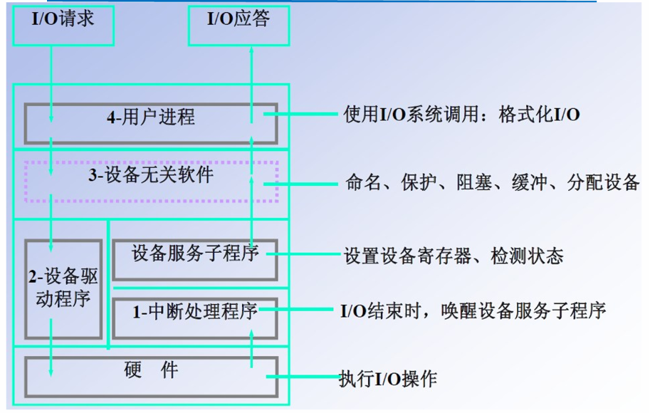
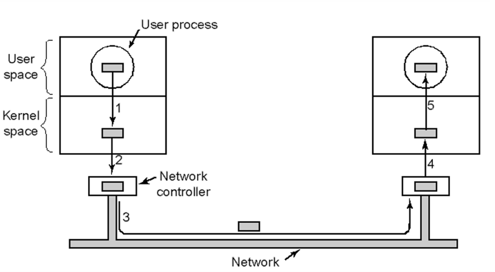

# 第五章 I/O管理

## 从bus讲起
**bus：系统总线**
总线带宽 = 频率 × 速度 byte/sec
不同输入系统传输速率差异巨大
## I/O设备分类

+ 传输速度：
+ 信息交换单位：块设备【存储设备：磁盘...】 字符设备【键鼠、某些USB设备】 网络设备
+ 共享属性
  
  设备管理目标：（）

## I/O管理硬件机制
**设备控制器**
**本质：数据、控制、状态寄存器的读写**
+ 寄存器的命名、寻址
  

RISC： 复用地址总线 

+ 考虑缓存的影响：设备寄存器的读取，不能走cache（MIPS架构中对应的是不走cache的kseg1）

## I/O管理的软件
**驱动程序**： 把设备文件的读写转化为对于上述三种寄存器的读写

### I/O相关软件的层次关系 【重点！】

## 缓冲技术

提高外设利用率

- 匹配CPU和外设的不同处理速度
- 减少CPU的中断数
- 提高CPU与I/O外设的**并行性**

想法：把数据归归组（类似于取号排队）

问题：多次复制一个数据包（设备、缓冲区与用户区来回复制）

### 单缓冲

一个缓冲区，CPU与外设轮流使用，I/O输入与向CPU传输只能同时进行一个

### 双缓冲

CPU与外设都可以连续处理，无需等待对方

### 循环缓冲

## 设备管理

### SPOOLing：

+ 把**独享设备**转变成具有**共享特征**的虚拟设备
+ 在硬件上增加了一个软件层抽象

额外提到的重点（补充到其他文件中：中断、系统调用、TLB MISS、缺页中断的处理过程与细节）
