# 第五章 I/O 管理（磁盘管理）

本笔记依据听回放随记、课程完整 PPT《6.1 磁盘管理》与期末考题重点整理，重点关注：磁盘基本结构、磁盘组织与访问时间、磁盘调度算法、Flash Disk、磁盘空间管理、RAID、提高 I/O 速度与考试计算题。

---

### 📚 一、磁盘基本概念：如何定位一个磁盘块？

#### 1. 磁盘的物理结构

磁盘由多个盘片组成，每个盘片通常有两个面，每个面都有一个磁头（head）。磁头在盘片半径方向移动，盘片自身高速旋转，从而完成读写。

**每个磁盘有两个面，每个面都有一个磁头(head)**

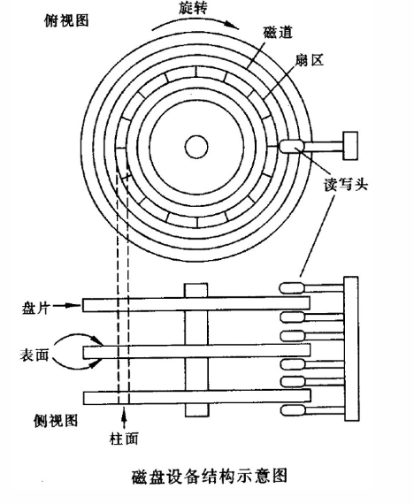

| 概念 | 含义 | 定位作用 |
| --- | --- | --- |
| 扇区（sector） | 盘片被分成的扇形区域，是磁盘读写的基本区域之一 | 指定磁道上的具体扇区位置 |
| 磁道（track） | 一个盘片上以盘片中心为圆心、不同半径的同心圆 | 指定磁头应移动到哪个半径 |
| 柱面（cylinder） | 不同盘片上相同半径的磁道组成的圆柱面 | 多个磁头在同一半径位置对应的一组磁道 |

【磁道+扇区 定位块】

【磁头组：这些磁头只能读不同盘片的同一个柱面】

可以把磁盘定位理解为三维定位：先确定柱面，再确定磁头，最后确定扇区。

```text
磁盘块定位
  │
  ├─ 柱面 Cylinder：磁头臂移动到哪个半径
  │
  ├─ 磁头 Head：选择哪个盘面
  │
  └─ 扇区 Sector：等待旋转到哪个扇形区域
```

#### 2. 磁盘的组织：CHS 与 LBA

磁盘上的信息可以映射为一个三维坐标：

$$
\text{磁盘地址} = (\text{柱面}, \text{磁头}, \text{扇区})
$$

也就是：

```text
定位信息：柱面 + 磁头 + 扇区
```

现代磁盘还可以看作一维逻辑块数组，每个逻辑块有一个 LBA（Logic Block Address，逻辑块号）。操作系统通常使用逻辑块号，磁盘控制器再负责映射到底层物理位置。

设：

| 符号 | 含义 |
| --- | --- |
| C | 每盘面上的柱面数 |
| H | 磁头数，即盘面数 |
| S | 每磁道扇区数 |

若已知磁盘地址 `(c, h, s)`，则逻辑块号可表示为【无需掌握，了解即可】：

$$
\text{块号}=c\times(H\times S)+h\times S+s
$$


#### 3. 磁盘缺陷与扇区替换

实际磁盘可能存在缺陷扇区，因此磁盘内部会维护缺陷列表，用保留扇区替代坏扇区。

---

### 🏗️ 二、磁盘访问时间：为什么磁盘慢？

#### 1. 磁盘访问的三个时间组成

读取或写入时，磁头必须定位到期望磁道，并等待目标扇区旋转到磁头下方，最后完成数据传输。因此一次磁盘访问时间主要由三部分构成：

| 时间 | 含义 | 主要影响因素 |
| --- | --- | --- |
| 寻道时间 `Ts` | 磁头移动到目标磁道所需时间 | 磁头移动距离、启动时间 |
| 旋转延迟时间 `Tr` | 等待目标扇区旋转到磁头下方的时间 | 磁盘转速 |
| 传输时间 `Tt` | 数据在磁盘和内存/控制器之间传输的时间 | 数据量、转速、磁道容量 |

#### 2. 寻道时间

**寻道时间**：启动时间 `s`，移动 `n` 个磁道。

$$
T_s=m\times n+s
$$

其中，`m` 是磁头移动一个磁道的时间常数，`n` 是移动的磁道数，`s` 是启动磁臂的时间。

#### 3. 旋转延迟时间

**平均旋转时间（延迟）**：

$$
T_r=\frac{1}{2r}
$$

其中 `r` 为转速。注意课程中公式默认 `r` 使用“转/秒”单位；如果题目给的是 RPM（转/分钟），需要先换算为：

$$
r=\frac{RPM}{60}
$$

**解释：**
+ **平均旋转延迟是一圈时间的一半**。 
+ $\frac{1}{r}$是一圈所需的时间，还需要再除以2。

典型转速对应平均延迟如下：

| 转速 RPM | 平均旋转延迟 |
| ---: | ---: |
| 4200 | 7.14 ms |
| 5400 | 5.56 ms |
| 7200 | 4.17 ms |
| 10000 | 3 ms |
| 15000 | 2 ms |

#### 4. 传输时间

**传输时间**：读写字节数 `b`，旋转速度 `r`，磁道上的字节数 `N`。

单位时间内转 `r` 圈，总共读取 `rN` 个字节；需要读取的总字节数为 `b`，所以：

$$
T_t=\frac{b}{rN}
$$

#### 5. 总访问时间

**总延迟时间**：

$$
T_a=T_s+\frac{1}{2r}+\frac{b}{rN}
$$

也可以写成：

$$
\text{访问时间}=\text{寻道时间}+\text{旋转延迟时间}+\text{传输时间}
$$

```text
一次磁盘 I/O
  │
  ├─ 1. 寻道：磁头移动到目标磁道
  │
  ├─ 2. 旋转等待：目标扇区转到磁头下方
  │
  └─ 3. 数据传输：读/写目标数据
```

💡 **判断主要矛盾，具体情况具体分析。** 小数据块读写中，寻道时间和旋转延迟通常占主要部分；数据量很大时，传输时间才更明显。

---

### 🚀 三、磁盘调度算法：如何减少寻道距离？

#### 1. 为什么需要磁盘调度？

磁盘 I/O 请求到达速度可能大于磁盘实际执行速度，于是请求会在队列中排队。操作系统可以重新排列请求顺序，减少磁头移动距离，提高吞吐量。

```text
多个 I/O 请求到达
        │
        ▼
请求队列等待磁盘服务
        │
        ▼
操作系统选择调度算法
        │
        ▼
重排访问顺序，减少寻道时间
```

#### 2. FCFS：先来先服务

FCFS（First Come First Served）按照请求到达顺序依次服务。

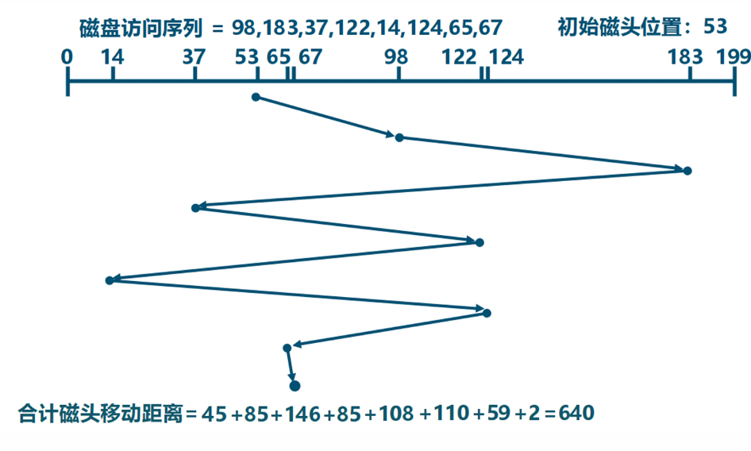

| 方面 | 内容 |
| --- | --- |
| 算法思想 | 按访问请求到达的先后次序服务 |
| 优点 | 简单、公平、**不会产生饥饿现象** |
| 缺点 | **平均寻道距离可能较大**，磁头可能**反复大范围移动** |
| 适用场景 | 磁盘 I/O 较少、请求不密集的场合 |

#### 3. SSTF：最短寻道时间优先

SSTF（Shortest Seek Time First，最短寻道时间优先）总是**优先满足距离当前磁头最近的访问请求**，属于贪心策略。

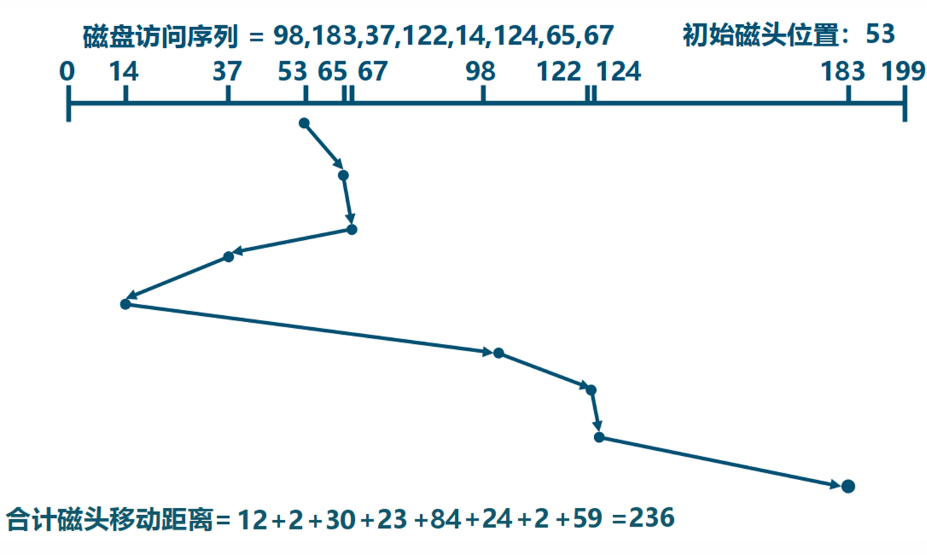

| 方面 | 内容 |
| --- | --- |
| 算法思想 | 优先选择距当前磁头最近的请求 |
| 优点 | 通常比 FCFS 有更短的平均寻道时间 |
| 缺点 | **可能产生“饥饿”现象**，远处请求长期等待 |
| 适用场景 | 追求平均服务时间、请求分布相对稳定时 |

问题：可能产生“饥饿” 现象，近处的请求源源不断产生。

#### 4. SCAN：扫描算法 / 电梯调度

SCAN 算法类似电梯运行：磁头沿一个方向移动，移动过程中遇到请求就服务；**到达该方向边界后，再反向移动并继续服务。**（检查）

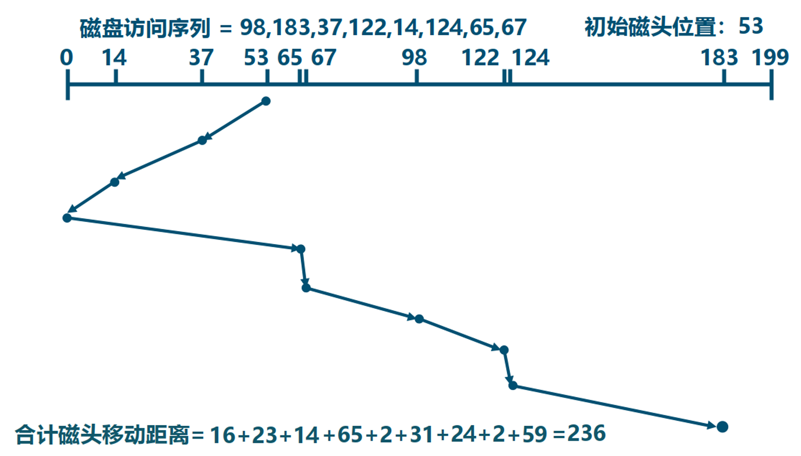

| 方面 | 内容 |
| --- | --- |
| 算法思想 | 磁头按一个方向移动，沿途服务请求，到端点后改变方向 |
| 优点 | 同时考虑距离和方向，可避免 SSTF 的严重饥饿 |
| 缺点 | 摆动式扫描中，**两侧磁道访问频率低于中间磁道** |
| 适用场景 | 请求较多、需要兼顾公平性和性能的磁盘系统 |

```text
SCAN（向大柱面方向）
当前位置
  │
  ├─ 向大柱面移动，服务沿途请求
  │
  ├─ 到达磁盘边界/方向终点
  │
  └─ 反向移动，服务反方向请求
```

#### 5. LOOK：对 SCAN 的改进

LOOK 是 SCAN 的改进版本。它并不一定扫描到磁盘物理端点，而是先“查看”该方向上是否还有请求；如果没有，就立即改变方向。

改进：

- LOOK 查看扫描算法：“**判断该方向上是否还有访问请求**，如果有则继续扫描；否则改变移动方向”
- 即：只需要到达最远端的一个请求即可返回，不需要到达磁盘端点。

#### 6. C-SCAN：循环扫描算法

C-SCAN（Circular-SCAN）在 SCAN 基础上，把“到达一端后反向服务”改为“到达一端后快速返回到 0 号柱面，返回过程中不服务请求”。

| 方面 | 内容 |
| --- | --- |
| 算法思想 | 始终按同一方向扫描服务，到达末端后快速返回起点 |
| 优点 | **对各位置请求更公平**，避免刚错过方向导致等待过长 |
| 缺点 | 返回过程中不服务请求，**会产生额外移动** |
| 适用场景 | 希望等待时间更均匀的场合 |

对于 SCAN 来说，若磁头刚转向，原方向就有新的请求，该请求等待时间较长；**而 C-SCAN 更公平，都需要从头开始扫描。**

**辨析**：CSCAN 算法解决的是SCAN算法中**请求等待时间不均衡的问题，而非饥饿问题**
+ 因为无论请求在哪一个位置，**SCAN算法一定能在一个周期内满足请求**。
+ SCAN算法解决了 SSTF 的饥饿问题，SSTF如果近处的请求源源不断产生，就会产生“饥饿” 现象。
#### 7. C-LOOK、N-Step-SCAN 与 FSCAN（了解）

| 算法 | 思想 | 解决的问题 |
| --- | --- | --- |
| C-LOOK | C-SCAN 的 LOOK 版本，只到达最远请求后快速返回最小请求端 | 减少不必要端点移动 |
| N-Step-SCAN | 将请求队列划分为长度为 N 的子队列，队列之间 FCFS，队列内部 SCAN | 缓解磁臂黏着 |
| FSCAN | 将请求划分为两个队列：当前旧请求队列和新请求队列，交替扫描 | 新请求不会不断插队影响旧请求 |

**磁臂黏着**：当前磁头位置附近源源不断地有请求，导致远位置的请求无法满足，形成饥饿。

**N-Step-SCAN**：将请求划为长度为 N 的子队列，队列之间采用 FCFS，队列内部采用 SCAN。当 N 很大时就是 SCAN，N 为 1 时就是 FCFS。

**FSCAN**：Fixed-period SCAN，按照时间将当前请求（旧请求）和新请求分为两个队列。

#### 8. 磁盘调度算法对比

| 算法 | 优点 | 缺点 | 记忆关键词 |
| --- | --- | --- | --- |
| FCFS | 公平、简单 | 平均寻道距离大 | 按到达顺序 |
| SSTF | 平均服务时间较好 | 可能饥饿 | 离当前最近 |
| SCAN | 寻道性能较好，可避免严重饥饿 | 两端请求相对不利 | 电梯，到边界再反向 |
| C-SCAN | 消除两端磁道请求的不公平 | 返回过程不服务请求 | 单向扫描，快速回到 0 |
| LOOK | 比 SCAN 少走无请求端点 | 题目需明确是否默认 LOOK | 到最远请求即返回 |
| C-LOOK | 比 C-SCAN 少走无请求端点 | 返回过程仍不服务请求 | 循环 LOOK |

【题型：给定柱面访问请求序列，用相应算法计算总访问道数，主要是SCAN FCFS SSTF三个】

方法：画出草稿图（类似于上面），列表。

---

### 🔄 四、磁盘空间管理：如何记录空闲块？（略）

#### 1. 磁盘空间管理方法

课程 PPT 中磁盘空间管理主要包括：

| 方法 | 基本思想 | 特点 |
| --- | --- | --- |
| 位图 | 每个物理块对应一位，用 0/1 表示分配状态 | 查找连续空闲块较方便，但位图本身占空间 |
| 空闲表法 | 用表记录每段连续空闲区的起始块号和块数 | 适合连续分配，表项可能动态变化 |
| 空闲链表法 | 将所有空闲块链接起来 | 不需要连续表，但链可能很长，查找效率较低 |
| 成组链接法 | 将空闲块分组，每组记录下一组信息 | 节省空间，分配/回收较高效，采用栈思想 |


### ⚖️ 五、非机械式存储：Flash Disk 与 SSD

#### 1. Flash Disk 的基本特点

Flash Disk 属于非机械式存储，没有高速旋转盘片和移动磁头，因此访问延迟远小于传统机械硬盘。

| 特点 | 说明 |
| --- | --- |
| 低功耗 | 没有复杂机械部件，能耗更低 |
| 数据访问速度高 | 没有寻道和旋转延迟 |
| 读写周期短 | NAND Flash 访问周期可达微秒级，而硬盘常为毫秒级 |
| 抗震性好 | 没有高速机械结构，可在剧烈振动环境下工作 |

存储技术：NOR（宽数据线，一次性寻址）、NAND（块号、块内页号、页内字节号）。

#### 2. NOR 与 NAND

| 对比项 | NOR Flash | NAND Flash |
| --- | --- | --- |
| 随机读取 | 较快 | 相对较慢 |
| 连续大数据传输 | 与 NAND 差异较小 | 适合大容量连续数据 |
| 成本 | 平均每 MB 成本较高 | 成本低，容量大 |
| 典型用途 | 代码存储、直接寻址场景 | SSD、U 盘、存储卡 |

#### 3. NAND 的写入与擦除问题

**NAND**

- 写的开销远大于读：必须**成块读写**，写的时候，必须先擦除该块块，再成块写。
- 寿命问题 类比：纸变薄了，拿橡皮擦就容易擦破。

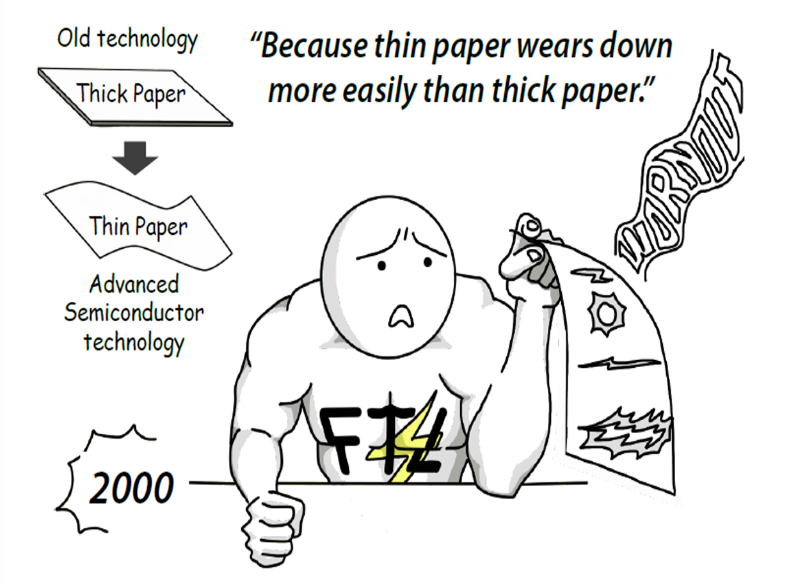

课程中给出规律：writes 10x reads, erasure 10x writes。也就是说，写比读慢，擦除又比写更慢。

#### 4. FTL 与磨损均衡

解决：**FTL** 技术，到底擦哪块，映射哪块，均匀被擦，恢复。

FTL（Flash Translation Layer，闪存转换层）的主要作用是维护逻辑块到物理闪存页/块的映射，并配合磨损均衡（Wear Leveling），让不同物理块尽量均匀承担擦写次数，延长寿命。

```text
操作系统看到：逻辑块 LBA
        │
        ▼
FTL 映射层
  ├─ 逻辑页 → 物理页
  ├─ 垃圾回收
  ├─ 坏块管理
  └─ 磨损均衡
        │
        ▼
真实 NAND Flash 块/页
```

#### 5. 磁盘调度算法对 Flash Disk 还适用吗？

机械硬盘调度的核心目标是减少寻道时间和旋转延迟，而 Flash Disk 没有磁头移动和盘片旋转，因此 FCFS、SSTF、SCAN、C-SCAN 等针对“柱面移动”的调度算法不再是主要矛盾。

| 存储介质 | 主要延迟来源 | 调度重点 |
| --- | --- | --- |
| HDD | 寻道时间、旋转延迟、传输时间 | 减少磁头移动距离，优化访问顺序 |
| SSD / Flash | 控制器并行度、擦写放大、垃圾回收、磨损均衡 | 合并请求、减少随机写、发挥通道并行、延长寿命 |

💡 **答题关键词：** 对 Flash Disk，传统磁盘调度算法“不再直接适用/意义大幅下降”，因为没有机械寻道和旋转延迟；但 I/O 合并、队列调度、负载均衡、减少写放大等优化仍然重要。

---

### 💡 六、RAID：用多块磁盘提高性能与可靠性

#### 1. RAID 的基本概念

RAID：独立硬盘冗余阵列。

RAID 的基本思想是：把多个相对便宜的硬盘组合起来，成为一个硬盘阵列组，使性能达到甚至超过一个价格昂贵、容量巨大的硬盘。

RAID 主要利用三类技术：

| 技术 | 含义 | 主要效果 |
| --- | --- | --- |
| 分条（striping） | 把数据划分为条带，分布到多个磁盘上 | 提高并行读写能力 |
| 镜像（mirroring） | 把同一份数据保存到多个磁盘上 | 提高可靠性和读性能 |
| 校验（parity） | 用异或（XOR）等方式保存冗余信息 | 磁盘故障时重建数据 |

```text
RAID 的核心目标
  │
  ├─ 性能：多盘并行读写
  │
  ├─ 可靠性：冗余、镜像、校验
  │
  └─ 容量：多盘组合成一个逻辑存储单元
```

#### 2. RAID 0：条带化

RAID 0 将数据分条分布到多个磁盘上。

| 项目 | 内容 |
| --- | --- |
| 技术 | 条带化 |
| 优点 | 读写性能高，容量利用率高 |
| 缺点 | **没有冗余**，任一磁盘故障都会导致数据丢失 |
| 适用 | 对性能要求高但可接受数据丢失风险的临时数据场景 |
示意|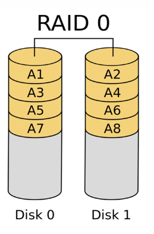 |
#### 3. RAID 1：镜像

RAID 1 将**同一份数据写入两个或多个磁盘**。

| 项目 | 内容 |
| --- | --- |
| 技术 | 镜像 |
| 优点 | 可靠性高，**读操作可并行** |
| 缺点 | **容量利用率低**，通常为 50% |
| 适用 | 系统盘、关键数据 |
示意|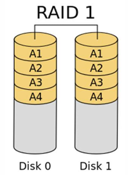
#### 4. RAID 0+1 与 RAID 1+0

| 级别 | 结构 | 可靠性理解 |
| --- | --- | --- |
| RAID 0+1 | 先做条带，再对整个条带集合做镜像 | 某个条带组失效后，冗余能力下降明显 |
| RAID 1+0（RAID 10） | 先做镜像，再在镜像组之间做条带 | 通常比 RAID 0+1 更可靠，也更常用 |

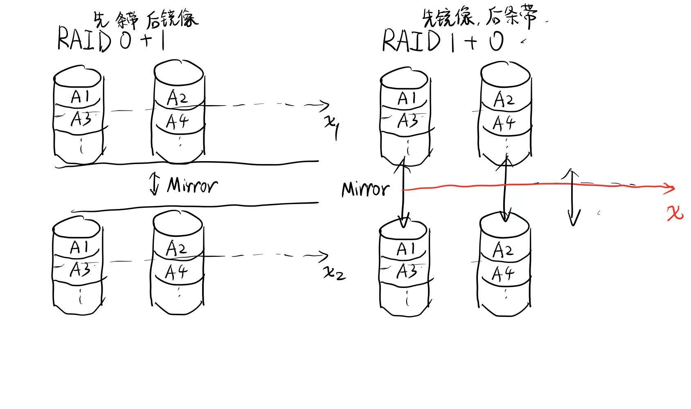
RAID 10 通常比 RAID 0+1 更可靠，也更常用。

#### 5. RAID 2：海明码校验

RAID 2 使用位级条带化，并用海明码进行错误检测和恢复。

| 项目 | 内容 |
| --- | --- |
| 技术 | 海明码校验，位级条带化 |
| 优点 | 可自动检测和纠正错误 |
| 缺点 | 需要多个校验盘，实现复杂，现代系统很少使用 |

#### 6. RAID 3：专用奇偶校验盘，字节/位级条带化

RAID 3 使用数据位交叉（位级/字节级条带化），一个冗余校验盘保存奇偶校验信息。

任意一块盘坏了，可以利用异或计算：

```text
xi = 校验码 XOR 其他盘数据
```

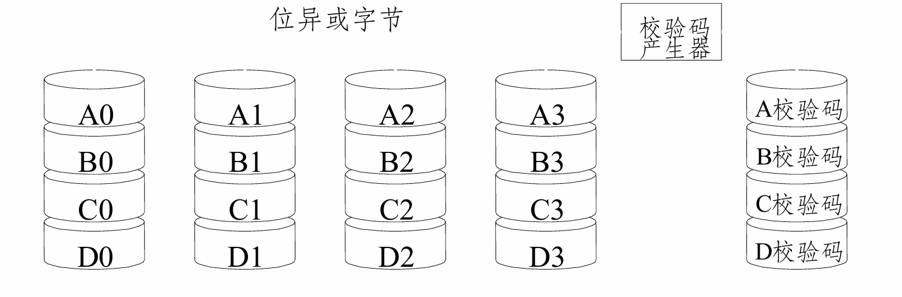

| 项目 | 内容 |
| --- | --- |
| 优点 | 奇偶校验，可恢复一块盘故障 |
| 缺点 | **字节**条带化，**读写需要访问所有盘**，恢复时间较长，读写性能有水桶效应 |

#### 7. RAID 4：专用校验盘，块级条带化

RAID 4 使用块级条带化和一个专用校验盘。

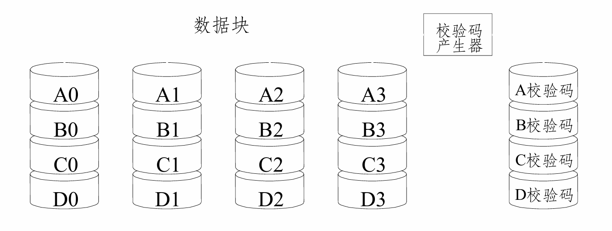

| 项目 | 内容 |
| --- | --- |
| 优点 | 支持独立小读，随机读快 |
| 缺点 | 所有写操作都要更新校验盘，校验盘成为瓶颈，**随机写慢**，RAID 3 和 RAID 4 都需要**竞争同一块校验盘。**|


#### 8. RAID 5：分布式校验，块级条带化

RAID 5 使用分布式冗余校验和数据块交叉，将校验块分布在所有磁盘上，避免 RAID 4 的单校验盘瓶颈。

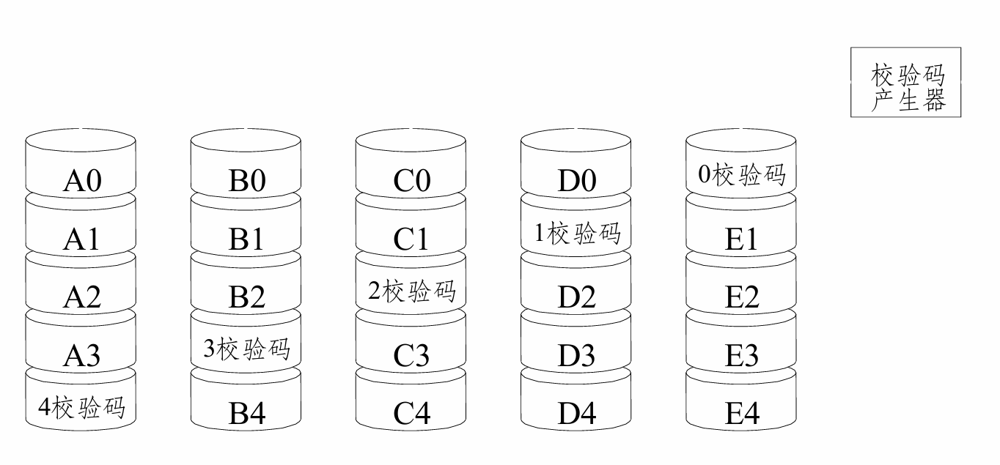

| 项目 | 内容 |
| --- | --- |
| 优点 | 容量利用率较高，可容忍一块磁盘故障，读性能好 |
| 缺点 | 小写需要读旧数据和旧校验，再写新数据和新校验，即“写惩罚” |
| 容量 | N 块盘中相当于 1 块盘用于校验 |

RAID 5 中有“写损失”：每一次小写操作会产生四个实际读/写操作：

```text
读旧数据 + 读旧校验 + 写新数据 + 写新校验
```

两块盘坏掉会导致整个 RAID 数据失效。

#### 9. RAID 6：双重分布式校验

RAID 6 类似 RAID 5，但增加一层冗余，保存两类独立校验信息。

两层校验冗余，奇偶校验（XOR），条带存储。

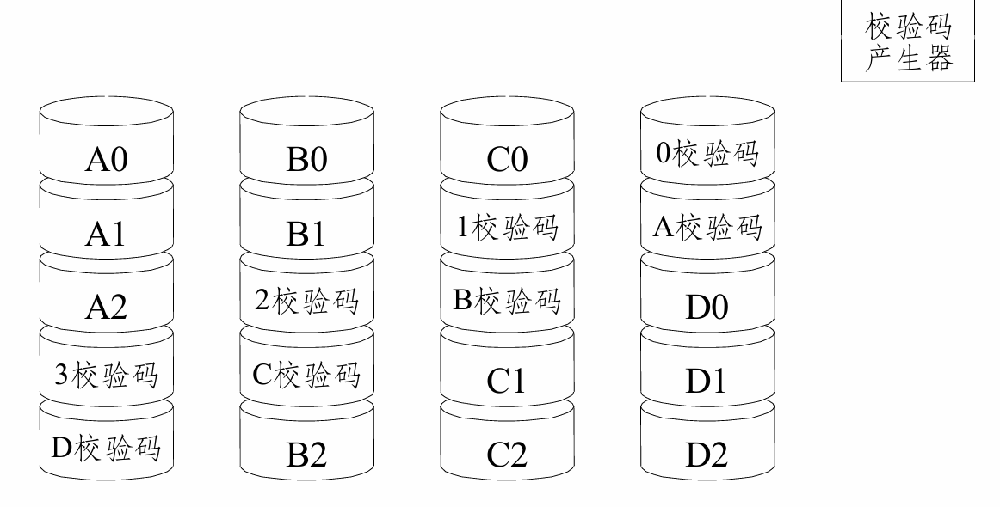

| 项目 | 内容 |
| --- | --- |
| 优点 | 可容忍两块磁盘同时故障 |
| 缺点 | 写开销更大，容量相当于损失 2 块盘 |
| 适用 | 大容量阵列中重建时间长、故障概率更高的场景 |

#### 10. RAID 级别对比表

重点关注：磁盘数量与最少磁盘数量。

| 级别 | 说明 | 特点 | 磁盘数量 | 最少磁盘数量 |
| --- | --- | --- | --- | --- |
| 0 | 条带化 | 速度加倍，可靠性减半，容量不变 | n | 2 |
| 1 | 镜像 | 速度不变，可靠性加倍，容量减半 | n × 2 | 2 |
| 0+1 | 组内条带化、组间镜像 | 速度加倍，可靠性加倍，容量减半 | n × 2 | 4 |
| 1+0 | 组内镜像，组间条带化 | 速度加倍，可靠性加倍，容量减半 | 2 × n | 4 |
| 2 | 海明码校验 | 校验独立存储，数据位交叉（条带化），自动纠正 1 个盘错 | n + log(n) | 7 |
| 3 | 奇偶校验 | 校验独立存储，数据位交叉（条带化），容 1 块盘错 | n + 1 | 3 |
| 4 | 奇偶校验 | 校验独立存储，数据块交叉，容 1 块盘错 | n + 1 | 3 |
| 5 | 奇偶校验 | 校验交叉存储，数据块交叉，容 1 块盘错 | n + 1 | 3 |
| 6 | 奇偶校验 | 校验交叉存储，数据块交叉，容 2 块盘错 | n + 2 | 4 |

#### 平均损坏时间

平均损坏时间 **MTTF（Mean Time To Failure）**，表示设备从开始工作到发生故障的平均时间。

考试里常把故障看作近似**独立事件**，并用“单位时间故障率”来计算：

```text
单块磁盘平均损坏时间 = MTTF
单块磁盘故障率 λ = 1 / MTTF
系统平均损坏时间 = 1 / 系统故障率
```

若 n 块磁盘相同，每块 MTTF 都是 T，并且任一块坏系统就坏：

类比概率论练习中的电路串联/并联 故障概率题
```text
RAID 0：任意一块坏就坏，可靠性下降  --- 串联，事件的交
RAID 1：需要所有镜像盘都坏才坏，可靠性提高 --- 并联，独立事件同时发生
```
因此对于 RAID0：

$$
\lambda_{RAID0}=n\lambda=\frac{n}{T}
$$

$$
MTTF_{RAID0}=\frac{1}{\lambda_{RAID0}}=\frac{T}{n}
$$

对于 RAID1（以 2 块镜像盘为例，设平均修复时间为 $MTTR=R$）：

$$
MTTF_{RAID1}\approx\frac{T^2}{2R}
$$


#### 11. RAID 概念小结

| 概念 | 优点 | 缺点 |
| --- | --- | --- |
| 条带化 | 并行存取，性能好，磁盘负载均衡 | 可靠性下降，不同 I/O 请求可能需要排队 |
| 镜像 | 可靠性高，读性能可能提升 | 存储开销大 |
| 校验 | 提高可靠性，可快速恢复 | 需要计算和存储开销，写入可能变慢 |

💡 **期末选择题重点：** RAID 6 与 RAID 5 的容错能力不同。RAID 5 可容忍 1 块盘故障；RAID 6 可容忍 2 块盘故障。

---

### 🔧 七、提高磁盘 I/O 速度/性能（了解）

#### 1. 提高 I/O 速度的主要途径

课程 PPT 总结的主要途径包括：

1. 选择性能好的磁盘；
2. 并行化；
3. 采用适当的调度算法；
4. 设置磁盘高速缓冲区。
【总结为：以上所学主要内容 + 提高磁盘速度 + 下面的内容】

#### 2. 磁盘高速缓存

磁盘高速缓存可以减少真实磁盘访问次数，将近期使用或即将使用的数据暂存在内存中。

| 缓存形式 | 特点 |
| --- | --- |
| 独立缓存 | 大小固定，专门作为磁盘缓存 |
| 虚拟内存作为缓存 | 大小弹性，可根据系统负载变化 |

数据交付方式：

| 方式 | 含义 | 特点 |
| --- | --- | --- |
| 直接交付 | 将缓存数据复制给请求进程 | 有 copy 开销 |
| 指针交付 | 直接交付缓存块指针 | 减少复制，但内存管理更复杂 |

#### 3. 周期性写回

周期性写回是指系统定期将 disk cache 中被修改过的内容写回磁盘。

```text
写请求到达
  │
  ▼
先写入磁盘缓存
  │
  ├─ 稍后周期性写回磁盘
  │
  └─ 若系统崩溃，可能丢失尚未写回的数据
```

#### 4. 优化数据布局

优化物理块分布的目标是让相关数据尽量靠近，减少磁头移动和随机访问。

| 方法 | 作用 |
| --- | --- |
| 连续摆放 | 顺序访问性能高，减少寻道 |
| 优化索引节点分布 | 减少索引节点与数据块之间的距离 |
| 索引节点与数据块结合 | 进一步减少访问局部性差带来的开销 |

#### 5. 提前读与延迟写

| 方法 | 思想 | 适用情况 | 风险/代价 |
| --- | --- | --- | --- |
| 提前读 | 顺序访问时，提前把下一块读入缓冲区 | 顺序读、文件扫描 | 预测错误会浪费缓存和 I/O |
| 延迟写 | 将本应立即写回磁盘的数据暂挂到缓冲队列，稍后再写 | 写请求频繁、可合并写入 | 可靠性风险，崩溃时可能丢数据 |

延迟写的核心思想：将本应立即写回磁盘的数据挂到空闲缓冲区队列末尾，直到该数据块移到链头时才写回磁盘，再作为空闲区分配出去。

#### 6. 虚拟盘（RAM Disk）

虚拟盘利用内存空间仿真磁盘，也称 RAM 盘。

| 对比项 | Virtual disk | Disk cache |
| --- | --- | --- |
| 内容控制者 | 用户完全控制 | 操作系统控制 |
| 主要目的 | 用内存模拟一个高速磁盘 | 缓存磁盘数据，提高访问速度 |
| 数据可靠性 | 掉电易丢失，需额外持久化 | 依赖缓存写回策略 |

---

### 📝 八、考试指南：磁盘管理常见题型

#### 题型 1：磁盘调度算法计算总访问道数

【题型：给定柱面访问请求序列，用相应算法计算总访问道数，主要是SCAN FCFS SSTF三个】

##### 解题步骤

```text
第一步：写出请求序列、初始磁头位置、初始移动方向
        │
        ▼
第二步：按算法规则排出实际访问顺序
        │
        ▼
第三步：逐段计算柱面移动距离
        │
        ▼
第四步：求总柱面数
        │
        ▼
第五步：若给出每柱面移动时间，则乘以单位时间
```

##### 例题：SCAN 电梯调度

题目：

- 在一个磁盘 I/O 调度系统中，某一时刻 t，队列中的磁盘访问请求序列（柱面号）为：10，22，20，2，40，6，38。
- 假设磁头初始位置在第 20 号柱面，初始时磁头向柱面号大的方向移动，磁头每移动 1 个柱面需要 4ms，磁盘共 51 个柱面（编号 0-50）。
- 使用扫描（电梯）调度算法处理完所有上述请求，每次需要扫描到磁盘柱面边界才开始反向扫描。

求：实际磁头访问上述请求柱面的次序，并求磁头寻道总时间？

##### 第一步：按方向整理请求

初始位置为 20，向大柱面方向移动。

```text
小于 20 的请求：10，2，6
等于 20 的请求：20
大于 20 的请求：22，40，38
```

向大方向访问时，顺序应为：20 → 22 → 38 → 40，然后继续扫描到边界 50，再反向访问 10 → 6 → 2。

##### 第二步：写出实际访问请求柱面顺序

```text
20 → 22 → 38 → 40 → 10 → 6 → 2
```

注意：磁头会到达边界 50 后反向，但 50 不是原始请求柱面；题目问“实际访问请求柱面顺序”时不把 50 作为请求写入访问序列，但计算移动距离时要算到 50。

##### 第三步：计算移动柱面数

| 阶段 | 移动 | 柱面数 |
| --- | --- | ---: |
| 初始到 22 | 20 → 22 | 2 |
| 到 38 | 22 → 38 | 16 |
| 到 40 | 38 → 40 | 2 |
| 扫描到边界 | 40 → 50 | 10 |
| 反向到 10 | 50 → 10 | 40 |
| 到 6 | 10 → 6 | 4 |
| 到 2 | 6 → 2 | 4 |
| 合计 |  | 78 |

##### 第四步：计算总时间

$$
78\times4\text{ms}=312\text{ms}
$$

结论：

**磁头实际访问请求柱面顺序为：20 → 22 → 38 → 40 → 10 → 6 → 2**

**寻道总柱面数：78 个柱面**

**寻道总时间：78 × 4ms = 312ms**

💡 **期末重点提醒：** 2019-2020 与 2024 期末都出现了该类 SCAN 计算题。只写答案不给分时，必须写出访问每一请求柱面的时刻、磁头位置、请求队列或至少清晰过程。

#### 题型 2：有新请求动态到达的 SCAN

2019-2020 期末还考过：在原题基础上，若 `t+31ms`、`t+70ms`、`t+91ms` 又分别产生新请求，仍使用电梯调度算法，要求给出从 t 时刻开始的访问顺序和寻道总时间。

解这类题时要特别注意：

1. 把时间换算成磁头移动柱面数；
2. 判断新请求到达时磁头已经走到哪里；
3. 新请求若位于当前扫描方向前方，可能被本轮服务；若已经错过，通常要等反向或下一轮；
4. 每一步都要维护请求队列，不能只按最终集合排序。

```text
动态请求题
  │
  ├─ 先按原始队列推进时间线
  ├─ 到达新请求时插入队列
  ├─ 判断新请求是否在当前方向上尚未经过
  └─ 继续按 SCAN 规则服务
```

#### 题型 3：磁盘访问时间计算

##### 常见给法

题目可能给出：平均寻道时间、转速 RPM、每磁道容量、块大小、文件大小。

##### 解题模板

```text
第一步：寻道时间 Ts 直接取题目给定平均值
第二步：RPM 转为 rps：r = RPM / 60
第三步：平均旋转延迟 = 1 / (2r)
第四步：传输时间 = b / (rN)
第五步：总时间 = Ts + Tr + Tt
第六步：若文件占多个块，按题目假设判断是否每块都需要一次完整访问
```

例如，若转速为 7500 rpm：

$$
r=\frac{7500}{60}=125\ \text{转/秒}
$$

$$
T_r=\frac{1}{2\times125}=0.004\text{s}=4\text{ms}
$$

💡 **易错点：** RPM 是每分钟转数，公式中的 `r` 常按每秒转数使用，必须先除以 60。


#### 题型 5：RAID 概念判断

常见判断点：

| 判断点 | 正确结论 |
| --- | --- |
| RAID 0 是否有冗余 | 没有冗余，任一盘坏都可能丢数据 |
| RAID 1 容量利用率 | 通常约 50% |
| RAID 3 是否可容忍一块盘故障 | 可以 |
| RAID 4 的瓶颈 | 专用校验盘成为写瓶颈 |
| RAID 5 为什么分布式校验 | 避免 RAID 4 单校验盘瓶颈 |
| RAID 6 与 RAID 5 容错能力是否相同 | 不同，RAID 6 可容忍两块盘故障 |

#### 题型 6：Flash Disk 与传统磁盘调度

答题结构：

```text
1. 传统磁盘调度算法主要为减少寻道时间和旋转延迟；
2. Flash Disk 没有磁头和旋转盘片，因此不存在机械寻道与旋转等待；
3. 所以 SCAN/SSTF 这类按柱面距离优化的算法意义明显下降；
4. 但仍需要 I/O 合并、队列管理、减少写放大、磨损均衡等优化。
```

---

### ✅ 本章速记总结

1. 磁盘定位依赖柱面、磁头、扇区；现代系统更多使用 LBA。
2. 磁盘访问时间由寻道时间、旋转延迟、传输时间组成，公式为：

   $$
   T_a=T_s+\frac{1}{2r}+\frac{b}{rN}
   $$

3. 磁盘调度的核心是减少寻道距离：FCFS 简单公平，SSTF 可能饥饿，SCAN 像电梯，C-SCAN 更公平。
4. LOOK/C-LOOK 不一定走到磁盘端点，只到最远请求处返回。
5. Flash Disk 没有机械寻道和旋转延迟，传统柱面调度算法不再是主要优化点；重点转向写放大、磨损均衡、FTL 与并行度。
6. RAID 三大技术是条带化、镜像、校验；RAID 5 可容忍一块盘故障，RAID 6 可容忍两块盘故障。
7. 提高磁盘 I/O 速度的方法包括缓存、优化数据布局、提前读、延迟写、并行化和合适的调度算法。
8. 期末高频题包括：SCAN 访问序列与寻道总时间、磁盘访问时间公式、缓冲区流水时间、RAID 概念判断。
