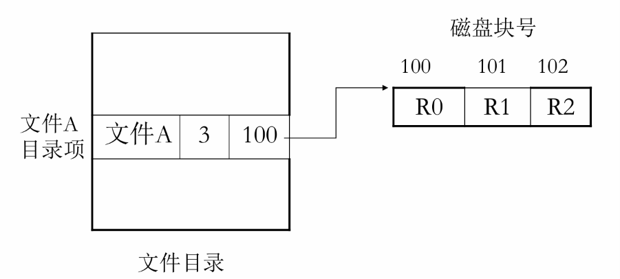
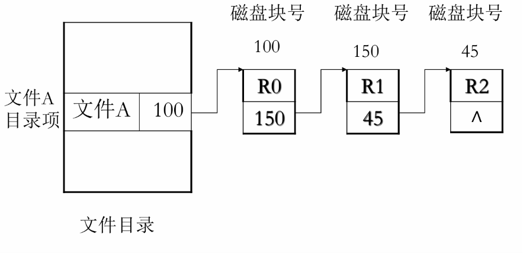
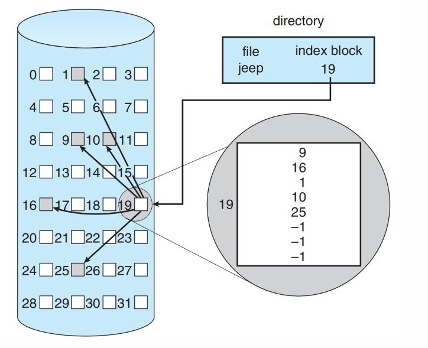
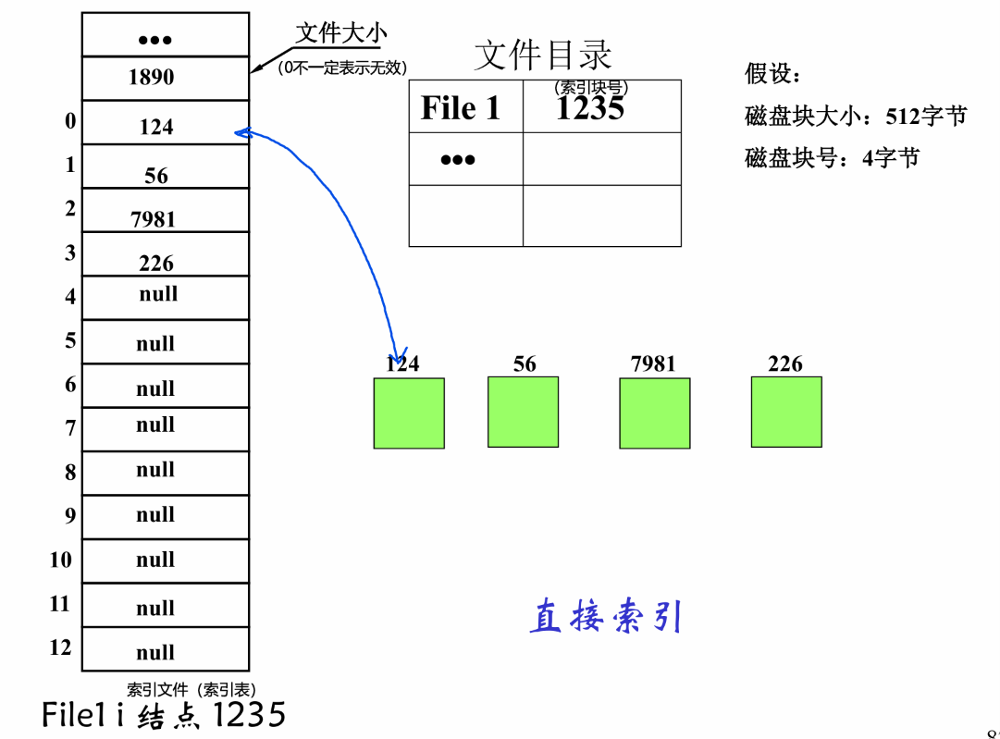
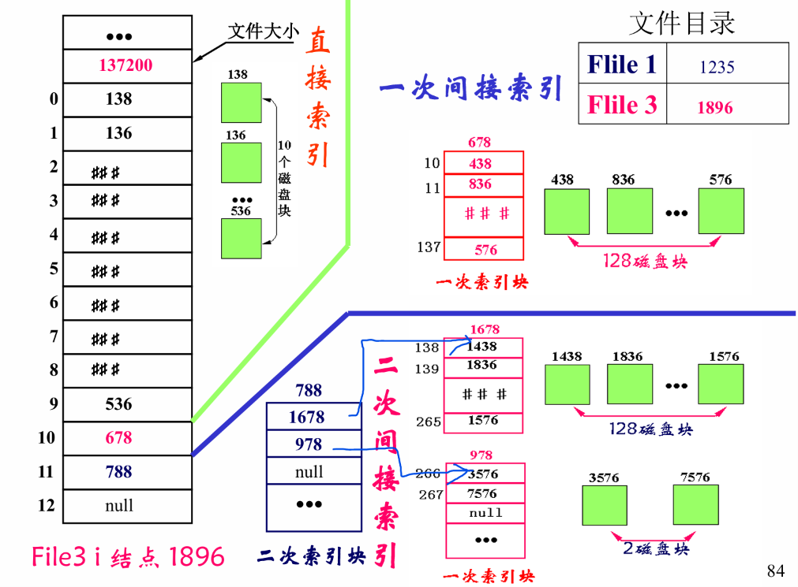
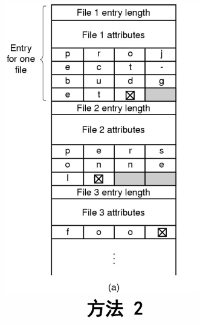
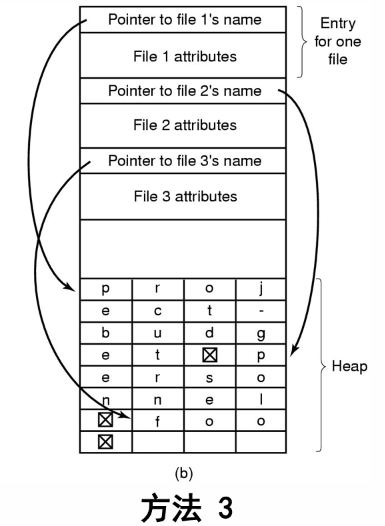
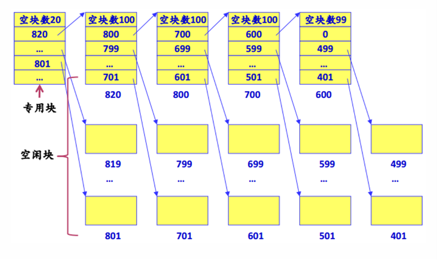
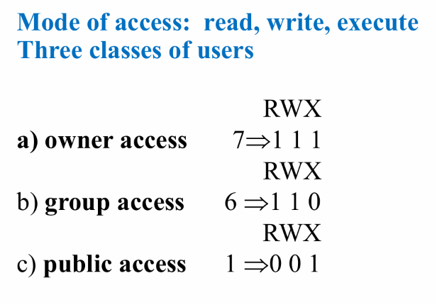

# 第六章 文件管理（文件系统）精简版

本笔记依据课堂回放、课程 PPT《6.2 文件系统》与期末复习重点整理，保留文件抽象、文件系统接口、目录与路径、FCB / inode、文件物理结构、目录实现、磁盘空闲空间管理、文件保护与一致性、文件系统性能以及常考题型。

---

### 📚 一、文件基本概念：为什么要引入“文件”？

#### 1. 数据持久化存储需求

进程地址空间不适合作为长期数据组织方式，因为它难以满足：

| 需求 | 含义 | 仅靠进程地址空间的问题 |
| --- | --- | --- |
| 存储大量数据 | 数据规模可能远超内存或进程空间 | 用户地址空间有限 |
| 长期保存 | 进程终止后数据仍应存在 | 进程结束后地址空间消失 |
| 共享数据 | 多个进程、用户访问同一份数据 | 进程私有空间不便共享 |

因此，操作系统提出“文件”概念，作为数据存储与访问单位。【抽象提炼】

不直接用扇区、页作为用户访问单位，是因为文件更能满足“大量存储、长期保存、共享访问”，并屏蔽存储介质和磁盘块布局细节。

```text
用户需要保存数据
      ├─ 数据量大：超过进程地址空间
      ├─ 生命周期长：进程结束后仍存在
      └─ 需要共享：多个进程/用户访问
      ▼
操作系统抽象出“文件”
      └─ 用符号名 + 字节序列组织持久化数据
```

#### 2. 文件定义与构成

文件是具有符号名、由字节序列构成的数据项集合，是文件系统的基本数据单位。

**概念: 一组带标识的、在逻辑上有完整意义的信息项的序列**

| 角度 | 理解 |
| --- | --- |
| 用户视角 | 带名字的、逻辑完整的数据集合 |
| OS 视角 | 若干数据块及其元数据组合 |
| 地址空间视角 | 单独连续的逻辑地址空间 |
| 抽象视角 | 屏蔽磁盘、扇区、块等实现细节 |

文件特征：数据抽象机制；单独连续的逻辑地址空间；与进程地址空间无关；本质是字节序列。**信息项**是文件内容基本单位，信息项之间有顺序关系。

文件由两部分组成：

| 组成 | 含义 | 例子 |
| --- | --- | --- |
| 文件体 data | 文件本身内容 | 文本、程序、图片数据 |
| 文件说明 metadata | 存储和管理信息 | 文件名、位置、大小、权限、时间戳 |

文件的构成：文件体(data)、文件说明（如：补充） (meta data)

#### 3. “一切皆文件”

Unix / Linux 中，普通文件、目录、设备、管道、套接字等都可抽象为文件。

- linux 外设的访问也一切皆文件

| 类型 | 例子 | 说明 |
| --- | --- | --- |
| 普通文件 | `.txt`、`.c`、可执行文件 | 保存用户数据或程序 |
| 目录文件 | `/home`、`/usr` | 保存目录项 |
| 字符设备文件 | 键盘、终端、打印机 | 按字符流访问 |
| 块设备文件 | 磁盘、光驱 | 按块访问 |
| 网络文件 | socket | 文件式通信接口 |

好处：所有 I/O 对象都可通过 `open/read/write/close` 等统一接口访问。

---

### 🏗️ 二、文件管理与文件系统：OS 如何管理文件？

#### 1. 文件管理内容

**文件由操作系统管理：** 结构、命名、存取、使用、保护和实现方法。

文件管理要解决：命名、目录组织、读写定位、逻辑块到物理块映射、共享保护、可靠性和性能。

#### 2. 文件系统定义与任务

文件系统是存储设备上组织文件的方法和数据结构，也是 OS 中负责文件命名、存储、检索、更新、共享与保护的子系统。

**文件系统**

- 有效的分配文件存储器的空间；
- 对用户透明的机制（具体的实现对用户不可见，只需要最基本的接口）。

```text
用户看到：/tmp/test/hello.c
      ▼
文件系统解析路径、查目录、查 inode/FCB
      ▼
找到文件逻辑块 → 物理块映射
      ▼
磁盘驱动按块号访问磁盘
```

| 任务 | 内容 |
| --- | --- |
| 空间管理 | 管理磁盘空间，分配与回收空闲块 |
| 按名存取 | 名字空间映射到磁盘空间 |
| 共享与保护 | 支持共享，提供权限与安全机制 |
| 用户接口 | 创建、删除、读写、打开、关闭等 |
| 性能优化 | 减少磁盘访问次数，提高效率 |
| I/O 统一接口 | 与设备管理配合，统一抽象不同设备 |

#### 3. 文件系统层次

**文件系统的层次**

- 文件系统的接口（接口）；
- 对象 OS 的软件集合（行为）；
  - 存储空间管理、目录管理、用户将文件 VA 转化为 PA；
  - 读写管理；
  - 共享保护；
- 对象及属性（数据结构）；
  - 文件；目录；磁盘储存空间。

```text
文件系统层次
  ├─ 用户接口层：create/delete/open/close/read/write/seek
  ├─ 文件管理软件层：目录、空间、读写、共享保护
  └─ 基本数据结构层：文件、目录、FCB/inode、磁盘块/空闲空间
```

---

### 📁 三、用户视角的文件：名称、类型、访问方式与操作

#### 1. 文件名与类型

**文件名**：有限长度字符串。  
**文件名.扩展名**：扩展名提示 OS 或应用如何解析文件。

文件类型：

| 分类标准 | 类型 |
| --- | --- |
| 按性质和用途 | 系统文件、库文件、用户文件 |
| 按数据形式 | 源文件、目标文件、可执行文件 |
| 按保护级别 | 只读、读写、执行、不保护文件 |
| 按逻辑结构 | 有结构文件、无结构文件 |
| 按物理结构 | 顺序文件、链接文件、索引文件 |

**文件类型**

- 按文件中物理结构分：顺序文件、链接文件、索引文件；
- 按数据形式：源文件、目标文件、可执行文件。

#### 2. 文件逻辑结构与存取方式

文件逻辑结构是用户角度看到的文件组织方式。

| 逻辑结构 | 含义 | 例子 |
| --- | --- | --- |
| 流式文件 | 无结构字节序列 | UNIX 普通文件 |
| 记录式文件 | 若干记录组成，可按记录访问 | 数据库记录、表格 |
| 树形结构 | 内容组织成树 | 某些索引结构 |

| 存取方式 | 含义 | 适合场景 |
| --- | --- | --- |
| 顺序访问 | 从前到后依次读写 | 文本扫描、日志 |
| 随机访问 | 从任意位置读写 | 数据库、数组文件 |
| 索引访问 | 根据关键字或索引查找 | 数据库索引 |

#### 3. 文件基本操作

| 操作 | 含义 |
| --- | --- |
| Create/Delete | 创建/删除文件 |
| Open/Close | 打开/关闭文件 |
| Read/Write/Append | 读、写、追加写 |
| Seek | 设置读写位置 |
| Get/Set attributes | 获取/设置属性 |
| Rename | 修改文件名 |

应用访问文件前必须先打开文件，获得文件描述符：

```c
fd = open(name, flag);
read(fd, ...);
close(fd);
```

文件描述符是非负整数，实质是指向进程打开文件表的索引。

---

### 🧭 四、目录与路径：如何通过名字找到文件？

#### 1. 目录定义

目录：由**文件说明索引**组成的用于文件检索的**特殊文件**。

- 是文件；
- 内容是由指针组成。

目录项通常记录：

```text
<文件名, 指向文件控制块/索引节点的指针>
```

**典型的文件系统组织**：Dir + files

目录要解决效率、命名、别名、分组、共享等问题。

别名：同一个文件可以有多个别名。  
**目录内容：文件名，别名的数目**  
**文件类型、地址信息、访问控制信息、使用信息**

#### 2. 目录结构演化

| 目录结构 | 优点 | 缺点 |
| --- | --- | --- |
| 单级目录 | 简单，实现容易 | 文件多时检索慢，易命名冲突，不便分组共享 |
| 两级目录 | 不同用户可有同名文件 | 用户目录下不能继续分层 |
| 多级目录 | 层次清楚、解决重名、查找较快、便于保护 | 层级太深时路径检索时间增加 |

课堂随记“单击文件目录”应整理为“单级文件目录”。

```text
多级目录
/
├─ home
│  └─ user
│     └─ note.md
└─ tmp
   └─ test
      └─ helloworld.c
```

**两级目录、多级目录**：最后一级目录，指向文件的物理地址。更准确地说，基于 inode 的文件系统中，目录项一般指向 inode / FCB，而非直接保存数据块地址。

#### 3. 路径

#### 路径 - 描述一个文件的位置

| 路径类型 | 含义 | 例子 |
| --- | --- | --- |
| 绝对路径 | 从根目录开始 | `/tmp/test/helloworld.c` |
| 相对路径 | 从当前目录开始 | `../notes/16文件管理.md` |
| 当前目录 | `.` | 当前所在目录 |
| 上一级目录 | `..` | 父目录 |

---

### 🧱 五、文件系统实现：FCB、inode 与逻辑块映射

#### 1. 根本问题

### 文件系统实现

### 根本问题：逻辑对象到物理对象的映射

用户看到文件名和文件内偏移；磁盘只能按物理块读写。因此文件系统必须完成：

```text
文件名 / 路径
      ▼
目录项查找
      ▼
FCB / inode
      ▼
逻辑块号 → 物理块号
      ▼
磁盘块读写
```

#### 2. FCB 文件控制块

### FCB 文件控制块

FCB（File Control Block）是为管理文件而设置的数据结构，保存文件管理所需信息。

| 信息类别 | 内容 |
| --- | --- |
| 基本信息 | 文件名、文件号、大小、物理位置、逻辑结构、物理结构 |
| 访问控制信息 | 所有者、访问权限、共享计数 |
| 使用信息 | 创建/修改/访问时间、当前使用信息、只读/隐藏/系统/归档标志 |

#### 3. inode 思想

Unix 类文件系统常用 inode 描述文件。inode 保存文件或目录属性和数据块指针，但通常不直接保存文件名；文件名保存在目录项中。

| 结构 | 保存内容 |
| --- | --- |
| 目录项 | 文件名 + inode 号 / inode 指针 |
| inode | 文件类型、大小、权限、时间戳、数据块指针 |
| 数据块 | 文件实际内容或目录项内容 |

```text
目录项：hello.txt → inode #10
                    ▼
inode #10：权限、大小、时间、数据块指针
                    ▼
数据块：hello.txt 的真实内容
```

💡 **期末重点：** 目录项一般不保存文件数据物理块指针，而保存索引节点位置；inode 再保存文件元数据和数据块指针。

---

### 🧩 六、文件物理结构：连续、链接与索引

### 文件逻辑结构 物理结构

文件物理结构解决：文件划分为 N 块后，这些块如何存放，以及 FCB 如何记录逻辑块到物理块的映射。

#### 1. 连续（顺序）结构 -- 顺序表

连续结构把文件信息存放在若干连续物理块中，FCB 只需记录起始块号和长度。



| 项目 | 内容 |
| --- | --- |
| 记录方式 | 起始块号 + 块数 / 长度 |
| 逻辑块 i 的物理块 | 起始块号 + i |
| 适合 | 变化不大、顺序访问为主的文件 |

| 优点 | 缺点 |
| --- | --- |
| 结构简单，实现容易 | 文件长度一经固定不易改变 |
| 支持顺序存取和随机存取 | 不利于动态增长和修改 |
| 顺序读取速度快 | 可能产生外部碎片，创建时需预估大小 |

#### 2. 串联/链接文件结构 -- 链表

每个物理块的最后一个字作为链接字，指向后继块物理地址。



链接结构中，文件由不一定连续的物理块组成，FCB 保存链首指针，结尾块指针为空或特殊标记。

| 项目 | 内容 |
| --- | --- |
| 记录方式 | FCB 保存首块地址，每块保存下一块地址 |
| 适合 | 动态增长、顺序访问较多的文件 |
| 结尾标记 | 空指针或特殊值 |

优点：空间利用率高，文件动态扩充修改容易，顺序存取效率高（链表）。  
缺点：**随机存储效率太低**，链接指针占用一定空间。

| 优点 | 缺点 |
| --- | --- |
| 空间利用率高，不要求连续空间 | 随机访问效率低，第 i 块需从头遍历 |
| 文件动态扩充容易 | 指针出错影响可靠性 |
| 适合顺序访问 | 链接指针占用空间，局部性差 |

##### FAT：显示链接

显示链接 FAT file allocation table 【为磁盘所有盘块建立链接表】

文件分配表中：下标为盘块号，存放指向下一个盘快的指针，-1表示最后一块，-2表示空闲等等。

| FAT 表项值 | 含义 |
| --- | --- |
| 0 | 空闲 |
| 坏簇标记 | 物理坏块 |
| 下一簇号 | 当前簇被文件占用，且下一簇为该值 |
| EOF / FFFF | 文件最后一簇 |

FAT 把块内链接指针集中放到文件分配表中，减少读取块内指针的开销，但 FAT 表本身占空间，损坏后影响大。

#### 3. 索引结构【重点!】

#### 索引结构 【重点!】

**索引表**：为**每个文件**建立一个数据结构，将该文件的**所有物理块块号存放在该索引中**。

课堂随记“下标是物理块号”应修正为：索引表下标通常是**文件逻辑块号**，表项内容是对应**物理块号**。

```text
索引表
逻辑块号  0   1   2   3   ...
          │   │   │   │
          ▼   ▼   ▼   ▼
物理块号  8  21   5  40   ...
```

访问索引文件通常两步：先读索引表块，再读目标数据块。

```text
访问文件逻辑块 i
      ├─ 1. 查索引表：逻辑块 i → 物理块号 p
      └─ 2. 读取物理块 p 中的数据
```



| 优点 | 缺点 |
| --- | --- |
| 既支持顺序访问，也支持随机访问 | 索引表需要额外空间 |
| 文件可动态增长，外存利用率高 | 访问时可能先读索引块，增加 I/O |
| 避免链接结构随机访问差的问题 | 大文件需多级索引，小文件也有开销 |

#### 4. 索引表组织方式

##### 直接索引

inode / FCB 中的地址项直接保存数据块地址。



缺点：文件大小受 inode/FCB 地址项数量限制。

##### 多级索引（间接索引）

- 一级间接索引：地址项指向索引块，索引块中保存数据块地址；
- 二级间接索引：地址项指向一级索引块，一级索引块再指向二级索引块；
- 三级间接索引依此类推。

##### 综合模式：直接 + 间接



| 文件大小 | 使用方式 | 好处 |
| --- | --- | --- |
| 小文件 | 直接索引 | 访问快，少一次索引块 I/O |
| 中等文件 | 一级间接索引 | 扩展文件容量 |
| 大文件 | 二级/三级间接索引 | 支持很大文件 |

💡 **常考：** 直接索引 + 多级间接索引支持的最大文件大小计算。

#### 5. 三种文件物理结构对比【常考】

**【常考】三者文件逻辑结构，优缺点比较**

| 结构 | FCB 中记录 | 顺序访问 | 随机访问 | 动态增长 | 空间利用 | 主要缺点 |
| --- | --- | --- | --- | --- | --- | --- |
| 连续结构 | 起始块号 + 长度 | 很快 | 很快 | 差 | 可能外部碎片 | 文件大小不易改变 |
| 链接结构 | 首块指针 | 较好 | 很差 | 好 | 较高 | 随机访问必须沿链查找 |
| 索引结构 | 索引表地址 / inode 指针 | 好 | 好 | 好 | 较高 | 索引表带来空间和时间开销 |

【考试重点】若选择题说“索引文件适用于顺序访问，但不适合随机访问”，这是错误的。索引文件既适合顺序访问，也适合随机访问。

---

### 🧮 七、目录实现与 inode 查找过程

#### 1. 目录项如何保存 FCB 信息

### 目录的实现

**目录项：**给定文件名，能够获取相应的FCB（直接法或者间接法）

| 方法 | 目录项内容 | 典型系统 | 特点 |
| --- | --- | --- | --- |
| 直接法 | 文件名 + FCB 属性信息 | MS-DOS / 部分 Windows | 查到目录项即可获得属性，但目录项大 |
| 间接法 | 文件名 + FCB 地址 / inode 号 | Unix / Linux | 目录项小，便于共享和硬链接 |

```text
直接法：目录项 = 文件名 + FCB
间接法：目录项 = 文件名 + inode号
```

#### 2. 基于 inode 的文件查找过程

以 `/foo/bar` 为例，假设根目录 inode 已经读入内存：

```text
读取 /foo/bar
  ├─ 1. 根据根目录 inode，得到根目录数据块地址
  ├─ 2. 读取根目录内容，查找目录项 "foo"
  ├─ 3. 得到 foo 的 inode 号 / inode 所在块地址
  ├─ 4. 读取 foo 的 inode，得到 /foo 目录数据块地址
  ├─ 5. 读取 /foo 目录内容，查找目录项 "bar"
  ├─ 6. 得到 bar 的 inode 号 / inode 所在块地址
  ├─ 7. 读取 bar 的 inode，得到文件数据块地址
  └─ 8. 根据数据块指针读取 bar 的实际内容
```

这是 2021、2024 期末文件系统大题高频考法。

#### 3. 长文件名与目录查询

**两种处理长文件名的方法（可变字符串）**

方法2：长度+fcb+文件名



方法3：字符串堆，然后存放指向不同字符串首字符的指针



| 方法 | 思路 | 优点 | 缺点 |
| --- | --- | --- | --- |
| 固定长度文件名 | 目录项预留固定长度 | 实现简单 | 浪费空间 |
| 可变长度目录项 | 目录项长度 + 属性/FCB + 文件名 | 节省文件名空间 | 删除后回收麻烦 |
| 文件名集中放末尾 | 固定目录项 + 字符串区 | 目录项规整 | 需管理字符串区 |

**符号文件目录的查询**

- 顺序查询：依次寻找目录项；
- Hash表：把文件名唯一变换为符号表中的表目录索引。

| 方法 | 基本思想 | 适用情况 |
| --- | --- | --- |
| 顺序查找 | 依次扫描目录项并比较文件名 | 目录项较少 |
| Hash 查找 | 用 Hash 函数把文件名映射到索引 | 目录项多、追求速度 |

---

### 🔗 八、文件共享：硬链接与软链接

#### 1. 文件共享

#### 可供共享的目录组织

**文件共享**：系统**保留**该文件的**一个副本**，共享该文件的用户可用**相同或者不同的文件名**访问它。

目标是在磁盘中只保存一份文件内容，但允许多个目录项指向它。

#### 2. 硬链接

硬链接是多个文件名指向同一个物理文件 / inode 的链接关系，具有相同 inode 号。

| 特点 | 说明 |
| --- | --- |
| inode 相同 | 多个目录项指向同一 inode |
| 地位平等 | 原始文件名和硬链接没有本质区别 |
| 删除一个名字不影响其他名字 | 链接计数为 0 时才释放文件 |
| 通常不能跨文件系统 | inode 号只在同一文件系统内有效 |

```text
目录项 A：a.txt ─┐
                 ├─ inode #100 ── 数据块
目录项 B：b.txt ─┘
```

#### 3. 软链接

软链接（符号链接）是一个特殊文件，保存目标文件或目录的路径名。

| 特点 | 说明 |
| --- | --- |
| 独立文件 | 有自己的 inode |
| 保存路径 | 内容是目标路径字符串 |
| 可跨文件系统 | 因为保存的是路径 |
| 可能悬空 | 目标被删除后软链接失效 |

```text
link.txt ──保存路径──> /path/to/Foo.txt ──> inode #2433
```

#### 4. 硬链接 vs 软链接

| 对比项 | 硬链接 | 软链接 |
| --- | --- | --- |
| 本质 | 多个目录项指向同一 inode | 一个文件保存另一个文件路径 |
| inode | 与目标相同 | 与目标不同 |
| 删除目标后 | 其他硬链接仍可访问 | 软链接可能失效 |
| 是否可跨文件系统 | 通常不可以 | 可以 |
| 是否可链接目录 | 通常限制较多 | 可以链接目录 |

---

### 🔄 九、磁盘空间管理：如何记录空闲块？【重点】

## 磁盘空间的管理 【重点2】

文件系统既要记录文件已分配块，也要管理空闲块。

#### 1. 空闲表法

### 空闲表

记录第一个空闲盘块号、该空闲区的空号线盘块数

- 类似内存的动态分配

空闲表记录每段连续空闲区的起始块号和空闲块数。

| 起始块号 | 空闲块数 |
| ---: | ---: |
| 10 | 5 |
| 30 | 8 |
| 100 | 20 |

| 优点 | 缺点 |
| --- | --- |
| 适合连续分配，查找连续空闲区方便 | 表项可能很多，分配回收需合并相邻空闲区 |

#### 2. 位图法

### 位图法

位图法为每个磁盘块设置一位，用 0/1 表示空闲或已分配。

```text
块号： 0 1 2 3 4 5 6 7 ...
位图： 1 1 0 0 1 0 1 1 ...
```

| 优点 | 缺点 |
| --- | --- |
| 结构简单，易找连续空闲块，可用位运算加速 | 位图占空间，大磁盘扫描可能耗时，需常驻或频繁读入内存 |

#### 3. 空闲链表法

### 空闲链表法

**空闲盘块链：以盘块为基本元素成链**，每个盘块都有指向下一个空闲盘快的指针。

**空闲盘区链：** **空闲盘区**内包含若干**连续空闲盘块**，每个盘区包含**本盘区的盘块数**，和**指向下一个空闲盘区的指针**（顺序和链表的结合）。

| 类型 | 基本元素 | 特点 |
| --- | --- | --- |
| 空闲盘块链 | 单个空闲块 | 分配单块容易，但链很长 |
| 空闲盘区链 | 一段连续空闲块 | 兼顾连续空间信息，链较短 |

#### 4. 成组链接法【掌握】

### 成组链接法 【掌握】

将空闲盘块分成**若干组**；**第一组**空闲块信息记录在**超级块（专用块）**中；每组**第一个空闲块**记录**下一组空闲块的物理盘块号**与本组**空闲块总数**（为0表示结束）；其余为空闲块指针。



成组链接法可理解为“栈 + 链接”：超级块保存一组空闲块号，分配时像栈一样弹出；当弹出保存下一组信息的块时，把其中记录的下一组空闲块号读入超级块。

**分配过程**

**空闲盘块号栈: **
不断压入空闲盘块号栈，若压入的是栈底（自下而上），则将下一组盘块的内容压入栈（似乎描述不太准）

```text
成组链接法分配空闲块
  ├─ 1. 超级块中维护一组空闲块号，类似栈
  ├─ 2. 分配时从栈顶弹出一个空闲块号
  ├─ 3. 若弹出的不是“下一组信息块”，直接分配给文件
  └─ 4. 若弹出的是保存下一组信息的块，先把其中记录的下一组空闲块号读入超级块，再分配该块
```

回收时把释放块号压入超级块空闲块号栈；若栈满，则把当前超级块中的一组空闲块号写入被回收块，让它成为新的“下一组信息块”。

---

### 🛡️ 十、文件保护、一致性与并发访问

## 文件保护

#### 1. 文件保护方法

| 方法 | 含义 | 特点 |
| --- | --- | --- |
| 建立副本 | 文件保存到多个介质 | 简单但开销大 |
| 定时转储 | 定期备份到其他介质 | 可恢复到某时间点 |
| 权限控制 | 控制用户访问方式 | 多用户系统常用 |
| 一致性检查 | 检测并修复元数据不一致 | 崩溃恢复重要 |

#### 2. 文件一致性检查

**文件的一致性检查**

- 磁盘块的一致性（文件、磁盘）：
- 文件的一致性（I结点引用次数，文件目录引用次数）

| 一致性类型 | 检查内容 | 典型工具 |
| --- | --- | --- |
| 磁盘块一致性 | 每块在文件中出现次数与空闲表中出现次数是否冲突 | Unix `fsck`、Windows `scandisk` |
| 文件一致性 | inode 链接计数与目录引用次数是否一致 | `fsck` |

```text
每个磁盘块：
  ├─ 在文件中出现的次数
  └─ 在空闲块结构中出现的次数
```

若某块既在文件中又在空闲表中，说明严重不一致；若两边都没有出现，说明空间泄漏。

#### 3. 存取控制权限

### 存取控制-权限

**存取控制矩阵**

例如：

文件访问控制要防止：未授权访问、冒充其他用户、已授权用户误用文件。常见权限包括读、写、执行、删除。

Unix 权限：

```text
<用户 | 组 | 其他人, 读 | 写 | 执行>
```

$$
7 { \Longrightarrow } 1\ 1\ 1
$$

$$
6 \Rightarrow 1\ 1\ 0
$$

| 数字 | 二进制 | 权限 |
| ---: | --- | --- |
| 7 | 111 | 读 + 写 + 执行 |
| 6 | 110 | 读 + 写 |
| 5 | 101 | 读 + 执行 |
| 4 | 100 | 只读 |

#### 4. 文件并发访问

## 文件并发访问

文件并发访问控制用于提供多个进程并发访问同一文件时的一致性机制。

文件锁：可以持久化，作为特殊文件，电脑重启后依然保持。


| 操作 | 含义 |
| --- | --- |
| F_LOCK | 加锁，若已锁则阻塞 |
| F_TLOCK | 尝试加锁，若已锁则失败返回 |
| F_UNLOCK | 解锁 |
| F_TEST | 测试是否可加锁 |

---

### 🚀 十一、文件系统性能：如何减少磁盘访问次数？

## 文件性能问题

**减少磁盘访问速度**

这里应理解为：减少磁盘访问次数、降低磁盘访问开销，或使用 SSD 等更快设备。

文件系统优化核心：

```text
减少真实磁盘 I/O 次数
      ├─ 缓存：命中则不访问磁盘
      ├─ 提前读：顺序访问时预取后续块
      ├─ 延迟写：合并多个写操作
      ├─ 优化布局：相关数据尽量靠近
      └─ 合理块大小：平衡吞吐与空间利用率
```

#### 1. 块高速缓存

**块高速缓冲** 替换算法

块高速缓存（Block Cache）是在内存中为磁盘块设置的缓冲区，保存磁盘中某些块的副本。

```text
读请求到达
  ├─ 检查块高速缓存
  │     ├─ 命中：直接从缓存读
  │     └─ 未命中：从磁盘读入缓存，再返回数据
  └─ 根据局部性原理，后续可能再次访问该块
```

| 结构 | 作用 |
| --- | --- |
| 双向链表 | 管理缓存块替换顺序，如 LRU |
| Hash 表 | 根据块号快速判断是否在缓存中 |

#### 2. 磁盘块大小权衡

**磁盘块大小：块大，读取次数少但浪费空间；块小，利用率高，但需要多次读写**

| 块大小 | 优点 | 缺点 |
| --- | --- | --- |
| 较大 | 顺序读写效率高，索引项少 | 内部碎片大，小文件浪费空间 |
| 较小 | 空间利用率高，小文件浪费少 | 块数多，索引开销大，读写次数多 |

#### 3. LFS：基于日志结构的文件系统（了解）

LFS 把磁盘看成日志系统，所有写操作追加到日志头部，尽量把随机写变成顺序写。

| 项目 | 内容 |
| --- | --- |
| 背景 | 缓存使许多读不访问磁盘，负载更多体现为写 |
| 核心思想 | 新数据块和元数据先入缓存，再成段顺序写入 |
| 优点 | 减少寻道，提高写吞吐 |
| 问题 | segment 会碎片化，需要 cleaning |
| 恢复 | checkpoint + roll-forward，恢复快 |

---

### 🧬 十二、典型文件系统：FAT、Ext2 与 VFS

#### 1. FAT 文件系统

FAT 使用文件分配表记录簇的分配状态和链接关系。

| 项目 | 内容 |
| --- | --- |
| FAT12 | 最大支持约 32MB |
| FAT16 | 最大支持约 2GB |
| FAT32 | 最大支持约 2TB |
| 目录项 | 典型为 32 字节 |
| 根目录 | 早期 FAT 中根目录大小固定 |
| FAT 表 | 通常有两个镜像，互为备份 |

FAT 分区布局：

| 引导区 | 文件分配表1 | 文件分配表2 | 根目录 | 其他目录和文件 |
| --- | --- | --- | --- | --- |

#### 2. VFS 虚拟文件系统

VFS（Virtual File System）是中间层，对上提供 POSIX API，对下对接不同文件系统驱动，屏蔽 Ext4、XFS、FAT、NTFS 等差异。

```text
用户程序
  │ open/read/write
  ▼
VFS 虚拟文件系统
  ├─ Ext4 驱动
  ├─ XFS 驱动
  ├─ FAT 驱动
  └─ NTFS 驱动
```

| 功能 | 说明 |
| --- | --- |
| 统一接口 | 对所有文件系统提供相同接口 |
| 管理通用对象 | inode、目录项、文件对象、超级块等 |
| 高效查询 | 支持路径遍历和目录项缓存 |
| 调用具体实现 | 根据所在文件系统调用对应驱动 |

---

### 📝 十三、考试指南：文件管理常见题型

#### 题型 1：索引结构支持的最大文件大小【高频】

设：

| 符号 | 含义 |
| --- | --- |
| B | 磁盘块大小，单位字节 |
| A | 每个块地址大小，单位字节 |
| N | 一个索引块可存放的地址项数 |

$$
N=\frac{B}{A}
$$

若 inode 中有 `d` 个直接索引、`s` 个一级间接、`t` 个二级间接、`u` 个三级间接，则最大文件大小：

$$
(d+sN+tN^2+uN^3)\times B
$$

```text
第一步：计算一个索引块能放多少地址项 N = 块大小 / 地址大小
第二步：计算直接索引能表示多少数据块
第三步：计算一级、二级、三级间接索引能表示多少数据块
第四步：总数据块数 × 块大小
第五步：按题目要求换算为 KB / MB / GB
```

##### 例题 1：2024 期末同型题

块大小 512B，块地址 4B，inode 中 8 个直接、4 个一次间接、1 个二次间接。

$$
N=\frac{512}{4}=128
$$

| 索引类型 | 数据块数 | 容量 |
| --- | ---: | ---: |
| 直接块 | 8 | $8\times512B=4KB$ |
| 一次间接块 | $4\times128$ | $4\times128\times512B=256KB$ |
| 二次间接块 | $128^2$ | $128^2\times512B=8192KB$ |

$$
\text{最大文件大小}=4KB+256KB+8192KB=8452KB
$$

##### 例题 2：2021 期末同型题

块大小 512B，块地址 4B，10 个直接、1 个一级、1 个二级、1 个三级间接。

$$
N=\frac{512}{4}=128
$$

$$
(10+128+128^2+128^3)\times512B
$$

换算为 KB：

$$
(10+128+16384+2097152)\times0.5KB=1056837KB
$$

##### 例题 3：PPT 思考题

混合索引 `iaddr(0)~iaddr(11)`，其中 `iaddr(0)~iaddr(9)` 直接，`iaddr(10)` 一级间址，`iaddr(11)` 二级间址。盘块 8KB，每个盘块号 4B。

$$
N=\frac{8KB}{4B}=\frac{8192B}{4B}=2048=2K
$$

| 类型 | 数据块数 | 容量 |
| --- | ---: | ---: |
| 10 个直接地址 | 10 | $10\times8KB=80KB$ |
| 1 个一级间址 | $2K$ | $2K\times8KB=16MB$ |
| 1 个二级间址 | $2K\times2K$ | $2K\times2K\times8KB=32GB$ |

最大文件长度：

$$
80KB+16MB+32GB
$$

字节形式：

$$
10\times8192+2048\times8192+2048^2\times8192
$$

#### 题型 2：基于 inode 的路径查找过程【高频】

```text
1. 从根目录 inode 开始，读取根目录的数据块；
2. 在根目录内容中查找目标一级目录项，得到对应 inode 号；
3. 读取该目录 inode，得到该目录的数据块地址；
4. 读取该目录数据块，继续查找下一层目录项；
5. 找到目标文件目录项后，得到目标文件 inode 号；
6. 读取目标文件 inode，获得文件大小、权限和数据块指针；
7. 根据 inode 中的数据块指针读取文件实际内容。
```

💡 **注意：** 若题目说“根目录内容已在内存”，不用读根目录内容；若说“根目录 inode 已读入内存”，仍可能要读根目录数据块。

#### 题型 3：读取文件需要访问磁盘几次

```text
第一步：分清题目已在内存的内容
        ├─ 根目录内容已在内存：不用读根目录数据块
        └─ 根目录 inode 已在内存：可能还要读根目录数据块
第二步：路径每深入一级目录，通常要读目录 inode 和目录内容
第三步：读到目标文件目录项后，还要读目标文件 FCB / inode
第四步：根据文件大小和块大小，计算文件数据块数
```

若文件大小 102KB，数据块 4KB：

$$
\left\lceil\frac{102KB}{4KB}\right\rceil=26
$$

如果题目说明“FCB 全部内容直接存储在目录项中”，找到目录项后不需要额外读取 FCB / inode。

#### 题型 4：块大小与磁盘空间利用率

```text
第一步：对每类文件计算占用块数 = ceil(文件大小 / 块大小)
第二步：占用空间 = 占用块数 × 块大小
第三步：空间利用率 = 文件真实大小 / 实际占用空间
第四步：若有多类文件，按数量比例加权计算
```

若一半文件 2KB、另一半 1.5KB，块大小 2KB：

| 文件真实大小 | 实际占用 | 利用率 |
| ---: | ---: | ---: |
| 2KB | 2KB | 100% |
| 1.5KB | 2KB | 75% |

总体：

$$
\frac{2KB+1.5KB}{2KB+2KB}=\frac{3.5}{4}=87.5\%
$$

若块大小 1KB，2KB 文件占 2KB，1.5KB 文件仍需 2KB，总体仍为 87.5%。一般情况下，块越小内部碎片越少；块越大顺序读写效率越高。

#### 题型 5：大文件随机读取性能下降原因

1. 大文件可能需要间接索引，访问数据块前要先访问索引块；
2. 随机读取局部性差，缓存命中率低；
3. 数据块可能分散在磁盘各处，机械磁盘寻道和旋转延迟增加；
4. 索引结构更复杂，路径为“索引块 → 数据块”，I/O 次数更多。

| 解决方法 | 作用 |
| --- | --- |
| 增大缓存 | 提高索引块和热点数据块命中率 |
| 预读 / 聚簇读取 | 对有局部性的访问提前读相邻块 |
| 优化文件布局 | 尽量连续或局部集中分配数据块 |
| 使用 extent | 用“起始块 + 长度”表示连续区间，减少索引项 |
| 使用 SSD | 降低随机访问机械代价 |

#### 题型 6：文件物理结构选择题

| 判断点 | 正确结论 |
| --- | --- |
| 连续文件是否支持随机访问 | 支持，逻辑块到物理块可直接计算 |
| 连续文件是否利于动态增长 | 不利于 |
| 链接文件随机访问效率 | 很低 |
| 链接文件是否适合动态增长 | 适合 |
| 索引文件是否支持随机访问 | 支持 |
| 索引文件代价 | 索引表占空间，访问索引块耗时 |
| 目录是否是文件 | 是，目录是一种特殊文件 |

---

### ✅ 本章速记总结

1. 文件是带符号名的字节序列，是 OS 为持久化存储、共享和抽象外存提供的机制。
2. 文件由文件体和文件说明组成；文件说明即元数据，如大小、位置、权限、时间戳等。
3. 文件系统负责命名、目录、空间分配、读写、保护共享、可靠性和性能优化。
4. 目录是特殊文件，内容是目录项；多级目录能解决重名、分组和管理问题。
5. FCB / inode 保存文件属性和数据块指针；目录项通常保存“文件名 + inode 号”。
6. 连续结构访问快但不利于增长；链接结构易增长但随机访问差；索引结构既支持顺序又支持随机，但有索引开销。
7. 综合索引通过直接索引服务小文件，通过多级间接索引支持大文件。
8. 空闲空间管理包括空闲表、位图、空闲链表和成组链接法。
9. 文件保护包括副本、定时转储、权限控制和一致性检查；并发访问可用文件锁协调。
10. 文件系统性能优化重点是减少磁盘 I/O：块高速缓存、预读、延迟写、优化布局和选择合适块大小。
11. 期末高频题包括：索引结构最大文件大小、inode 路径查找、文件读取磁盘访问次数、块大小与空间利用率、文件物理结构优缺点比较。
