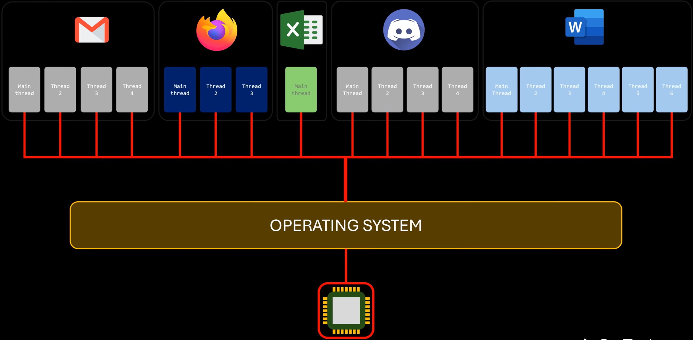
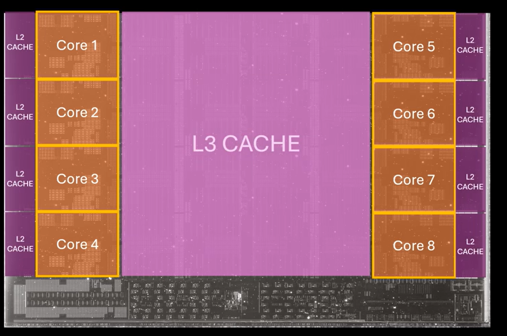

## 程序不等于进程
简化理解：A process is a program in excucation

例如**同时运行的两个word文件**是**两个不同的进程** 进程≠程序

**进程地址空间**
+ 进程加载到内存中的地址范围

一个进程往往包含: Text(指令) Data(常量或者全局变量) Stack Heap（临时变量）

附: C/ Rust 编译型语言 Js Python 解释型语言，解释型语言运行的是解释器，其代码文件往往载入到Heap中作为数据；而编译型语言则是编译成机器码后载入到Text中。

## 多核系统上的线程

###  并发 (Concurrency) 
*   **概念**：在单核CPU上，操作系统通过极速**交替分配**CPU使用权，让多个程序“感觉上”是在同时运行。【在一段时间内同时进行】
*   **两大作用**：
    *   确保短任务不需要长时间排队等待；
    *   当某个任务因I/O（如读取文件）而阻塞时，CPU可以立刻去执行其他任务，避免性能浪费。
*   **缺点**：如果并发任务过多，每个任务重新获得CPU的时间就会变长，导致系统不再流畅。
*   **解决思路**：单核CPU运算更快、优化调度策略、**增加处理器数量（即多核）**。

### 多核处理器 (Multi-core Processors)
*   在一个芯片（Package）内封装多个独立的处理单元（Core）。每个核心对操作系统而言都像是一个独立的处理器，但它们在底层会共享一些组件（如Cache）。

### 并发 (Concurrency) vs 并行 (Parallelism)
*   **并发 (Concurrency)**：系统支持多个任务**都在推进**。在单核系统中，这是通过时间交替（交错执行）实现的**假象**。【本质是一种通过交替进行的假象】
*   **并行 (Parallelism)**：多个任务**真正意义上同时**发生。这只有在多核系统中，系统将不同线程分配给不同物理核心时才能实现。

* Tips：你可以拥有“没有并行的并发”（单核多线程），但多核让真正的并行成为了可能。
* 现代OS将**线程**作为基本调度单元，程序员只需用线程写出并发代码，OS会自动在多核上进行并行分配，极大提高了代码的可移植性。

【在单核时自动并发，多核时并行+并发，进一步表明了**线程**是基本单位】

### 多核并行的限制
+ **并行的上限**：如果系统有 n 个核心，那么在任意给定的时刻，最多只能有 n 个线程在真正并行执行
+ **全局资源竞争**：程序与系统中其他应用程序的线程竞争。操作系统为了公平分配资源，会限制你的程序能同时独占的核心数量。

### 并行的两种模式 
*   **1. 数据并行 (Data Parallelism)**：
    *   **相同操作，划分数据**。
    *   **例**：在一个巨大的数组中找素数。将数组分成4等份，交给4个核心**同时执行相同**的素数查找操作。
*   **2. 任务并行 (Task Parallelism)**：
    *   **不同操作，共享数据**（或不同数据）。
    *   **案例**：给你同一个巨大数组。分配4个不同的核心，一个去找最大值，一个去找最小值，一个算平均数，一个去检索特定数字。
  
*   **不一定成倍数提升性能**：即使使用4个核心进行并行计算，受限于任务拆分和通信开销，整体性能提升并**不一定**能达到完美的4倍。