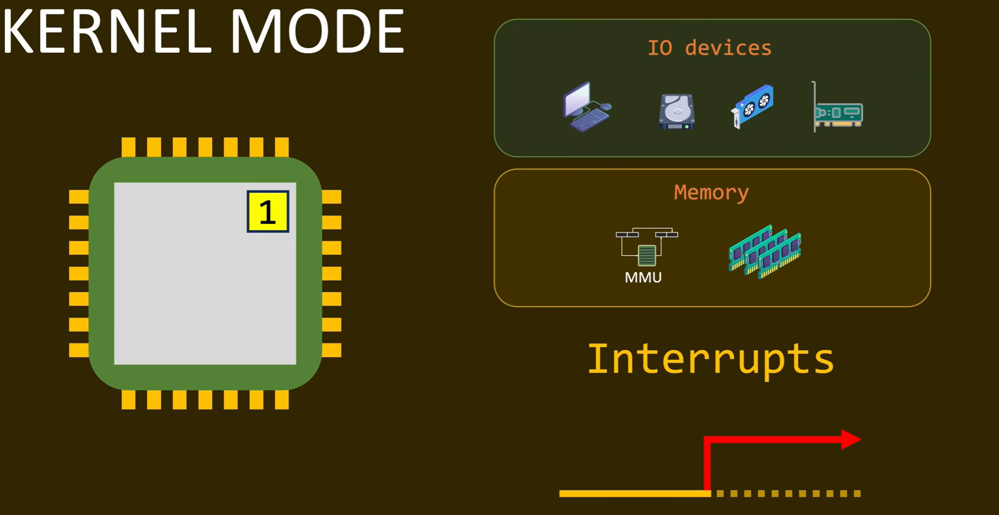
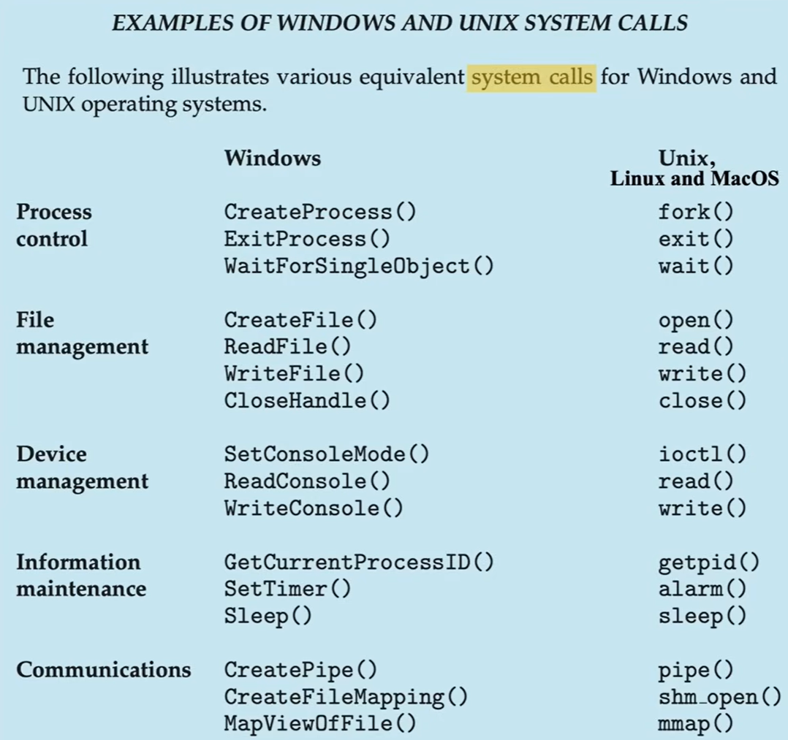
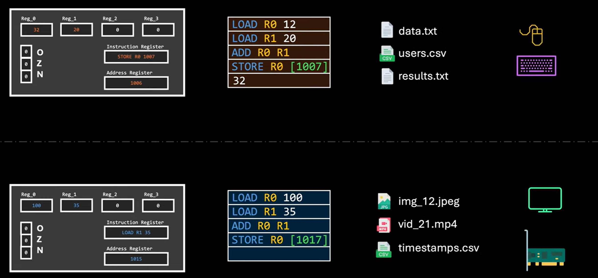
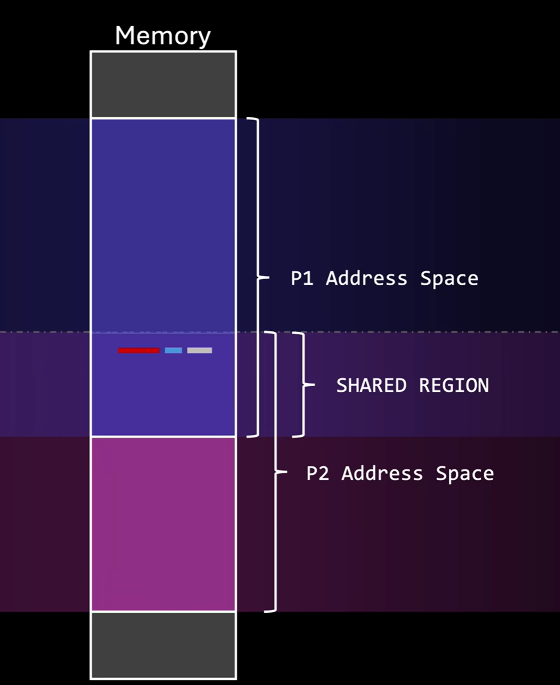
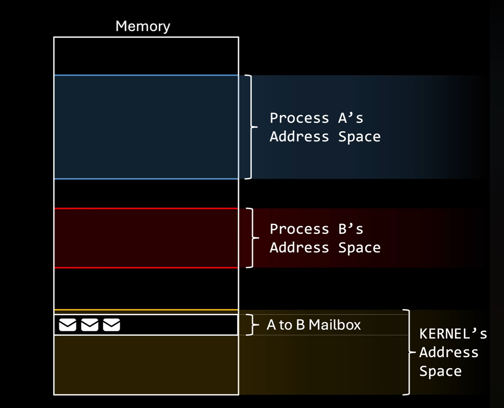
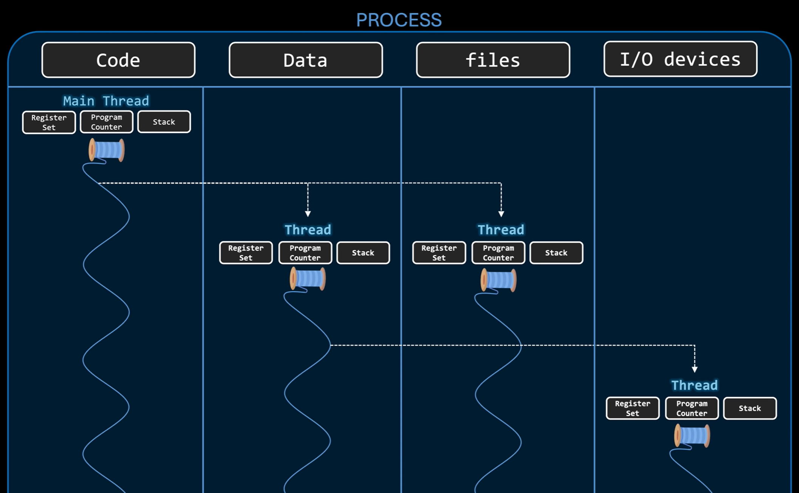
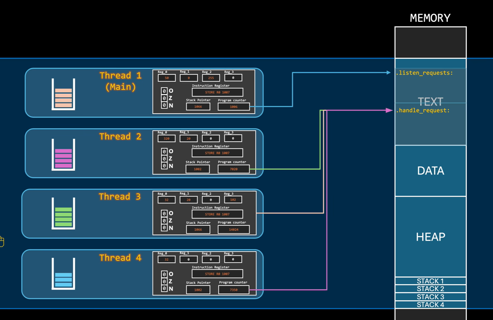

## **《操作系统》by Core dumped**

> B站 https://www.bilibili.com/video/BV19h48zoEeB/?p=5&share_source=copy_web&vd_source=d94f352d12b7f52cc94881dde16d595c
> YTB https://www.youtube.com/playlist?list=PL9vTTBa7QaQPdvEuMTqS9McY-ieaweU8M

### 一、 进程与程序 (Programs vs. Processes)

*   **本质区别**：**程序（Program）** 是一个被动的实体，比如存储在磁盘上的可执行文件。而 **进程（Process）** 是一个主动的实体，是“A program in execution”，包含了程序运行时的整个上下文环境。
    
  *   同一个程序可以有多个进程（例如，打开两个txt）
  *   
  
  
  
  
  
*   **内存布局**：程序被加载到内存后变为**进程**，其内存布局包含：
    
    *   **Text（代码段）**：存放可执行指令，内容和大小固定不变。
    *   **Data（数据段）**：存放全局变量等数据。
  *   **Heap（堆）**与**Stack（栈）**：用于存储运行时生成的动态数据、局部变量和临时结果，大小会动态伸缩。
  *   堆：动态分配的变量，例如`malloc`函数，
  *   
  
  
  
*   **解释型语言的特例**：对于Python等解释型语言，真正执行的“程序”是**解释器**本身，而我们写的源代码只是（一个文本文件）被解释器加载到堆区作为数据进行处理。

### 二、 硬件保护与运行模式 (Hardware Protection & CPU Modes)

为了防止用户程序恶意或错误地控制系统，操作系统必须借助**硬件机制**来实现保护。
*   **模式位 (Mode Bit)**：CPU内部的一个特殊寄存器位，用于区分当前的运行状态。
*   **特权模式（内核态/Kernel Mode）**只有在内核态下才能执行的指令，例如直接**操作I/O设备**、操作**内存管理**单元 (MMU)、以及配置**中断**处理等。用户程序运行在用户态，无法执行这些指令。



*   **受限模式（用户态/User Mode）**用户只能通过系统调用发起中断，才能由**OS执行**内核态的指令
    *   **中断 (Interrupts) 与系统调用 (System Calls)**： 
        *   当需要硬件服务（如读写文件）时，用户程序不能直接操作，而是通过触发软件中断（如 `int` 或 `syscall` 指令）发起**系统调用**。
        *   中断会使CPU暂停当前进程，将模式位切换为内核态，并跳转到操作系统地址空间中的特定处理程序。完成服务后，OS通过特定的中断返回指令将CPU切回用户态并恢复进程。

    *   常见的几种 system calls




*   **定时器中断 (Timer Interrupts)**：为了防止进程死循环导致CPU被霸占（即抢占式操作系统的核心），OS会设置硬件定时器。定时器到期会触发强制中断，将控制权交还给OS内核。


*   **运行在内核态的特殊程序**：由于OS开发者无法为所有硬件编写代码，因此允许**第三方驱动程序运行在内核态**。但由于它们拥有最高特权，一旦发生越界写内存或崩溃，就会导致整个操作系统崩溃（如Windows的蓝屏死机）。

### 三、 上下文切换与进程控制块 (Context Switch & PCB)

现代操作系统让多个进程通过排队交替使用单核CPU（并发），制造出同时运行的假象。
*   **CPU状态**：进程运行时，CPU的寄存器（如通用寄存器、程序计数器PC、状态标志等）中保存着该进程的当前数据，这被称为CPU状态。
*   **上下文切换 (Context Switch)**：
    *   如果直接把CPU分配给下一个进程，下一个进程会破坏当前进程的CPU状态，导致计算错误或安全漏洞。
    *   **核心逻辑**：OS在切换前，必须像“拍照”一样，把被中断进程的CPU状态（寄存器、PC等）捕捉并保存到内存中；然后再从内存中恢复下一个待执行进程的CPU状态。这就保证了隔离性与正确性。

**Process ≈ Context**



*   **进程控制块 (PCB / Process Control Block)**：

    * 进程不仅仅是一段代码，它是一个**完整的上下文**。OS使用PCB这个数据结构来管理进程。

    * **PCB包含的内容**：进程ID、进程状态、**CPU状态（寄存器、程序计数器PC的保存位置）**、内存管理信息（地址空间的限制）、以及分配的资源（如打开的文件列表、I/O设备）。

    * 在Linux内核中，PCB结构体被称为 `task_struct`，因为Linux将进程和线程统一抽象为“**任务(Task)**”进行调度。

      ```rust
      pub struct ProcessControlBlock {
          pid: u16,
          state: ProcessState,
          
          // 以下部分被标注为 CPU-STATE（CPU 状态/上下文）
          program_counter: u16,
          general_purpose_registers: [u8; 4],
          instruction_register: u8,
          flags: [u1; 3],
          stack_pointer: u16,
          index_registers: [u16; 2],
      }
      ```

      

### 四、 进程间通信 (IPC: Interprocess Communication)

因为进程具有隔离的地址空间，为了实现模块化和并行加速，需要IPC机制来协同合作。 
*   **1. 共享内存 (Shared Memory)**
    *   **原理**：OS通过系统调用解除内存隔离，在内存中**划分**出一块**允许多个进程共同读写**的区域。
    *   **优点**：**速度极快**。除了初始化时需要系统调用，后续读写就像访问自己的内存一样，不需要经过OS内核。
    *   **缺点/难点**：OS不再干预数据管理，**进程必须自己解决同步问题**和数据结构的约定，否则容易引发**竞态条件 (Race conditions)**。
    *   **例子**：Chrome浏览器（不同进程负责界面、渲染、插件等）。



*   **2. 消息传递 (Message Passing)**
    *   **原理**：进程的地址空间**保持隔离**。OS在自己的**内核空间**的一片内存区域中，维护消息队列/邮箱/端口 (Ports)，进程通过 `send` 和 `receive` 系统调用来收发消息。
    *   **优点**：安全性高，且不需要进程位于同一台物理机器上，**非常适合网络通信**（如客户端-服务器架构中的 Socket 接口）。
    *   **缺点**：每次发送和接收都需要**进行系统调用**（进入内核态），**性能开销较大**。【通俗：只能使用OS提供的接口函数】



### 五、 线程与并发 (Threads & Concurrency)

*   **进程的局限性**：如果**进程因为等待I/O（如读取磁盘文件）而被阻塞**，**该进程就无法执行**。通过为每个客户端请求创建一个新进程来解决阻塞，会导致严重的内存浪费，且创建进程的系统开销很大。
    *   【个人理解】从上到下、
    *   进程（多道程序系统）是**程序间的并发优化**：当一个进程因 IO 阻塞时，CPU 切换到另一个就绪进程执行，避免 CPU 闲置，但进程的创建和上下文切换开销较高。
    *   线程是**进程内的并发优化**：在同一个进程内，一个线程 IO 阻塞时，其他线程可直接占用 CPU 执行，无需切换进程，大幅降低了上下文切换的开销，是对进程并发模式的**精细化升级**。

**线程的定义**：线程是进程内部的“内部可执行实体”。开发者可以告诉OS让程序内部的特定代码段并发执行。

**线程共享与私有资源**：

*   **共享资源 (Shared)**：同一进程下的所有线程共享整个**地址空间**（如堆区 Heap）。
    - *注：由于栈也在共享的地址空间内，理论上一个线程可以越界访问另一个线程的栈，但除非明确知道自己在做什么，否则绝对应该避免这种危险操作。*
    - 线程间通信通常使用共享的**堆区 (Heap)**，但这需要硬件级别的同步机制来防止数据被破坏（竞态条件）。
*   **私有**：为了能够独立进行上下文切换，**每个线程必须拥有独立的CPU状态（自己的程序计数器PC、寄存器集合）以及独立的栈 (Stack)**。独立的栈保证了不同线程中局部变量和函数调用的安全。
*   Linux将进程和线程统一抽象为“**任务(Task)**”进行调度。



**操作系统如何管理线程**

- **Linux的优雅实现**：在Linux内核中，并不严格区分进程和线程结构，而是统一用一个名为 `task`（任务）的结构体来表示。操作系统的调度器实际上是在交替执行这些 task。

- **主线程 (Main Thread)**：无论是否使用多线程，当一个新进程被创建时，OS都会自动为其创建至少一个线程，即主线程。如果主线程结束，该进程下的所有其他线程通常也会立即终止。

- **动态创建**：主流OS允许进程在运行时动态生成新线程，以应对未知的并发需求，这比创建进程快得多。

**线程到底是什么？**

- **线程不是函数**：线程并不包含代码本身，它只是通过程序计数器**指向**内存中（Text 代码段）的某段可执行指令。

  - 【类比】

    - A program != A process    -----  A function != A thread

    - process is program in execution 

    - 相同线程指向了相同的 function in text.

      

  **并发访问的安全性**：多个线程同时指向并执行内存中的同一段代码是**绝对安全**的，因为 Text 代码段和常量数据段是**只读**的，不会被写入破坏。线程运行时产生的动态数据会保存在各自私有的栈或共享的堆中。

- **双重视角**：

  - 从 **OS视角** 来看，线程是**最基本的执行单元**（有时被称为“轻量级进程”，因为创建起来更快更容易）。
  - 从 **开发者视角** 来看，线程是一种机制，用于告诉OS程序中的哪些代码片段可以并发执行。

