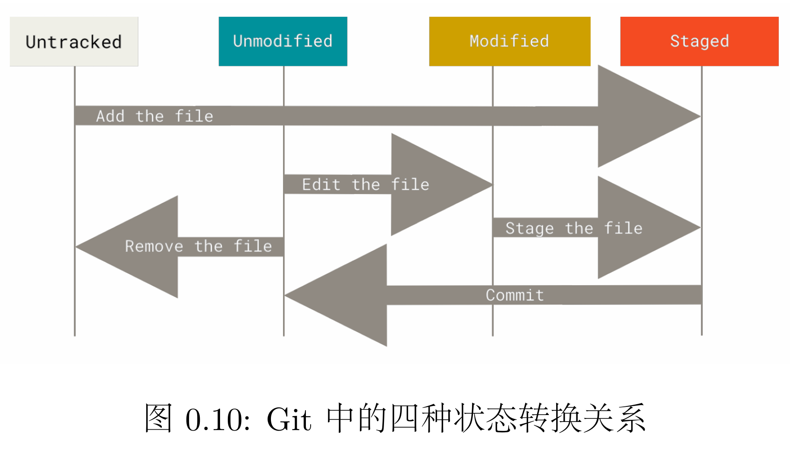

## Lab0 实验

### 思考题
#### 思考题1：
```
位于分支 master

尚无提交

未跟踪的文件:
  （使用 "git add <文件>..." 以包含要提交的内容）
        README.txt
        Untracked.txt

提交为空，但是存在尚未跟踪的文件（使用 "git add" 建立跟踪）
```
`git add .`之后 
```
...
要提交的变更：
  （使用 "git rm --cached <文件>..." 以取消暂存）
        新文件：   README.txt
        新文件：   Untracked.txt

未跟踪的文件:
  （使用 "git add <文件>..." 以包含要提交的内容）
        Stage.txt
```
然后修改文件后
```
...
尚未暂存以备提交的变更：
  （使用 "git add <文件>..." 更新要提交的内容）
  （使用 "git restore <文件>..." 丢弃工作区的改动）
        修改：     README.txt

未跟踪的文件:
  （使用 "git add <文件>..." 以包含要提交的内容）
        Modified.txt
        Stage.txt

修改尚未加入提交（使用 "git add" 和/或 "git commit -a"）
```
因此可见：
+ `Modified.txt`文件，在仓库初始时，处于`Untracked`状态
+ 经过`Add`后，进入Staged，已暂存，等待提交；
+ 此时（或提交后）再修改文件，会变成`modified`状态。

显然第三次与第一次不同，第一次是根本没有处于git的管理中，一旦被`Add`后，除非手动`Remove`移除（真实移除或者放弃追踪），否则无法回到`Untracked`状态。这时所有的修改改动都会被记录`modified`

#### 思考题2：


+ Add the file/Stage : `git add`
+ Stage the file : `git add`
+ Commit: `git commit -m ""`

#### 思考题3：关于版本回退
**1. 代码文件print.c 被错误删除时，应当使用什么命令将其恢复？**

``` bash
git restore print.c
```


**2. 代码文件 print.c 被错误删除后，执行了 git rm print.c 命令，此时应当使用什么命令将其恢复？**

此时，不仅工作区的文件删除，删除操作也会加入暂存区，因此只能从版本库拿回来了
``` bash
git reset HEAD print.c
# 或新版 Git
git restore --staged print.c
```
 **3. 无关文件 hello.txt 已经被添加到暂存区时，如何在不删除此文件的前提下将其移出暂存区？**

``` bash
git rm --cached hello.txt
```

#### 思考题4：版本回退
`git reset` 

可以回退到任意版本，想退回上个版本就用HEAD^，使用hash值可以在不同版本之间任意切换

`git reser --hard`

如果加上`--hard`工作区会直接被覆盖，全部修改会消失，回退到指定版本

#### 思考题5 重定向
``` bash
git@24371277:~/learnGit (master)$ echo first
first
git@24371277:~/learnGit (master)$ echo second > output.txt
git@24371277:~/learnGit (master)$ cat output.txt 
second
git@24371277:~/learnGit (master)$ echo third > output.txt 
git@24371277:~/learnGit (master)$ cat output.txt 
third
git@24371277:~/learnGit (master)$ echo fourth >> output.txt 
git@24371277:~/learnGit (master)$ cat output.txt 
third
fourth
```
`>`

输出重定向，会覆盖

`>>`

输出重定向，在文件结尾下一行添加，不会覆盖

#### 思考题6
``` bash
# command.sh
#!/bin/bash
# 1. 使用 Here Document 创建 test 脚本（带单引号 EOF，避免提前解析变量）
cat > test << 'EOF'
echo Shell Start...
echo set a = 1
a=1
echo set b = 2
b=2
echo set c = a+b
c=$[$a+$b]
echo c = $c
echo save c to ./file1
echo $c>file1
echo save b to ./file2
echo $b>file2
echo save a to ./file3
echo $a>file3
echo save file1 file2 file3 to file4
cat file1>file4
cat file2>>file4
cat file3>>file4
echo save file4 to ./result
cat file4>>result
EOF

# 2. 为 test 脚本添加可执行权限
chmod +x test

# 3. 运行 test 脚本，将标准输出（echo 提示信息）追加到 result
./test >> result
```

``` 
#result.txt
Shell Start...
set a = 1
set b = 2
set c = a+b
c = 3
save c to ./file1
save b to ./file2
save a to ./file3
save file1 file2 file3 to file4
save file4 to ./result
3
2
1
```
**输出解释：**
1. **执行过程输出**：脚本依次打印变量定义、赋值、计算、文件保存的提示信息，清晰展示 Shell 变量定义、算术运算（`c=$[$a+$b]`）的执行流程。
2. **文件操作结果**：脚本通过重定向将变量值分别写入 `file1`、`file2`、`file3`，并拼接三个文件内容生成 `file4`；最终将 `file4` 内容追加至 `result` 文件。
3. **最终结果**：`result` 文件末尾得到拼接后的数值 `3`、`2`、`1`，完整验证了 Shell 变量运算、文件重定向（覆盖/追加）、文件内容拼接的功能实现。

```bash
echo echo Shell Start
echo `echo Shell Start`
```
二者效果不同
+ 前者输出`echo Shell Start`
+ 后者``是命令替换，先执行内部的 `echo Shell Start`，再将执行结果交给外层 `echo`
因而输出`Shell Start`
```bash
echo echo $c > file1
echo `echo $c > file1`
```
效果不同
+ 前者向 file1 输出`echo 10`
+ 后者先执行向 file1 输出`10`，外层输出空行。
  

### 难点分析