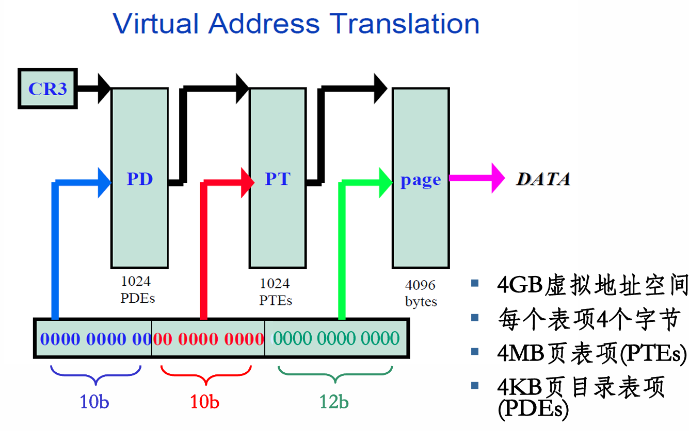

# 3.5 页目录自映射

廖晓坚
liaoxj@buaa.edu.cn

---

## 回顾：页式内存管理

### 页式内存管理思想
**破除内存分配"连续性假设"**

- 页从0开始编号（Page number）
- 物理内存按页框（Frame number）划分
- 页表记录页号到块号的映射关系

### 页内碎片
进程最后一页可能用不满，产生页内碎片。

---

## 页式内存管理的参数

页表的作用是将虚拟地址空间映射到物理地址空间。

### 32位系统参数
- 地址长度：32位
- 可寻址空间：4GB
- 页内偏移：12位
- 页大小：4KB = 2¹² B
- 页数：4GB / 4KB = 1M = 2²⁰ 页
- 需要 **1M个页表项（PTE）** 记录逻辑-物理映射关系

---

## 一级页表的问题

**页表的大小与逻辑地址空间大小成正比**。

如果逻辑地址空间很大，则划分的页比较多，页表就很大，占用的物理存储空间大，实现较困难（分配困难）。

### 示例
**32位系统**：
- 页面大小4KB
- 页表项4字节
- 每个进程页表大小 = 2²⁰ × 4B = **4MB（连续物理内存！）**

**64位系统更恐怖**：
- 2⁶⁴ / 2¹² = 2⁵² 页
- 页表大小 = 2⁵⁴ B = **16 PB 的连续物理内存！**

---

## 多级页表

### Virtual Address Translation（32位二级页表）
- 每个表项4个字节
- 共4MB页表项（PTEs）
- 页目录表项（PDEs）本身占4KB

### 地址结构（10+10+12）
```
[31-22] 页目录索引 (10位) → PDE
[21-12] 页表索引   (10位) → PTE
[11-0]  页内偏移   (12位) → 页内地址
```

---

## 基本功练习1：单位换算

| 表达式 | 结果 |
|--------|------|
| 1 KB | = 1024 B = 2¹⁰ B |
| 4 KB | = 4096 B = 2¹² B |
| 1 MB | = 2²⁰ B |
| 4 MB | = 2²² B |
| 2¹⁶ B | = 64 KB |
| 2³² B | = 4 GB |
| 2⁶⁴ B | = 16 EB |

### 存储单位口诀
- 2¹⁰ B = 1 KB
- 2²⁰ B = 1 MB
- 2³⁰ B = 1 GB
- 2⁴⁰ B = 1 TB
- 2⁵⁰ B = 1 PB
- 2⁶⁰ B = 1 EB
- 2⁷⁰ B = 1 ZB

---

## 基本功练习2：地址运算

### 进制与移位
- 十六进制数 0x12345678 转成二进制有 **32** 位
- 0x12345678 >> 12 = **0x12345**
- **0x80000000 >> 22 = 0x200 【先看移动多少十六进制位，再转化为二进制，看移动多少二进制位，**

### 常用地址常量
| 大小 | 十六进制值 |
|------|-----------|
| 4K | 0x1000 |
| 16K | 0x4000 |
| 64K | 0x10000 |
| 1M | 0x100000 |
| 4M | 0x400000 |
| 1G | 0x40000000 |
| 2G | 0x80000000 |
| 3G | 0xC0000000 |
| 4G | 0x100000000 |

---

## 页表管理

### 关键问题
| 问题 | 答案 |
|------|------|
| 谁来管理（填写）页表？ | 操作系统OS |
| 填写页表目的？ | 反映内存布局 |
| 如何填写、修改页表？ | 写页表所在内存 |
| 用虚拟地址还是物理地址写？ | 虚拟地址！（OS运行在保护模式下） |

---

## 页目录自映射

### 什么是自映射？
**页目录中有一条PDE（页目录项）指向自身的物理地址**。

---

## 页表在虚拟地址空间中的映射

### 页表空间大小计算
1. 每个页表项需要4字节，所以1M个页表项需要：1M × 4B = **4MB**
2. 所以整个页表占用的虚拟地址空间大小就是 **4MB**

### 页表分页存储
- 4MB页表也要分页存储
- 共需要：4MB / 4KB = **1024个页面**存储（页表页）
- 每一页中存储：4KB / 4B = 1024项页表项
- 每1个页表页对应：1024 × 4KB = **4MB内存**

---

## 页目录定义

**页目录是页表页的地址映射表**：

1. 1024个页表页逻辑上连续，物理上可以分散，其对应逻辑-物理映射关系记录在页目录中
2. 页目录占1页（4KB）空间，有1024项（页目录项PDE），每一项指向一个页表页
3. 每一个页目录项对应4MB内存，1024个页目录项正好对应 **4GB内存（整个地址空间）**

---

## 自映射的构建方法

### 核心公式

1. **页表基址对齐**：
   给定一个页表基址 PT<sub>base</sub>，该基址需 **4M对齐**，即：
   ```
   PT_base = ((PT_base) >> 22) << 22;
   ```
   4MB对齐的地址：低22位全为0。

2. **页目录表基址 PD<sub>base</sub>**：从页表基址计算得出【第几个4MB，重复两次】

3. **自映射目录表项 PDE<sub>self-mapping</sub>**：在页目录表中的位置【还是基于第几个4MB，重复3次】

---

## 4MB对齐的思考

### 是不是一定要4M对齐？
- 如果仅考虑映射关系：不是必须的
- 从使用方便性角度：是必须的！
  - 采用4M对齐，可使页目录表单独地存在于一个页面（页表）中
  - 采用4M对齐，还可以简化计算，各部分地址可以采取"拼接"的方式

### 思考题
以下哪个地址是4MB对齐的？
- 0x7fc00000 ✓（低22位全0）
- 0x7fd00000
- 0x80200000
- 0x10000000 ✓

> 4MB对齐特征：地址中21-0位全为0

---

## 特别强调（重点！）

1. **只要给定4M对齐的页表基址（虚拟地址），就可以得到所有页表项对应的地址**，也就包括页目录表基址和自映射页目录项在页目录表中的位置。因此页目录表基址和自映射页目录项在虚空间中是**计算出来的**。

2. 页表主要供OS使用的，因此页表和页目录表通常放置在 **OS空间中**（如Win的高2G空间）。

3. **"页目录自映射"的含义是页目录包含在页表当中，是我们采用的映射（或组织）方法的一个特征**，是虚拟地址空间内的映射，**与虚拟地址到物理地址的映射无关！**

4. 支持"页目录自映射"可节省 **4K（虚拟地址）** 空间。

---

## 举例：页目录在哪？

**给定页表虚拟地址起始位置**：例如 0x7fc00000

1. 可知，从这个地址开始的4MB是存储页表的空间
2. 这4MB地址空间是整个4GB地址空间中第 (0x7fc00000 >> 22) 个4MB地址空间
3. 因此其逻辑-物理映射关系应该记录在第 (0x7fc00000 >> 22) 个页表页中

### 计算
```
0x7fc00000 >> 22 = 0x1ff (十进制511)
```
所以页目录对应的页表页是第511个页表页。

---

## 自映射的完整地址计算

### 页表项地址公式
给定虚拟地址V，其对应的页表项（PTE）地址为：
```
PTE_address = PT_base + (V >> 12) * 4
```
其中 `(V >> 12)` 是去掉页内偏移后的页号。

### 页目录项地址公式
页目录本身也是一个页表（第1023个），所以：
```
PD_base = PT_base + (PT_base >> 12) * 4
```

### 自映射PDE的位置
```
self_PDE_index = PT_base >> 22
```

---

## 简化计算公式

### 核心简化公式（重要！）

对于 **32位地址字长，2级页表，4KB页面大小**：

给定页表起始地址（虚拟地址，**4MB对齐**）X

```
页目录起始地址 = X + (X >> 10) = X + X / 1024
```

### 练习示例

**题目**：页表起始地址 0x80000000，页目录起始地址 = ?

**计算**：
```
X = 0x80000000
X >> 10 = 0x80000000 >> 10 = 0x00200000

PD_base = 0x80000000 + 0x00200000 = 0x80200000
```

---

## 反向计算公式

### 问题
如果给定页目录起始地址，求页表起始地址？

### 核心公式
```
PT_base = (PD_base >> 22) << 22
```

> 本质：提取高10位，低22位清零（4MB对齐）

### 练习示例

**题目**：页目录起始地址 0xC0300000，页表起始地址 = ?

**计算**：
```
0xC0300000 >> 22 = 0x300 (十进制768)
0x300 << 22 = 0xC0000000

PT_base = 0xC0000000
```

---

## 自映射的本质

### 一句话理解自映射
**通过在页目录中放一个指向自己的指针，我们就可以用虚拟地址读写所有页表（包括页目录本身）。**

### 为什么要自映射？
| 优势 | 说明 |
|------|------|
| 简化操作 | OS用普通虚拟地址指针就能读写任何PDE/PTE |
| 无需物理地址 | 不用切换到物理地址模式就能操作页表 |
| 统一管理 | 页表本身也是虚拟内存的一部分 |
| 节省空间 | 不需要单独为页目录分配虚拟地址 |

---

## 本章总结

| 概念 | 内容 |
|------|------|
| 一级页表问题 | 太大，需要连续4MB物理内存 |
| 多级页表解决 | 10+10+12分层，破除连续性假设 |
| 页表管理问题 | OS需要用虚拟地址访问页表本身 |
| 4MB对齐 | 页表基址低22位全0，简化计算 |
| 自映射核心 | 页目录中一个PDE指向自身物理地址 |
| 计算方式 | 通过移位和指针运算得到任意PDE/PTE地址 |
| 空间位置 | 页表通常放在高地址OS空间（如3G以上） |

> 自映射是Lab2"缺页故障处理"的核心机制，务必理解并掌握地址计算！
